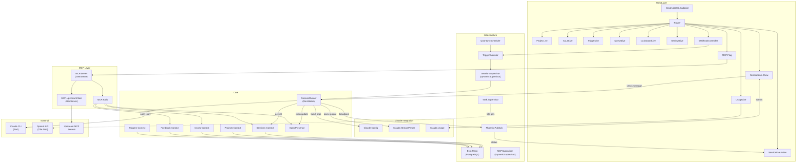

# Architecture Overview

```mermaid
graph TB
    subgraph Web["Web Layer"]
        Endpoint["OrcaHubWeb.Endpoint"]
        Router["Router"]
        SessionShow["SessionLive.Show"]
        SessionIndex["SessionLive.Index"]
        ProjectLive["ProjectLive"]
        IssueLive["IssueLive"]
        TriggerLive["TriggerLive"]
        QueueLive["QueueLive"]
        UsageLive["UsageLive"]
        DashboardLive["DashboardLive"]
        SettingsLive["SettingsLive"]
        MCPPlug["MCP.Plug"]
        WebhookPlug["WebhookController"]
    end

    subgraph Core["Core"]
        SessionRunner["SessionRunner\n(GenStatem)"]
        Sessions["Sessions Context"]
        Projects["Projects Context"]
        Issues["Issues Context"]
        Feedback["Feedback Context"]
        Triggers["Triggers Context"]
        AgentPresence["AgentPresence"]
    end

    subgraph Claude["Claude Integration"]
        Config["Claude.Config"]
        StreamParser["Claude.StreamParser"]
        Usage["Claude.Usage"]
    end

    subgraph MCP["MCP Layer"]
        MCPServer["MCP.Server\n(GenServer)"]
        MCPTools["MCP.Tools"]
        UpstreamClient["MCP.UpstreamClient\n(GenServer)"]
    end

    subgraph Infra["Infrastructure"]
        PubSub["Phoenix.PubSub"]
        Repo["Ecto.Repo\n(PostgreSQL)"]
        SessionSupervisor["SessionSupervisor\n(DynamicSupervisor)"]
        MCPSupervisor["MCPSupervisor\n(DynamicSupervisor)"]
        Scheduler["Quantum Scheduler"]
        TriggerExecutor["TriggerExecutor"]
        TaskSupervisor["Task.Supervisor"]
    end

    subgraph External["External"]
        ClaudeCLI["Claude CLI\n(Port)"]
        OpenAI["OpenAI API\n(Title Gen)"]
        UpstreamServers["Upstream MCP\nServers"]
    end

    Endpoint --> Router
    Router --> SessionShow & SessionIndex & ProjectLive & IssueLive & TriggerLive & QueueLive & UsageLive & DashboardLive & SettingsLive
    Router --> MCPPlug & WebhookPlug

    SessionShow -->|send_message| SessionRunner
    SessionRunner -->|broadcast| PubSub
    PubSub -->|events| SessionShow
    PubSub -->|status| SessionIndex

    SessionRunner -->|persist| Sessions
    Sessions --> Repo
    Projects --> Repo
    Issues --> Repo
    Feedback --> Repo
    Triggers --> Repo

    SessionRunner -->|build_args| Config
    SessionRunner -->|parse output| StreamParser
    SessionRunner -->|open_port| ClaudeCLI
    SessionRunner -->|write/update| AgentPresence

    MCPPlug --> MCPServer
    MCPServer --> MCPTools
    MCPTools --> Sessions & Issues & Feedback & AgentPresence
    MCPServer --> UpstreamClient
    UpstreamClient --> UpstreamServers

    Scheduler --> TriggerExecutor
    WebhookPlug --> TriggerExecutor
    TriggerExecutor --> SessionSupervisor
    SessionSupervisor --> SessionRunner

    UsageLive --> Usage
    TaskSupervisor -.->|title gen| OpenAI
```
