# Architecture Overview

```mermaid
graph TB
    subgraph Web["Web Layer"]
        Endpoint["OrcaHubWeb.Endpoint"]
        Router["Router"]
        SessionShow["SessionLive.Show"]
        SessionIndex["SessionLive.Index"]
        ProjectIndex["ProjectLive.Index"]
        ProjectShow["ProjectLive.Show"]
        IssueIndex["IssueLive.Index<br>(durable work items)"]
        IssueShow["IssueLive.Show"]
        TriggerLive["TriggerLive.Index / Show"]
        QueueLive["QueueLive"]
        UsageLive["UsageLive"]
        DashboardLive["DashboardLive"]
        SettingsLive["SettingsLive.Index<br>(upstream + email inboxes<br>+ scoped API tokens)"]
        PiConfigLive["PiConfigLive.Index<br>(/settings/pi-config)"]
        SkillLive["SkillLive.Index"]
        ArtifactLive["ArtifactLive.Index / Show"]
        NodeLive["NodeLive.Index / Show"]
        TerminalLive["TerminalLive.Index / Show"]
        CommandPalette["CommandPaletteLive<br>(live_component in the layout,<br>not a route)"]
        MCPPlug["MCP.Plug (/mcp)"]
        ApiAuth["Plugs.ApiAuth<br>(scoped token, else ORCA_API_TOKEN)"]
        WebhookCtrl["WebhookController"]
        TTSCtrl["TTSController"]
        ArtifactCtrl["ArtifactController<br>(/artifacts/:id/raw|download)"]
        FileDownloadCtrl["FileDownloadController<br>(chunked, node-routed)"]
        ApiRunCtrl["ApiRunController<br>(/api/v1/runs)"]
        SessionApiCtrl["SessionApiController<br>(GET /api/v1/sessions,<br>/recent, /:id, /:id/tail)"]
        A2ACtrl["A2AController<br>(/a2a, inbound JSON-RPC)"]
        ApiSocket["ApiSocket (/api/v1/socket)<br>+ SessionEventsChannel<br>(scoped-token WS push)"]
        UserSocket["UserSocket (/terminal_socket)<br>TerminalChannel + VoiceChannel"]
        VoiceBar["VoiceBarLive<br>(sticky nested LV in the header)"]
    end

    subgraph Core["Core"]
        SessionRunner["SessionRunner<br>(GenStatem)"]
        HubRPC["HubRPC<br>(DB proxy)"]
        Mode["Mode<br>(hub/agent)"]
        Cluster["Cluster<br>(routing layer)"]
        Sessions["Sessions Context"]
        Projects["Projects Context"]
        Issues["Issues Context<br>(durable work items)"]
        IssueChunker["Issues.Chunker<br>(pure text chunking)"]
        Embeddings["Embeddings<br>(hub-only HTTP)"]
        Triggers["Triggers Context"]
        Terminals["Terminals Context"]
        Jobs["Jobs Context<br>+ Launcher / Progress"]
        Artifacts["Artifacts Context"]
        Skills["Skills Context"]
        PiConfig["PiConfig Context"]
        ClusterNodes["ClusterNodes Context"]
        NodePolicy["NodePolicy<br>(isolation, env scrub, defaults)"]
        UpstreamServers["UpstreamServers Context"]
        Secrets["Secrets<br>(UpstreamSecret)"]
        ApiRuns["ApiRuns Context"]
        ApiTokens["ApiTokens Context<br>(scoped, revocable, hashed)"]
        A2ATasks["A2ATasks Context"]
        EmailInboxes["EmailInboxes Context"]
        AgentPresence["AgentPresence"]
        SessionHeartbeat["SessionHeartbeat<br>(hub only)"]
        ChurnSampler["ChurnSampler + AlertEvaluator<br>(hub only, 120s sweep)"]
        AlertSubs["AlertSubscriptions Context"]
        Churn["Sessions.Churn<br>(+ ChurnDetail / FileSurgery)"]
        SessionResumer["SessionResumer"]
        ForkGate["ForkGate<br>(pi fork first-turn FIFO)"]
        ToolPolicy["ToolPolicy<br>(per-session MCP allow/deny)"]
        TTSConfig["TTSConfig<br>(provider/model, env fallback)"]
        ASRConfig["ASRConfig<br>(one provider row, env fallback)"]
        SessionEvents["SessionEvents<br>(turn-end fan-out, hub)"]
        DirectoryMove["Projects.DirectoryMove<br>+ MoveSideEffects"]
    end

    subgraph Voice["Voice Mode (see .context/voice-mode.md)"]
        VoiceChannel["VoiceChannel<br>(transport + effects)"]
        VoiceSession["Voice.Session<br>(pure state machine)"]
        VoiceASR["Voice.ASR<br>(GB10 sync lane)"]
        VoiceIntent["Voice.Intent<br>(phonetic command matcher)"]
        Deltas["Backend.Deltas<br>(normalized orca_delta)"]
    end

    subgraph Deploys["Project Deploys (durable Jobs + TTL lease)"]
        DeploysMod["Deploys<br>(compose, lease, launch)"]
        DeployRegistry["Deploys.Registry<br>(targets + flag allow-list)"]
        DeployLeases["Deploys.Leases<br>(partial unique index)"]
        LeaseReaper["Deploys.LeaseReaper<br>(hub only)"]
    end

    subgraph MemSub["Agent Memory"]
        MemoryClient["MemoryClient<br>(hub-only HTTP)"]
        MemoryExtraction["MemoryExtraction<br>(+ finalize_self)"]
        MemoryExtractionSweep["MemoryExtractionSweep<br>(hub only, boot backstop)"]
        MemoryReview["MemoryReview<br>(nightly + weekly triggers)"]
    end

    subgraph Sync["Hub-DB -> Node-Disk Sync (every node)"]
        SkillSync["SkillSync<br>(skills -> SKILL.md)"]
        PiConfigSync["PiConfigSync<br>(entries -> ~/.pi/agent)"]
        PiModelSync["PiModelSync<br>(hub only, hourly:<br>gateway -> provider models)"]
        MemoryGitServer["MemoryGit.Server<br>(agent memory -> Gitea)"]
    end

    subgraph JobsSub["Jobs (detached background work)"]
        JobLauncher["Jobs.Launcher<br>(setsid, own pgid)"]
        JobWatcher["JobWatcher<br>(polls sentinel/pid/progress)"]
        JobResumer["JobResumer"]
        DetachedProc["Detached OS process<br>(outlives OrcaHub)"]
    end

    subgraph Email["Inbound Email (hub only)"]
        EmailLoader["EmailInboxLoader"]
        EmailPoller["EmailInbox.Poller<br>(IMAP)"]
        EmailIngest["EmailInbox.Ingest<br>+ Security"]
    end

    subgraph Backend["Backend Layer (pluggable agent CLIs)"]
        BackendBehaviour["Backend behaviour<br>+ Capabilities struct"]
        ClaudeAdapter["backend/claude.ex"]
        CodexAdapter["backend/codex.ex"]
        PiAdapter["backend/pi.ex"]
        ClaudeConfig["Claude.Config"]
        StreamParser["Claude.StreamParser"]
        JsonRpcFraming["Backend.JsonRpcFraming"]
        Usage["Claude.Usage"]
        BackendInstaller["BackendInstaller<br>+ Job + Supervisor"]
        LoginRunner["LoginRunner /<br>CodexLoginRunner"]
        BackendAuth["BackendAuth /<br>NodeCredentials"]
    end

    subgraph Streaming["Streaming Engine"]
        StreamingMod["Streaming<br>(kill switch, warm cap)"]
        WarmPool["Streaming.WarmPool"]
    end

    subgraph MCP["MCP Layer"]
        MCPServer["MCP.Server<br>(GenServer)"]
        MCPTools["MCP.Tools"]
        UpstreamClient["MCP.UpstreamClient<br>(GenServer)"]
        CodeExecMeta["CodeExec.MetaTools"]
        CodeExecSandbox["CodeExec.Sandbox +<br>Dispatcher"]
        CodeExecGenerator["CodeExec.Generator"]
        CodeExecBindingStore["CodeExec.BindingStore"]
        CodeExecToolSearch["CodeExec.ToolSearch /<br>Analyzer"]
        CodeExecMediaSink["CodeExec.MediaSink<br>(image/audio -> disk)"]
        CodeExecPlaywright["CodeExec.PlaywrightUpload<br>(local paths -> pod paths)"]
        ToolsInfra["MCP.Tools.Probes / Notify /<br>Databases / PhxAgents"]
    end

    subgraph Discord["Discord Bridge (opt-in, env-gated)"]
        DiscordBot["Discord.Bot<br>(nostrum)"]
        DiscordBridge["Discord.Bridge"]
    end

    subgraph Infra["Infrastructure"]
        PubSub["Phoenix.PubSub"]
        Repo["Ecto.Repo<br>(PostgreSQL, hub only)"]
        SessionSupervisor["SessionSupervisor<br>(DynamicSupervisor)"]
        TerminalSupervisor["TerminalSupervisor<br>(DynamicSupervisor)"]
        JobSupervisor["JobSupervisor<br>(DynamicSupervisor)"]
        MCPSupervisor["MCPSupervisor<br>(DynamicSupervisor)"]
        Scheduler["Quantum Scheduler<br>(hub only, RunStrategy.Local)"]
        TriggerLoader["TriggerLoader<br>(hub only)"]
        TriggerExecutor["TriggerExecutor"]
        TaskSupervisor["Task.Supervisor"]
        ClusterNodeTracker["ClusterNodeTracker<br>(hub only)"]
        NodeDialer["NodeDialer<br>(hub only)"]
    end

    subgraph External["External"]
        ClaudeCLI["Claude CLI"]
        CodexCLI["Codex CLI"]
        PiCLI["pi CLI"]
        ElevenLabs["ElevenLabs API<br>(TTS)"]
        ExtMCPServers["Upstream MCP<br>Servers"]
        DiscordAPI["Discord Gateway"]
        Gitea["Gitea<br>(agent-memory remotes)"]
        IMAP["IMAP mailbox"]
        MemoryService["Agent-memory service<br>(HTTP)"]
        Gotify["Gotify<br>(push to the human)"]
        PgProv["pg-provisioner<br>(homelab Postgres)"]
        PhxApp["phx-app A2A agents"]
    end

    Endpoint --> Router
    Router --> SessionShow & SessionIndex & ProjectIndex & ProjectShow & IssueIndex & IssueShow
    Router --> TriggerLive & QueueLive & UsageLive & DashboardLive & SettingsLive & NodeLive & TerminalLive & CommandPalette
    Router --> PiConfigLive & SkillLive & ArtifactLive
    Router --> MCPPlug & WebhookCtrl & ArtifactCtrl & FileDownloadCtrl
    Router -->|":api_authed pipeline"| ApiAuth
    ApiAuth --> TTSCtrl & ApiRunCtrl & SessionApiCtrl & A2ACtrl
    ApiAuth -->|"scoped token: hash lookup,<br>scope + session-pin check"| ApiTokens
    ApiSocket -->|"same scoped token at CONNECT,<br>requires sessions:read"| ApiTokens
    SessionEvents -->|"broadcast turn_end"| ApiSocket
    SessionEvents -.->|"opt-in, per-node<br>ORCA_NOTIFY_ON_FINISH"| Gotify
    UserSocket --> VoiceChannel
    VoiceBar --> UserSocket

    SessionShow -->|send_message| SessionRunner
    SessionRunner -->|broadcast| PubSub
    PubSub -->|events| SessionShow
    PubSub -->|status| SessionIndex

    SessionRunner -->|persist via| HubRPC
    HubRPC -->|hub: local call| Sessions & Projects & Issues & Triggers & Terminals & Jobs & ClusterNodes
    HubRPC -.->|agent: erpc to hub| Repo
    Sessions & Projects & Issues & Triggers & Terminals & Jobs & ClusterNodes --> Repo
    Artifacts & Skills & PiConfig & A2ATasks & EmailInboxes --> Repo

    Cluster --> HubRPC
    SessionRunner -->|resolve engine| StreamingMod
    StreamingMod --> WarmPool
    WarmPool -->|evict/admit| SessionRunner

    SessionRunner -->|delegates CLI concerns to| BackendBehaviour
    BackendBehaviour --> ClaudeAdapter & CodexAdapter & PiAdapter
    ClaudeAdapter -->|build_args| ClaudeConfig
    ClaudeAdapter -->|parse ndjson| StreamParser
    CodexAdapter -->|parse jsonrpc| JsonRpcFraming
    ClaudeAdapter -->|open_port| ClaudeCLI
    CodexAdapter -->|open_port| CodexCLI
    PiAdapter -->|open_port| PiCLI
    SessionRunner -->|write/update| AgentPresence
    NodePolicy -->|isolation, env scrub, defaults| Sessions
    NodePolicy -->|reads| ClusterNodes

    BackendInstaller -->|installs/upgrades| ClaudeCLI & CodexCLI & PiCLI
    LoginRunner -->|drives auth flow| BackendAuth

    MCPPlug --> MCPServer
    MCPServer -->|code_exec off: full tools/list| MCPTools
    MCPServer -->|"code_exec on: tools/list == [run_elixir]"| CodeExecMeta
    CodeExecMeta --> CodeExecSandbox
    CodeExecSandbox -->|generated Tools.*| CodeExecGenerator
    CodeExecSandbox --> CodeExecBindingStore
    CodeExecSandbox --> MCPTools & UpstreamClient
    CodeExecGenerator -->|"Tools.search/1 ranking"| CodeExecToolSearch
    CodeExecSandbox -->|"media blocks -> session dir"| CodeExecMediaSink
    CodeExecSandbox -.->|"playwright paths arg"| CodeExecPlaywright
    MCPServer --> UpstreamClient
    MCPServer -->|"resolved lazily, cached<br>per MCP connection"| ToolPolicy
    ToolPolicy -->|"reads allow/denylist"| Sessions
    MCPTools --> ToolsInfra
    ToolsInfra -->|"node-routed read-only probes"| Cluster
    ToolsInfra -.-> Gotify & PgProv & PhxApp
    MCPTools -->|persist via| HubRPC
    UpstreamClient --> UpstreamServers & Secrets
    UpstreamClient --> ExtMCPServers

    Scheduler --> TriggerExecutor
    WebhookCtrl -->|async via TaskSupervisor| TriggerExecutor
    TriggerExecutor --> SessionSupervisor
    SessionSupervisor --> SessionRunner
    TerminalSupervisor -.-> SessionRunner

    ApiRunCtrl --> ApiRuns
    ApiRuns --> SessionSupervisor
    SessionApiCtrl -->|"read-only projection"| Sessions
    A2ACtrl --> A2ATasks
    A2ATasks --> SessionSupervisor

    EmailLoader --> EmailPoller
    EmailPoller --> IMAP
    EmailPoller --> EmailIngest
    EmailIngest -->|"routed payload (Cluster.rpc)"| TriggerExecutor

    MCPTools -->|"jobs tool surface"| Jobs
    MCPTools -->|"start_deploy / in_flight_deploys /<br>deploy_status (orchestrator only)"| DeploysMod
    DeploysMod --> DeployRegistry & DeployLeases
    DeploysMod -->|"launches as a normal job"| Jobs
    LeaseReaper -.->|"job_finished -> release"| DeployLeases
    Jobs --> JobLauncher
    JobLauncher -->|"spawns, then lets go"| DetachedProc
    JobSupervisor --> JobWatcher
    JobWatcher -.->|"polls sentinel/pid/progress"| DetachedProc
    JobWatcher -->|"writes observations"| Jobs
    JobResumer -.->|"re-attaches watchers on boot"| JobSupervisor

    SkillSync --> Skills
    PiConfigSync --> PiConfig
    PiModelSync -->|"refresh opted-in provider rows"| PiConfig
    PiConfigSync -.->|"evict idle pi warm ports"| WarmPool
    SessionRunner -.->|"idle transition triggers"| MemoryGitServer
    MemoryGitServer -.-> Gitea

    SessionRunner -.->|"fork child's first turn"| ForkGate
    ForkGate -.->|"releases one at a time"| SessionRunner

    DiscordAPI --> DiscordBot
    DiscordBot --> DiscordBridge
    DiscordBridge --> SessionSupervisor

    SessionHeartbeat -.->|schedules| SessionRunner
    ChurnSampler -->|"assess each running session"| Churn
    ChurnSampler -->|"persist samples + emit telemetry"| Sessions
    ChurnSampler -->|"reads watches"| AlertSubs
    ChurnSampler -.->|"rising-edge alerts, via<br>SessionHeartbeat.deliver_or_queue"| SessionHeartbeat
    MCPTools -->|"set_worker_alerts surface"| AlertSubs
    SessionResumer -.->|"resumes orphaned 'running'"| SessionSupervisor
    ClusterNodeTracker -.->|tracks node up/down| ClusterNodes
    NodeDialer -.->|dials rows flagged dial| ClusterNodes

    Sessions -.->|"archive_session/2"| MemoryExtraction
    MCPTools -->|"extract_memories tool"| MemoryExtraction
    MemoryExtraction -->|"Cluster.start_session on the<br>source session's own node"| SessionSupervisor
    SessionRunner -.->|"extraction child's turn end"| MemoryExtraction
    MemoryExtractionSweep -.->|"boot backstop for orphans"| MemoryExtraction
    TriggerLoader -.->|"hub boot, before sync_triggers"| MemoryReview
    MemoryReview -->|"upserts 2 scheduled triggers"| Triggers
    MCPTools -->|"remember/recall/..."| MemoryClient
    MemoryClient --> MemoryService
    Embeddings -->|"HubRPC.embeddings_*"| EmbeddingService["Local embedding endpoint<br>(OpenAI-compatible /v1/embeddings)"]
    IssueChunker -.->|"chunks sized to the endpoint's n_ctx"| Embeddings
    BackendBehaviour -->|"memory block at cold port open<br>(SharedPrompts / pi ORCA_MEMORY)"| MemoryClient

    UsageLive --> Usage
    ArtifactLive & ArtifactCtrl --> Artifacts
    TTSCtrl --> TTSConfig
    TTSConfig --> Repo
    TTSCtrl -.-> ElevenLabs

    SessionRunner -.->|"turn end (idle/error),<br>via HubRPC"| SessionEvents
    SessionRunner -->|"unpersisted delta broadcasts"| Deltas
    VoiceChannel --> VoiceSession & VoiceASR & VoiceIntent
    VoiceASR --> ASRConfig
    VoiceASR -.-> ASRService["GB10 transcription<br>(POST /v1/transcribe/sync)"]
    ProjectShow -->|"move directory"| DirectoryMove
```

## Subsystem Notes

- **Backend Layer** (`lib/orca_hub/backend.ex` + `backend/*.ex`): a
  behaviour + `Capabilities` struct (`streaming`, `interrupt`, `mcp`,
  `resume`, `usage`, `plan_mode`, `ask_user_question`, `steering`, …) that
  every adapter implements. `SessionRunner` resolves `data.backend` once at
  init and never branches on the backend name string directly — UI chrome
  and model lists branch on `Capabilities` fields instead. See
  `.context/message-flow.md` for the spawn/normalize call sequence.
- **Streaming Engine** (`lib/orca_hub/streaming.ex`,
  `streaming/warm_pool.ex`): the default long-lived-port engine, with a
  per-node runtime kill switch and `WarmPool` admission control. See
  `.context/message-flow.md`.
- **MCP CodeExec Layer** (`lib/orca_hub/mcp/code_exec/`): when a session has
  `code_exec: true` (default), its MCP `tools/list` collapses to exactly ONE
  tool — `run_elixir`. Every other tool is called as a generated
  `Tools.<name>/1` Elixir function inside the sandboxed eval, and discovered
  there via `Tools.search/1`, `Tools.list/0`, and `Tools.schema/1`. The
  earlier `search_tools` meta-tool and the promoted "passthrough" tools
  (`send_message_to_session`, `report_progress`, …) were both removed once
  their jobs were fully covered from inside `run_elixir`. See
  `.context/message-flow.md`.
- **NodeLive + NodePolicy**: `/nodes` (`NodeLive.Index`/`Show`) manages the
  `nodes` table and lets an operator install/upgrade backends across nodes.
  `OrcaHub.NodePolicy` resolves per-node isolation, session env scrubbing
  (allow-list merged from node + project), and default backend/model
  applied in `Sessions.create_session/1`. See `.context/clustering.md`.
- **BackendInstaller**: installs/upgrades agent CLIs (claude/codex/pi) on a
  target node via `Cluster.rpc`, one `BackendInstaller.Job` per install,
  streaming progress over PubSub.
- **Login / BackendAuth / NodeCredentials**: `LoginRunner`/
  `CodexLoginRunner` drive interactive CLI login (`claude setup-token`,
  codex auth) from the web UI; `NodeCredentials` persists the resulting
  per-node OAuth tokens.
- **Secrets**: `OrcaHub.Secrets` + `UpstreamSecret` schema — values injected
  into upstream MCP tool call headers at call time when an `UpstreamServer`
  has `secret_injection: true`.
- **Discord Bridge** (`lib/orca_hub/discord/`): a Nostrum gateway bot
  (env-gated by `DISCORD_BOT`/`DISCORD_BOT_TOKEN`) whose `Bridge` module
  maps a Discord channel to a session — auto-provisioning a project/session
  on an unmapped channel — sends the @-mention in, and posts the reply back.
- **Agent Runs API** (`lib/orca_hub/api_runs.ex`,
  `api_run_controller.ex`, `POST/GET /api/v1/runs`): an async-poll HTTP API
  — create a run, poll `GET /api/v1/runs/:id` for `running`/`completed`/
  `failed`/`timed_out`/`awaiting_tool_result`, with optional JSON-schema
  validation + retry, and AG-UI-style caller-defined ("client"/frontend)
  tools posted back via `POST /api/v1/runs/:id/tool_result`.
- **Read-only sessions API** (`lib/orca_hub_web/controllers/session_api_controller.ex`,
  `GET /api/v1/sessions`, `/sessions/recent`, `/sessions/:id`,
  `/sessions/:id/tail`): a compact projection of
  `Sessions.list_sessions/1` / `HubRPC.get_session/1` for
  bandwidth-constrained external clients (first consumer: a Wear OS watch
  companion). Deliberately thin — it never reimplements the query, only
  narrows the fields. `/recent` is the activity-ordered feed and `/:id/tail`
  the last-N-messages read the phone/watch apps poll instead of pulling a
  whole session.
- **Turn-end push** (`lib/orca_hub/session_events.ex`,
  `lib/orca_hub_web/channels/{api_socket,session_events_channel}.ex`): every
  genuine `running -> idle|error` transition that clears
  `SessionRunner.turn_end_push_eligible?/2` (not a memory-extraction child,
  not archived, and — by default — a root session rather than a worker, whose
  turn end reports to its ORCHESTRATOR instead) fans one four-field payload
  onto two wires from the HUB: the `session_events` channel ALWAYS, and Gotify
  only when the runner's own node sets `ORCA_NOTIFY_ON_FINISH`. The socket
  (`/api/v1/socket`) authenticates the same scoped `ApiToken` at CONNECT
  rather than at join, requires `sessions:read`, refuses the legacy global
  `ORCA_API_TOKEN` outright, and is kicked live on revocation via the
  socket `id/1`. See `.context/push-payload.md` for the field contract.
- **API auth** (`lib/orca_hub_web/plugs/api_auth.ex`, `lib/orca_hub/api_tokens.ex`):
  everything behind the `:api_authed` pipeline — `/api/tts`, `/api/v1/*`,
  `/a2a` — takes a bearer token. Two kinds are accepted, in order: a scoped,
  revocable `ApiToken` (SHA-256 hashed at rest, checked against the route's
  required scope and, if the token is session-pinned, that one session), then
  the legacy global `ORCA_API_TOKEN`, preserved byte-identically as a
  full-access fallback. 503 when the API is disabled, 401 on a bad token, and
  a deliberately distinct 403 on a scope/pin violation that never echoes what
  it denied. Tokens are managed from `/settings`; the plaintext is shown once
  at creation and never persisted.
- **A2A server** (`lib/orca_hub/a2a.ex`, `a2a_tasks.ex`,
  `a2a_controller.ex`, `/a2a`): the inbound Agent2Agent JSON-RPC surface —
  OrcaHub projects are advertised as A2A agents (`/a2a/agents`, per-agent
  agent cards), one `message/send` maps to one session turn recorded as an
  `A2ATask`, and a session doubles as the A2A `contextId` so a conversation
  continues across tasks. Shares the client-tool / schema-validation
  machinery with the Agent Runs API via `OrcaHub.MCP.ToolCallHolder`.
- **Jobs** (`lib/orca_hub/jobs.ex`, `jobs/launcher.ex`, `job_watcher.ex`,
  `job_resumer.ex`): durable records of DETACHED OS background processes so
  long work survives idle teardown, WarmPool eviction, kill-switch
  downgrades, and deploys. The process is never a BEAM child; a disposable
  per-node `JobWatcher` only observes it. See `.context/supervision-tree.md`.
- **Voice mode** (`lib/orca_hub_web/channels/voice_channel.ex`,
  `lib/orca_hub/voice/{session,asr,intent}.ex`, `lib/orca_hub/asr_config.ex`,
  `lib/orca_hub_web/live/voice_bar_live.ex`, `assets/js/voice/`): browser
  capture + client-side VAD -> `VoiceChannel` -> `Voice.ASR` (the GB10 sync
  lane, configured per-field by `ASRConfig`) -> `Voice.Intent` for spoken
  commands, with the draft sent through the page's own composer. The bar is a
  STICKY nested LiveView in the app header, so every internal link must
  live-navigate or the mic and channel die with the page. Assistant text
  streams back live through `OrcaHub.Backend.Deltas` (see
  `.context/message-flow.md`). Full pipeline, wire contract and invariants in
  `.context/voice-mode.md`.
- **Project deploys** (`lib/orca_hub/deploys.ex`, `deploys/{registry,leases,
  lease_reaper,log_parser}.ex`, `mcp/tools/deploys.ex`): runs a project's
  deploy script as an ordinary detached `Jobs` job under a mutually-exclusive
  TTL lease. `Registry` owns WHAT may run (a checked-in target map, deep-merged
  with `:deploy_targets` config) and validates arguments as an EXACT-MATCH flag
  allow-list — defence against shell injection on an LLM-reachable production
  trigger, not a model of each script's semantics. `Deploys` is the only thing
  that composes a command, takes a lease and launches, in an order chosen so
  nothing that can fail cheaply happens after the lease is taken and every
  failure after `acquire` releases it. A deploy is the most host-specific
  action in the system, so its target is PINNED to a node and an offline node
  is a refusal (`{:error, :node_unavailable}`, no lease taken), never a
  fallback. The subtle part is the cgroup escape: `deploy-orca-hub.sh` restarts
  the very systemd unit that launched it and `setsid` does not leave a cgroup,
  so the command is rewritten to run the real work over
  `ssh localhost` (landing in `user.slice`) with `job.pid`/`pgid` rebound to
  the remote pid afterwards. Three orchestrator-only MCP tools (`start_deploy`,
  `in_flight_deploys`, `deploy_status`) return refusals as RESULTS
  (`{"ok": false, …}`), never `isError` envelopes. Design in
  `.context/deploy-jobs-design.md`.
- **Project directory moves** (`lib/orca_hub/projects/directory_move.ex`,
  `move_side_effects.ex`): genuinely moves a project's directory on its owning
  node — with its own budget/timeout for the filesystem half — and carries the
  side effects (Claude's slug dir, the memory-service project slug) along,
  surfaced in the UI as problems rather than success bullets when they warn.
- **Artifacts** (`lib/orca_hub/artifacts.ex`, `ArtifactLive`,
  `ArtifactController`): agent-generated HTML/SVG/markdown persisted per
  project and rendered client-side in a sandboxed iframe, with a `data` map
  for live-data updates plus raw/download endpoints. `save_artifact` accepts
  a `content_path` (a file on disk, confined to the calling session's own
  directory via `OrcaHub.PathConfinement`, same 50MB cap as `put_file`) as
  an alternative to `content`, read directly on the session's own runner
  node — so a large artifact built/tested on disk across turns never has to
  round-trip through the agent's own context just to be saved (ORCAHUB3-56).
- **Artifact assets** (`lib/orca_hub/artifacts/artifact_asset.ex`,
  ORCAHUB3-72 slice 2): links an artifact to a file already in the
  cross-node file store (below) under a name unique per artifact, so the
  artifact's own HTML can reference it with a relative URL — e.g. `` — which resolves because the artifact itself is
  loaded via `src=/artifacts/:id/raw`. `attach_artifact_asset` requires the
  file to already be visible to the calling session (`put_file`/
  `share_file`) and the artifact to belong to the caller's project or have
  been created by the caller; the asset is then served publicly at
  `GET /artifacts/:id/assets/:name` on the same unauthenticated pipeline as
  `/raw` (no visibility re-check there — an artifact asset is public at the
  same route as the artifact's own content).
- **File store** (`lib/orca_hub/files.ex`, `object_store.ex` +
  `object_store/{local,s3}.ex`, `mcp/tools/files.ex`, hub-owned): lets
  sessions on different nodes exchange files (`put_file`/`get_file`/
  `list_files`/`share_file`/`delete_file`) without hand-writing base64, and
  without the `run_elixir` sandbox ever holding `File` — the MCP tool
  module runs in the BEAM on the session's own runner node, outside the
  sandbox, and does the local disk I/O itself before/after shipping bytes
  through `HubRPC` to the hub-owned `OrcaHub.Files` context. Metadata
  (`files`/`file_shares`) lives in Postgres; bytes live behind
  `OrcaHub.ObjectStore` (a local-disk adapter for dev/test, an S3-
  compatible adapter via `req_s3` otherwise — selected by whether
  `ORCA_S3_ENDPOINT` is set), and object store credentials never leave the
  hub. `put_file` confines its source path with `OrcaHub.PathConfinement`
  (shared with `MCP.Tools.Discord`'s `send_discord_message`) before
  reading any bytes; `get_file` takes no destination argument and always
  writes under the caller's own `.orca_inbox/`. Visibility is creator +
  same project + explicit share (`share_file`); deleting is narrower
  (creator or same project only — a share never grants delete rights).
  Presigned direct-to-object-store transfer is a later slice, not v1; the
  artifact-asset integration shipped as slice 2, see above.
- **Inbound email** (`lib/orca_hub/email_inbox/`, hub only): one
  `EmailInbox.Poller` per enabled inbox IMAP-polls for new mail;
  `EmailInbox.Security` authenticates the sender (`Authentication-Results`,
  optionally pinned to a `trusted_authserv_id`) and `EmailInbox.Ingest`
  normalizes the message into a payload that fires a matching `type: "email"`
  trigger. See `.context/triggers.md`.
- **PiModelSync** (`lib/orca_hub/pi_model_sync.ex`, hub only): hourly, refreshes
  the `models` array of every `pi_config_entries` provider row that opted in
  with a `models_from` URL, from the local LLM gateway's `/v1/models`. It only
  ever refreshes rows that ALREADY EXIST — it never creates a provider, so
  deleting every provider row leaves an empty `models.json` and an empty model
  picker with nothing to repair it. The resulting write fans out to every node
  through the existing `{:pi_config_updated}` broadcast.
- **SkillSync / PiConfigSync / MemoryGit** (every node): hub-DB-to-local-disk
  materializers and per-node agent-memory git snapshotting — see
  `.context/supervision-tree.md`. `MemoryGit.Server` no longer runs the
  mechanical Claude<->Codex `MemorySync` mirror pass after each snapshot
  (removed — `mix orca.memory_sync_cleanup` deletes a node's leftover
  mirror files); snapshots themselves stay on as a backup.
- **Memory service** (`lib/orca_hub/memory_client.ex`, hub-only): HTTP
  client for the external agent-memory service, reached from any node via
  new `HubRPC.memory_*` wrappers (same pattern as `OrcaHub.Notify`/
  `OrcaHub.Files`). Backs the `remember`/`recall`/`update_memory`/
  `retire_memory`/`verify_memory`/`merge_memories`/`list_memories` MCP
  tools (`OrcaHub.MCP.Tools.Memory`), visible to every session.
  `context_block/3` sits on the session-spawn path and always resolves to
  `{:ok, block_or_nil}` — a memory-service outage never blocks a spawn. The
  injection seam itself is per-backend: `maybe_prepend_memory/3` in
  `Backend.SharedPrompts` for Claude/Codex's first turn, and `Backend.Pi`'s
  `orca_memory_json/1` (the `ORCA_MEMORY` env) at pi's port-open.
- **Issue indexing foundation** (`lib/orca_hub/embeddings.ex`,
  `lib/orca_hub/issues/chunker.ex`, `lib/orca_hub/issues/issue_chunk.ex`):
  the pgvector substrate for semantic issue search. `Embeddings` is a
  hub-only HTTP client for a local OpenAI-compatible `/v1/embeddings`
  (qwen3-embedding-0.6b, 1024 dims), structured exactly like
  `MemoryClient` — thin wrappers over `HubRPC.embeddings_*` so only the hub
  needs `EMBEDDING_URL`, `{:error, :disabled}` when unset, never raises.
  `Chunker` is pure and splits an issue's prose into `issue_chunks`-shaped
  slices sized well under the endpoint's 8192-token `n_ctx` (an over-length
  input is a hard HTTP 400, not a truncation).
- **Issue indexing** (`lib/orca_hub/issues/indexer.ex`, `index_sweep.ex`,
  `backfill.ex`, plus `after_write/1` in `lib/orca_hub/issues.ex`): the
  writers on top of that substrate — what actually populates `issue_chunks`
  and `issues.indexed_at`. `Indexer.reindex_issue/1` chunks an issue, embeds
  only the chunks whose `content_hash` changed (or whose row has no vector,
  or was embedded by a different model), upserts on
  `(issue_id, field, chunk_index)`, DELETES keys the issue no longer
  produces, and stamps the watermark. It never raises, and embedding happens
  BEFORE any DB write with no transaction open — so an embedder failure
  writes nothing at all and leaves the previous, stale-but-working index
  intact instead of half-demolished. The deliberate consequence is that a
  persisted chunk row always HAS a vector: the schema permits NULL, but a
  vectorless row is invisible to search anyway, so it would buy no retrieval
  while costing write churn on every node with no `EMBEDDING_URL`.
  Every successful `Issues` write fires `Indexer.reindex_async/1`
  fire-and-forget under the CAPPED `OrcaHub.Issues.IndexTaskSupervisor`
  (`max_children`, so a loop closing 20 issues can't become 20 simultaneous
  requests to the shared GPU box; overflow is dropped and reconciled by the
  sweep), hooked at the
  `create_issue/1`/`update_issue/2` funnel that every other write path
  (`append_note/2`, `close_issue/2`, `reopen_issue/2`, `update_issue/3`,
  pin/unpin) already goes through — so a future write path cannot silently
  skip indexing. With no embedder configured (the entire test suite) it
  resolves `:off` and spawns nothing at all;
  `config :orca_hub, :issue_indexing` (`false`/`:off`/`:sync`/`:async`) is
  the per-node override. `IndexSweep` is the hub-only reconciliation loop
  (600s, ≤20 issues AND ≤400 chunks per tick, newest-write-first) and
  `Backfill` is the bulk pass behind `mix orca.reindex_issues` /
  `bin/orca_hub rpc 'OrcaHub.Issues.Backfill.run(force: true)'`. Both stop
  early on an endpoint-level failure (`Indexer.endpoint_failure?/1`) rather
  than marching a whole corpus through a server that just refused the
  connection — the 2026-09-11 memory-service OOMKill was that shape, aimed
  at a single shared GPU box. Two subtleties worth not rediscovering: the
  watermark is stamped with `Repo.update_all`, never a changeset (a
  changeset would bump `updated_at`, making the issue look stale again
  immediately and reindexing it on every tick forever), and the staleness
  test is `updated_at >= indexed_at`, not `>`, because Ecto timestamps are
  SECOND precision — a write landing in the same second as the stamp ties,
  and under `>` it would be invisible to the sweep forever. Unlike
  `ChurnSampler`, no in-process state gates progress here: the watermark
  lives in Postgres, so a wholly failed tick changes nothing and the next
  one retries the same set.
- **Issue search** (`lib/orca_hub/issues/search.ex`, the `search_issues` MCP
  tool in `mcp/tools/issues.ex`, plus the dedup wiring in
  `Issues.find_similar_open_issue/3`): the READ half. Three entry points,
  all `{:ok, [result]} | {:error, reason}` — `semantic_search/2` (embeds the
  query, cosine-orders `issue_chunks` via `<=>`), `lexical_search/2`
  (Postgres full-text over the `issues.search_tsv` generated column) and
  `hybrid_search/2` (reciprocal-rank fusion, k=60, what the MCP tool calls).
  A result carries `issue` (with `:project` preloaded), `score`, `field`,
  `snippet`, `source` (`:semantic`/`:lexical`/`:both`) and both leg-native
  scores. `score` is leg-native for a single-leg search but the FUSED RRF
  score for hybrid — RRF scores are tiny by construction (~0.016 for a
  first-place hit) and meaningful only relative to others in the same result
  set, never against a cosine threshold, which is why `semantic_score` /
  `lexical_score` survive fusion.
  Degradation is a hard requirement in BOTH directions: `hybrid_search/2`
  never fails because one leg failed — an unavailable embedder (the normal
  state in tests) returns lexical-only, and a full-text failure returns
  vector-only, with `:degraded` in the metadata for a caller that wants to
  say "keyword results only". Only both legs failing is an error.
  `hybrid_search_meta/2` is the same search returning that metadata
  (`%{semantic:, lexical:, degraded:}`) alongside the results, and is what
  `HubRPC.search_issues/2` calls. One wrinkle worth knowing: because
  `websearch_to_tsquery` ANDs bare terms, a SENTENCE-length query matches
  nothing lexically — fine while vectors are up, since a sentence is what
  the vector leg is for, but it would otherwise mean "embeddings down ⇒
  literally no results". So when the semantic leg has FAILED and strict
  keyword matching found nothing, the lexical leg retries with terms ORed
  (`meta.lexical == :relaxed`, surfaced by the MCP tool as noisy leads).
  Relaxation never runs while the vector leg is healthy (OR results are
  noisy enough to dilute a good fusion) and is skipped for quoted phrases
  and `-exclusions`, where rewriting `a & !b` to `a | !b` would invert the
  caller's intent. Results are best-chunk-per-ISSUE, reached by
  oversampling `limit * 8` rather than `DISTINCT ON`, which cannot apply a
  LIMIT before deduping and so gives up the HNSW index.
  The legs are good at DISJOINT things, measured on the real corpus rather
  than assumed: on paraphrase queries semantic was #1 six times out of eight
  while lexical returned ZERO rows for all eight (`websearch_to_tsquery`
  ANDs bare terms, so a sentence matches nothing); on rare exact identifiers
  lexical was #1 ten times out of ten while semantic missed two entirely.
  Hybrid wins across the query MIX, not on any single query.
  `similar_issues/2` is the dedup entry point behind
  `Issues.find_similar_open_issue/3` — non-terminal statuses by default and a
  0.85 cosine floor, calibrated because the median issue's NEAREST neighbour
  scores 0.72, so nearness alone is weak evidence of duplication (that floor
  flags 1.8% of the corpus; a 0.62 guess would have flagged 88% and made
  `create_issue` refuse almost everything). Measured on the real corpus, it
  catches the genuine refile (0.936) but NOT a tight rephrase (0.824) or a
  loose paraphrase (0.600), and there is no better threshold — 0.824 sits in
  the same band as genuinely distinct pairs. So automatic dedup only catches
  near-verbatim refiles, while RETRIEVAL ranked the right issue #1 in every
  one of those probes including the 0.600 paraphrase: searching before filing
  is the reliable path, and dedup is only a backstop. Full numbers in
  `find_similar_open_issue/3`'s docstring.
  The `search_issues` MCP tool is visible to regular workers, not just
  orchestrators, and unlike `list_issues` it defaults to EVERY project
  rather than the caller's own — it exists to find prior art. It returns
  compact rows (key, title, status, kind, project, url, score, `matched_by`,
  `matched_field`, a snippet capped at 320 chars), never whole issue bodies.
- **Memory extraction** (`lib/orca_hub/memory_extraction.ex`,
  `memory_extraction_sweep.ex`): on a session's natural end of work —
  `Sessions.archive_session/2` (default on) or the orchestrator-only
  `extract_memories` tool (always forced) — a cheap child session
  (`sessions.kind: "memory_extraction"`, hidden from the index and
  `search_sessions` by default) reads the new human+assistant transcript
  since `memory_extracted_at` and calls the memory tools itself. The
  intelligence is in the child, not in this module, whose job is scope
  gating (`orchestrator` or root session, overridable per-session with
  `memory_extract`), transcript building, the spawn, and reporting back.
  The child's own turn end is a real `SessionRunner` hook
  (`finalize_self/2`); nothing else in the lifecycle triggers extraction —
  see `.context/session-lifecycle.md` for why `idle_teardown`/`evict_warm`
  were rejected. `MemoryExtractionSweep` is the hub-only boot backstop.
- **Memory review** (`lib/orca_hub/memory_review.ex`): two hub-scheduled
  triggers upserted idempotently by `TriggerLoader` on boot —
  `memory-consolidate-nightly` and `memory-verify-weekly`. Both PROPOSE
  only (`merge_memories`/`flag_memory`/`verify_memories`), never
  `retire_memory` and never a text rewrite; both set `memory_extract:
  false` so a review pass never memory-extracts itself.
- **ToolPolicy** (`lib/orca_hub/tool_policy.ex`): per-session MCP tool
  allow/deny, resolved from the `sessions.tool_allowlist`/`tool_denylist`
  columns and ENFORCED in `MCP.Server` on every entry path — the
  declarative replacement for "you may never call X" prose in a prompt.
  `nil` **or** `[]` means no restriction on either side (an untouched form
  multi-select casts to `[]`, so that reading would silently strip every
  tool); explicit deny-all is `["*"]`; deny wins over allow; entries are
  exact raw MCP tool names or `*`-globs. It covers MCP tools ONLY — not the
  agent CLI's own Bash/Read/Write/WebFetch. `MCP.Server` resolves it lazily
  and caches it for the life of the MCP CONNECTION, which is why changing
  it evicts the warm port (see `.context/session-lifecycle.md`).
- **Infrastructure tool surfaces** (`lib/orca_hub/mcp/tools/`): four tool
  modules that reach outside OrcaHub. `Probes` (`git_probe`, `stat_paths`,
  `disk_free`) exists for NODE ROUTING — a session's own Read/Glob/Bash
  only ever see its own node, so these route a fixed, typed, read-only
  operation via `Cluster.rpc/5` to an explicit target node and return
  structured data, never a shell string. `Notify` pushes a Gotify message
  to the human through `HubRPC` so only the hub holds the creds, whereas
  `Databases` (pg-provisioner, create-only — the API has no delete
  endpoint) and `PhxAgents` (phx-app's A2A agents) call their external API
  straight from the session's own runner node using env-var config that
  must therefore be set on EVERY node, not just the hub.
- **`CodeExec.MediaSink` / `CodeExec.PlaywrightUpload`**: two rewrites on
  the tool-result and tool-arg edges of the sandbox. `MediaSink` renders an
  MCP `content` block list into the plain text a `run_elixir` snippet
  actually sees, writing image/audio bytes to
  `<session_directory>/.agents/media/<session_id>/` (somewhere the model's
  `Read` tool can reach — the app's own `$TMPDIR` is `PrivateTmp`/pod-local)
  rather than inlining base64. `PlaywrightUpload` rewrites LOCAL file paths
  in playwright-mcp's `paths` arg into pod-side paths via an upload sidecar,
  since playwright reads that arg from its OWN pod's filesystem.
- **TTS config** (`lib/orca_hub/tts_config.ex`): the ElevenLabs/local
  provider, its URL/language, and the model catalog are DB-backed
  (`tts_config_entries`, managed in `/settings`) and resolved per request by
  `TTSController`. Any blank or absent `spec` key falls back to that one
  field's env var, and `enabled: false` on the provider row reverts every
  field to env without deleting it.
- **ForkGate** (`lib/orca_hub/fork_gate.ex`): serializes forked pi children's
  first turns so concurrent same-prefix spawns don't each cold-prefill
  (`pi_fork_spec.md` §6).
- **SessionHeartbeat** (hub only) / **SessionResumer**: heartbeat delivers
  scheduled reminder messages into a session; resumer recovers sessions
  stuck in `status: "running"` after a node restart or deploy.
- **Churn sampling + worker alerts** (`lib/orca_hub/churn_sampler.ex`,
  `churn_sampler/alert_evaluator.ex`, `sessions/churn.ex`, hub only): one
  120s sweep does two things. First it samples every non-archived `running`
  session's churn metrics into `churn_samples` and emits
  `[:orca_hub, :churn, :sample]` for Grafana — including, since 2026-09-19,
  batched file-surgery evidence and the `SurgeryAlertPolicy` decision that
  would have been made about it, which is the only durable trace a SUPPRESSED
  alert leaves (and whose absence voids `churn_suspected` on every older row —
  see `.context/data-model.md`). Then `AlertEvaluator` — a
  delivery-free, directly testable module — evaluates each enabled
  `alert_subscriptions` row (set by an orchestrator via `set_worker_alerts`)
  against a FRESHLY resolved watched set, and hands any rising-edge alerts to
  `SessionHeartbeat.deliver_or_queue/2`. Rising edge + `cooldown_seconds`
  means a still-true condition doesn't re-alert every tick. Note the failure
  mode called out in `ChurnSampler`'s moduledoc: the outer `rescue` returns
  edge state UNCHANGED, so a PERSISTENT failure inside `evaluate/3` silently
  ends alerting forever rather than degrading it — and "no alerts" is this
  system's normal baseline, so nothing looks wrong. Every contributor to
  `evaluate/3` must fail closed to a neutral value locally.
  The watched `"churn"` condition has THREE drivers, not one: volumetric
  churn; `Sessions.EditFailure` (ORCAHUB3-63 §1 — ≥2 `Edit`/`Write`/
  `MultiEdit` failures on ONE path with no success between), suppressed by
  nothing, because the population it exists to find is volumetrically
  invisible and `SurgeryAlertPolicy`'s clauses cannot speak to a failing
  editor call; and file surgery, the only driver that has to clear
  `Sessions.SurgeryAlertPolicy` (~31% suppressed). Suppression lives in the
  policy layer on purpose — making the MATCHER decline a path it could
  resolve would arm a flood for whoever next improves it.
- **ClusterNodeTracker** / **NodeDialer** (both hub only): the tracker records
  Erlang node connect/disconnect events into the `nodes` table backing
  `NodeLive`; the dialer actively connects to rows flagged `dial: true`.

## Data Flow Summary

1. User sends a message via `SessionLive.Show` → `SessionRunner`.
2. `SessionRunner` resolves the engine (streaming vs one-shot) and delegates
   spawn/encode/normalize to the session's `Backend` adapter.
3. Events are persisted (via `HubRPC`, proxying to the hub `Repo` on agent
   nodes) and broadcast over `PubSub` back to every subscribed LiveView.
4. Tool calls from the CLI go through `MCP.Plug` → `MCP.Server`, either
   directly to `MCP.Tools`/`MCP.UpstreamClient` or — in the default
   code-exec mode — through the `CodeExec` sandbox layer first.
5. Four non-UI entry points create or message sessions, and all of them
   ultimately go through `SessionSupervisor` → `SessionRunner` like a manual
   send: `TriggerExecutor` (cron via `Scheduler`, webhook via
   `WebhookController`, or inbound email via `EmailInbox.Poller`/`Ingest`),
   the Discord `Bridge`, the Agent Runs API (`ApiRunController`), and the
   inbound A2A server (`A2AController`).
