# Architecture Overview

```mermaid
graph TB
    subgraph Web["Web Layer"]
        Endpoint["OrcaHubWeb.Endpoint"]
        Router["Router"]
        SessionShow["SessionLive.Show"]
        SessionIndex["SessionLive.Index"]
        ProjectIndex["ProjectLive.Index"]
        ProjectShow["ProjectLive.Show"]
        IssueIndex["IssueLive.Index<br>(durable work items)"]
        IssueShow["IssueLive.Show"]
        TriggerLive["TriggerLive.Index / Show"]
        QueueLive["QueueLive"]
        UsageLive["UsageLive"]
        DashboardLive["DashboardLive"]
        SettingsLive["SettingsLive.Index<br>(upstream + email inboxes)"]
        PiConfigLive["PiConfigLive.Index<br>(/settings/pi-config)"]
        SkillLive["SkillLive.Index"]
        ArtifactLive["ArtifactLive.Index / Show"]
        NodeLive["NodeLive.Index / Show"]
        TerminalLive["TerminalLive.Index / Show"]
        CommandPalette["CommandPaletteLive"]
        MCPPlug["MCP.Plug (/mcp)"]
        WebhookCtrl["WebhookController"]
        TTSCtrl["TTSController"]
        ArtifactCtrl["ArtifactController<br>(/artifacts/:id/raw|download)"]
        ApiRunCtrl["ApiRunController<br>(/api/v1/runs)"]
        A2ACtrl["A2AController<br>(/a2a, inbound JSON-RPC)"]
    end

    subgraph Core["Core"]
        SessionRunner["SessionRunner<br>(GenStatem)"]
        HubRPC["HubRPC<br>(DB proxy)"]
        Mode["Mode<br>(hub/agent)"]
        Cluster["Cluster<br>(routing layer)"]
        Sessions["Sessions Context"]
        Projects["Projects Context"]
        Issues["Issues Context<br>(durable work items)"]
        Triggers["Triggers Context"]
        Terminals["Terminals Context"]
        Jobs["Jobs Context<br>+ Launcher / Progress"]
        Artifacts["Artifacts Context"]
        Skills["Skills Context"]
        PiConfig["PiConfig Context"]
        ClusterNodes["ClusterNodes Context"]
        NodePolicy["NodePolicy<br>(isolation, env scrub, defaults)"]
        UpstreamServers["UpstreamServers Context"]
        Secrets["Secrets<br>(UpstreamSecret)"]
        ApiRuns["ApiRuns Context"]
        A2ATasks["A2ATasks Context"]
        EmailInboxes["EmailInboxes Context"]
        AgentPresence["AgentPresence"]
        SessionHeartbeat["SessionHeartbeat<br>(hub only)"]
        SessionResumer["SessionResumer"]
        ForkGate["ForkGate<br>(pi fork first-turn FIFO)"]
    end

    subgraph Sync["Hub-DB -> Node-Disk Sync (every node)"]
        SkillSync["SkillSync<br>(skills -> SKILL.md)"]
        PiConfigSync["PiConfigSync<br>(entries -> ~/.pi/agent)"]
        MemoryGitServer["MemoryGit.Server<br>(agent memory -> Gitea)"]
    end

    subgraph JobsSub["Jobs (detached background work)"]
        JobLauncher["Jobs.Launcher<br>(setsid, own pgid)"]
        JobWatcher["JobWatcher<br>(polls sentinel/pid/progress)"]
        JobResumer["JobResumer"]
        DetachedProc["Detached OS process<br>(outlives OrcaHub)"]
    end

    subgraph Email["Inbound Email (hub only)"]
        EmailLoader["EmailInboxLoader"]
        EmailPoller["EmailInbox.Poller<br>(IMAP)"]
        EmailIngest["EmailInbox.Ingest<br>+ Security"]
    end

    subgraph Backend["Backend Layer (pluggable agent CLIs)"]
        BackendBehaviour["Backend behaviour<br>+ Capabilities struct"]
        ClaudeAdapter["backend/claude.ex"]
        CodexAdapter["backend/codex.ex"]
        PiAdapter["backend/pi.ex"]
        ClaudeConfig["Claude.Config"]
        StreamParser["Claude.StreamParser"]
        JsonRpcFraming["Backend.JsonRpcFraming"]
        Usage["Claude.Usage"]
        BackendInstaller["BackendInstaller<br>+ Job + Supervisor"]
        LoginRunner["LoginRunner /<br>CodexLoginRunner"]
        BackendAuth["BackendAuth /<br>NodeCredentials"]
    end

    subgraph Streaming["Streaming Engine"]
        StreamingMod["Streaming<br>(kill switch, warm cap)"]
        WarmPool["Streaming.WarmPool"]
    end

    subgraph MCP["MCP Layer"]
        MCPServer["MCP.Server<br>(GenServer)"]
        MCPTools["MCP.Tools"]
        UpstreamClient["MCP.UpstreamClient<br>(GenServer)"]
        CodeExecMeta["CodeExec.MetaTools"]
        CodeExecSandbox["CodeExec.Sandbox +<br>Dispatcher"]
        CodeExecGenerator["CodeExec.Generator"]
        CodeExecBindingStore["CodeExec.BindingStore"]
        CodeExecToolSearch["CodeExec.ToolSearch /<br>Analyzer"]
    end

    subgraph Discord["Discord Bridge (opt-in, env-gated)"]
        DiscordBot["Discord.Bot<br>(nostrum)"]
        DiscordBridge["Discord.Bridge"]
    end

    subgraph Infra["Infrastructure"]
        PubSub["Phoenix.PubSub"]
        Repo["Ecto.Repo<br>(PostgreSQL, hub only)"]
        SessionSupervisor["SessionSupervisor<br>(DynamicSupervisor)"]
        TerminalSupervisor["TerminalSupervisor<br>(DynamicSupervisor)"]
        JobSupervisor["JobSupervisor<br>(DynamicSupervisor)"]
        MCPSupervisor["MCPSupervisor<br>(DynamicSupervisor)"]
        Scheduler["Quantum Scheduler<br>(hub only)"]
        TriggerExecutor["TriggerExecutor"]
        TaskSupervisor["Task.Supervisor"]
        ClusterNodeTracker["ClusterNodeTracker<br>(hub only)"]
        NodeDialer["NodeDialer<br>(hub only)"]
    end

    subgraph External["External"]
        ClaudeCLI["Claude CLI"]
        CodexCLI["Codex CLI"]
        PiCLI["pi CLI"]
        ElevenLabs["ElevenLabs API<br>(TTS)"]
        ExtMCPServers["Upstream MCP<br>Servers"]
        DiscordAPI["Discord Gateway"]
        Gitea["Gitea<br>(agent-memory remotes)"]
        IMAP["IMAP mailbox"]
    end

    Endpoint --> Router
    Router --> SessionShow & SessionIndex & ProjectIndex & ProjectShow & IssueIndex & IssueShow
    Router --> TriggerLive & QueueLive & UsageLive & DashboardLive & SettingsLive & NodeLive & TerminalLive & CommandPalette
    Router --> PiConfigLive & SkillLive & ArtifactLive
    Router --> MCPPlug & WebhookCtrl & TTSCtrl & ArtifactCtrl & ApiRunCtrl & A2ACtrl

    SessionShow -->|send_message| SessionRunner
    SessionRunner -->|broadcast| PubSub
    PubSub -->|events| SessionShow
    PubSub -->|status| SessionIndex

    SessionRunner -->|persist via| HubRPC
    HubRPC -->|hub: local call| Sessions & Projects & Issues & Triggers & Terminals & Jobs & ClusterNodes
    HubRPC -.->|agent: erpc to hub| Repo
    Sessions & Projects & Issues & Triggers & Terminals & Jobs & ClusterNodes --> Repo
    Artifacts & Skills & PiConfig & A2ATasks & EmailInboxes --> Repo

    Cluster --> HubRPC
    SessionRunner -->|resolve engine| StreamingMod
    StreamingMod --> WarmPool
    WarmPool -->|evict/admit| SessionRunner

    SessionRunner -->|delegates CLI concerns to| BackendBehaviour
    BackendBehaviour --> ClaudeAdapter & CodexAdapter & PiAdapter
    ClaudeAdapter -->|build_args| ClaudeConfig
    ClaudeAdapter -->|parse ndjson| StreamParser
    CodexAdapter -->|parse jsonrpc| JsonRpcFraming
    ClaudeAdapter -->|open_port| ClaudeCLI
    CodexAdapter -->|open_port| CodexCLI
    PiAdapter -->|open_port| PiCLI
    SessionRunner -->|write/update| AgentPresence
    NodePolicy -->|isolation, env scrub, defaults| Sessions
    NodePolicy -->|reads| ClusterNodes

    BackendInstaller -->|installs/upgrades| ClaudeCLI & CodexCLI & PiCLI
    LoginRunner -->|drives auth flow| BackendAuth

    MCPPlug --> MCPServer
    MCPServer -->|code_exec off: full tools/list| MCPTools
    MCPServer -->|"code_exec on: tools/list == [run_elixir]"| CodeExecMeta
    CodeExecMeta --> CodeExecSandbox
    CodeExecSandbox -->|generated Tools.*| CodeExecGenerator
    CodeExecSandbox --> CodeExecBindingStore
    CodeExecSandbox --> MCPTools & UpstreamClient
    CodeExecGenerator -->|"Tools.search/1 ranking"| CodeExecToolSearch
    MCPServer --> UpstreamClient
    MCPTools -->|persist via| HubRPC
    UpstreamClient --> UpstreamServers & Secrets
    UpstreamClient --> ExtMCPServers

    Scheduler --> TriggerExecutor
    WebhookCtrl -->|async via TaskSupervisor| TriggerExecutor
    TriggerExecutor --> SessionSupervisor
    SessionSupervisor --> SessionRunner
    TerminalSupervisor -.-> SessionRunner

    ApiRunCtrl --> ApiRuns
    ApiRuns --> SessionSupervisor
    A2ACtrl --> A2ATasks
    A2ATasks --> SessionSupervisor

    EmailLoader --> EmailPoller
    EmailPoller --> IMAP
    EmailPoller --> EmailIngest
    EmailIngest -->|"routed payload (Cluster.rpc)"| TriggerExecutor

    MCPTools -->|"jobs tool surface"| Jobs
    Jobs --> JobLauncher
    JobLauncher -->|"spawns, then lets go"| DetachedProc
    JobSupervisor --> JobWatcher
    JobWatcher -.->|"polls sentinel/pid/progress"| DetachedProc
    JobWatcher -->|"writes observations"| Jobs
    JobResumer -.->|"re-attaches watchers on boot"| JobSupervisor

    SkillSync --> Skills
    PiConfigSync --> PiConfig
    PiConfigSync -.->|"evict idle pi warm ports"| WarmPool
    SessionRunner -.->|"idle transition triggers"| MemoryGitServer
    MemoryGitServer -.-> Gitea

    SessionRunner -.->|"fork child's first turn"| ForkGate
    ForkGate -.->|"releases one at a time"| SessionRunner

    DiscordAPI --> DiscordBot
    DiscordBot --> DiscordBridge
    DiscordBridge --> SessionSupervisor

    SessionHeartbeat -.->|schedules| SessionRunner
    SessionResumer -.->|"resumes orphaned 'running'"| SessionSupervisor
    ClusterNodeTracker -.->|tracks node up/down| ClusterNodes
    NodeDialer -.->|dials rows flagged dial| ClusterNodes

    UsageLive --> Usage
    ArtifactLive & ArtifactCtrl --> Artifacts
    TTSCtrl -.-> ElevenLabs
```

## Subsystem Notes

- **Backend Layer** (`lib/orca_hub/backend.ex` + `backend/*.ex`): a
  behaviour + `Capabilities` struct (`streaming`, `interrupt`, `mcp`,
  `resume`, `usage`, `plan_mode`, `ask_user_question`, `steering`, …) that
  every adapter implements. `SessionRunner` resolves `data.backend` once at
  init and never branches on the backend name string directly — UI chrome
  and model lists branch on `Capabilities` fields instead. See
  `.context/message-flow.md` for the spawn/normalize call sequence.
- **Streaming Engine** (`lib/orca_hub/streaming.ex`,
  `streaming/warm_pool.ex`): the default long-lived-port engine, with a
  per-node runtime kill switch and `WarmPool` admission control. See
  `.context/message-flow.md`.
- **MCP CodeExec Layer** (`lib/orca_hub/mcp/code_exec/`): when a session has
  `code_exec: true` (default), its MCP `tools/list` collapses to exactly ONE
  tool — `run_elixir`. Every other tool is called as a generated
  `Tools.<name>/1` Elixir function inside the sandboxed eval, and discovered
  there via `Tools.search/1`, `Tools.list/0`, and `Tools.schema/1`. The
  earlier `search_tools` meta-tool and the promoted "passthrough" tools
  (`send_message_to_session`, `report_progress`, …) were both removed once
  their jobs were fully covered from inside `run_elixir`. See
  `.context/message-flow.md`.
- **NodeLive + NodePolicy**: `/nodes` (`NodeLive.Index`/`Show`) manages the
  `nodes` table and lets an operator install/upgrade backends across nodes.
  `OrcaHub.NodePolicy` resolves per-node isolation, session env scrubbing
  (allow-list merged from node + project), and default backend/model
  applied in `Sessions.create_session/1`. See `.context/clustering.md`.
- **BackendInstaller**: installs/upgrades agent CLIs (claude/codex/pi) on a
  target node via `Cluster.rpc`, one `BackendInstaller.Job` per install,
  streaming progress over PubSub.
- **Login / BackendAuth / NodeCredentials**: `LoginRunner`/
  `CodexLoginRunner` drive interactive CLI login (`claude setup-token`,
  codex auth) from the web UI; `NodeCredentials` persists the resulting
  per-node OAuth tokens.
- **Secrets**: `OrcaHub.Secrets` + `UpstreamSecret` schema — values injected
  into upstream MCP tool call headers at call time when an `UpstreamServer`
  has `secret_injection: true`.
- **Discord Bridge** (`lib/orca_hub/discord/`): a Nostrum gateway bot
  (env-gated by `DISCORD_BOT`/`DISCORD_BOT_TOKEN`) whose `Bridge` module
  maps a Discord channel to a session — auto-provisioning a project/session
  on an unmapped channel — sends the @-mention in, and posts the reply back.
- **Agent Runs API** (`lib/orca_hub/api_runs.ex`,
  `api_run_controller.ex`, `POST/GET /api/v1/runs`): an async-poll HTTP API
  — create a run, poll `GET /api/v1/runs/:id` for `running`/`completed`/
  `failed`/`timed_out`/`awaiting_tool_result`, with optional JSON-schema
  validation + retry, and AG-UI-style caller-defined ("client"/frontend)
  tools posted back via `POST /api/v1/runs/:id/tool_result`.
- **A2A server** (`lib/orca_hub/a2a.ex`, `a2a_tasks.ex`,
  `a2a_controller.ex`, `/a2a`): the inbound Agent2Agent JSON-RPC surface —
  OrcaHub projects are advertised as A2A agents (`/a2a/agents`, per-agent
  agent cards), one `message/send` maps to one session turn recorded as an
  `A2ATask`, and a session doubles as the A2A `contextId` so a conversation
  continues across tasks. Shares the client-tool / schema-validation
  machinery with the Agent Runs API via `OrcaHub.MCP.ToolCallHolder`.
- **Jobs** (`lib/orca_hub/jobs.ex`, `jobs/launcher.ex`, `job_watcher.ex`,
  `job_resumer.ex`): durable records of DETACHED OS background processes so
  long work survives idle teardown, WarmPool eviction, kill-switch
  downgrades, and deploys. The process is never a BEAM child; a disposable
  per-node `JobWatcher` only observes it. See `.context/supervision-tree.md`.
- **Artifacts** (`lib/orca_hub/artifacts.ex`, `ArtifactLive`,
  `ArtifactController`): agent-generated HTML/SVG/markdown persisted per
  project and rendered client-side in a sandboxed iframe, with a `data` map
  for live-data updates plus raw/download endpoints.
- **Inbound email** (`lib/orca_hub/email_inbox/`, hub only): one
  `EmailInbox.Poller` per enabled inbox IMAP-polls for new mail;
  `EmailInbox.Security` authenticates the sender (`Authentication-Results`,
  optionally pinned to a `trusted_authserv_id`) and `EmailInbox.Ingest`
  normalizes the message into a payload that fires a matching `type: "email"`
  trigger. See `.context/triggers.md`.
- **SkillSync / PiConfigSync / MemoryGit** (every node): hub-DB-to-local-disk
  materializers and per-node agent-memory git snapshotting — see
  `.context/supervision-tree.md`.
- **ForkGate** (`lib/orca_hub/fork_gate.ex`): serializes forked pi children's
  first turns so concurrent same-prefix spawns don't each cold-prefill
  (`pi_fork_spec.md` §6).
- **SessionHeartbeat** (hub only) / **SessionResumer**: heartbeat delivers
  scheduled reminder messages into a session; resumer recovers sessions
  stuck in `status: "running"` after a node restart or deploy.
- **ClusterNodeTracker** / **NodeDialer** (both hub only): the tracker records
  Erlang node connect/disconnect events into the `nodes` table backing
  `NodeLive`; the dialer actively connects to rows flagged `dial: true`.

## Data Flow Summary

1. User sends a message via `SessionLive.Show` → `SessionRunner`.
2. `SessionRunner` resolves the engine (streaming vs one-shot) and delegates
   spawn/encode/normalize to the session's `Backend` adapter.
3. Events are persisted (via `HubRPC`, proxying to the hub `Repo` on agent
   nodes) and broadcast over `PubSub` back to every subscribed LiveView.
4. Tool calls from the CLI go through `MCP.Plug` → `MCP.Server`, either
   directly to `MCP.Tools`/`MCP.UpstreamClient` or — in the default
   code-exec mode — through the `CodeExec` sandbox layer first.
5. Four non-UI entry points create or message sessions, and all of them
   ultimately go through `SessionSupervisor` → `SessionRunner` like a manual
   send: `TriggerExecutor` (cron via `Scheduler`, webhook via
   `WebhookController`, or inbound email via `EmailInbox.Poller`/`Ingest`),
   the Discord `Bridge`, the Agent Runs API (`ApiRunController`), and the
   inbound A2A server (`A2AController`).
