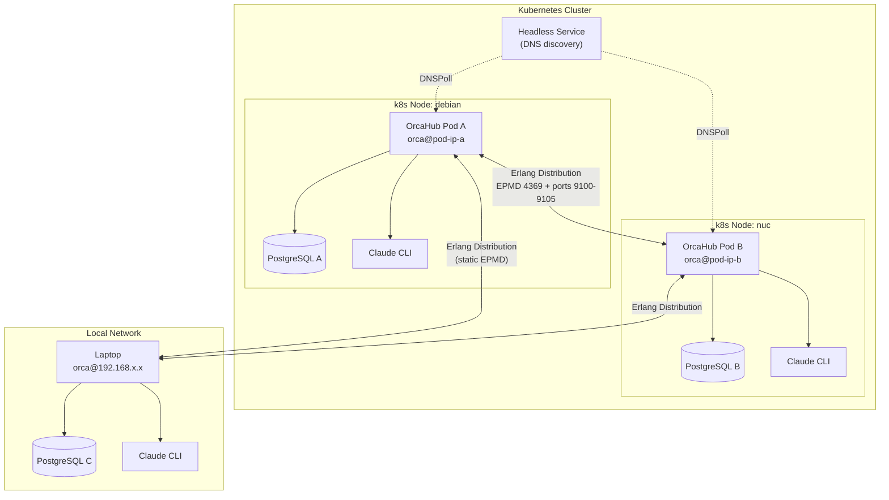
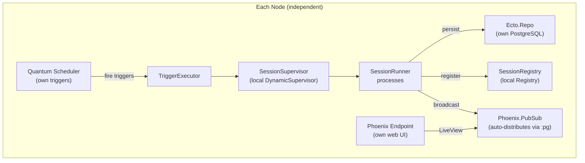
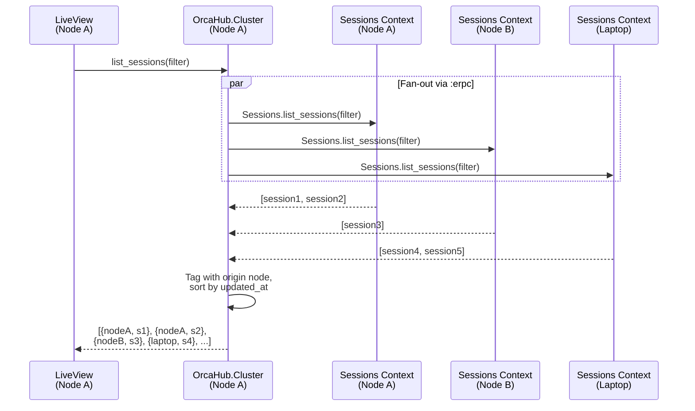
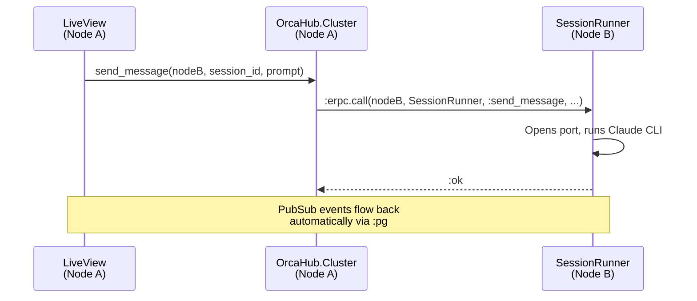
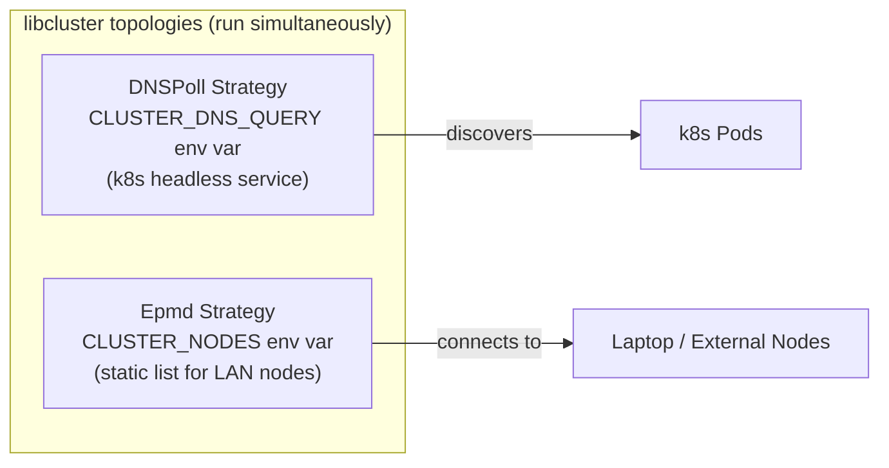

# Clustering Architecture

OrcaHub nodes connect via Erlang distribution. Each node keeps its own database,
registry, and supervisors. Cross-node visibility comes through `OrcaHub.Cluster`
which fans out queries via `:erpc` and routes actions to the owning node.

## Multi-Node Topology

## Per-Node Architecture (unchanged)

## Cross-Node Query Flow

## Cross-Node Action Routing

## Discovery Strategies

