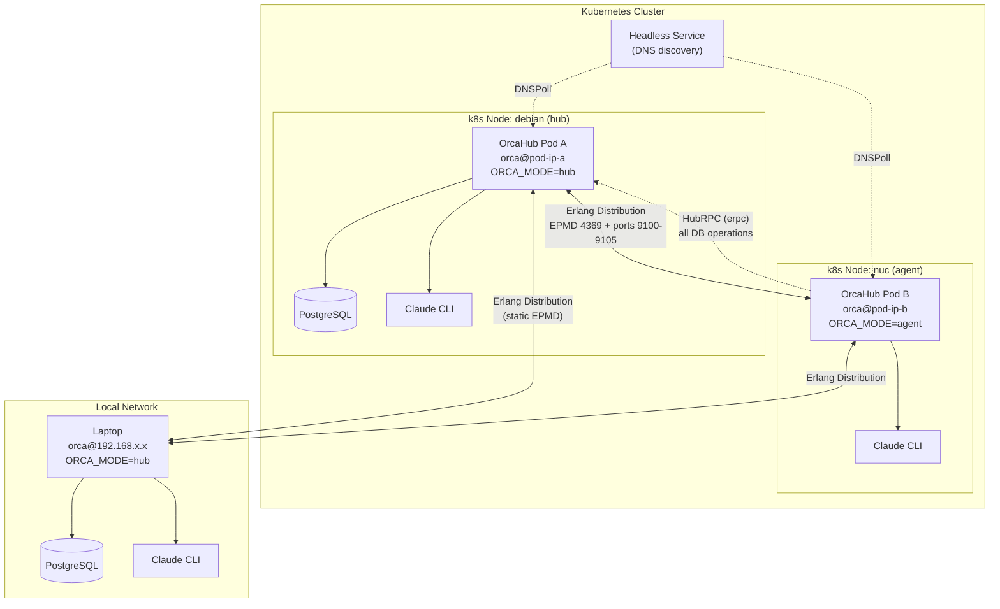
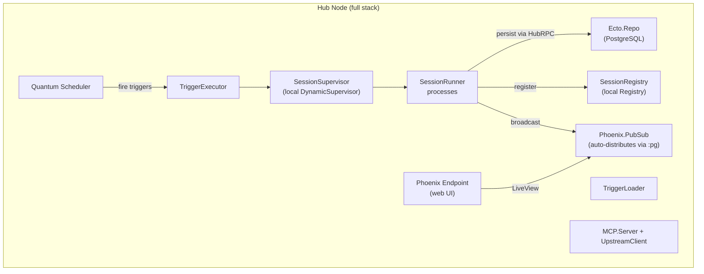
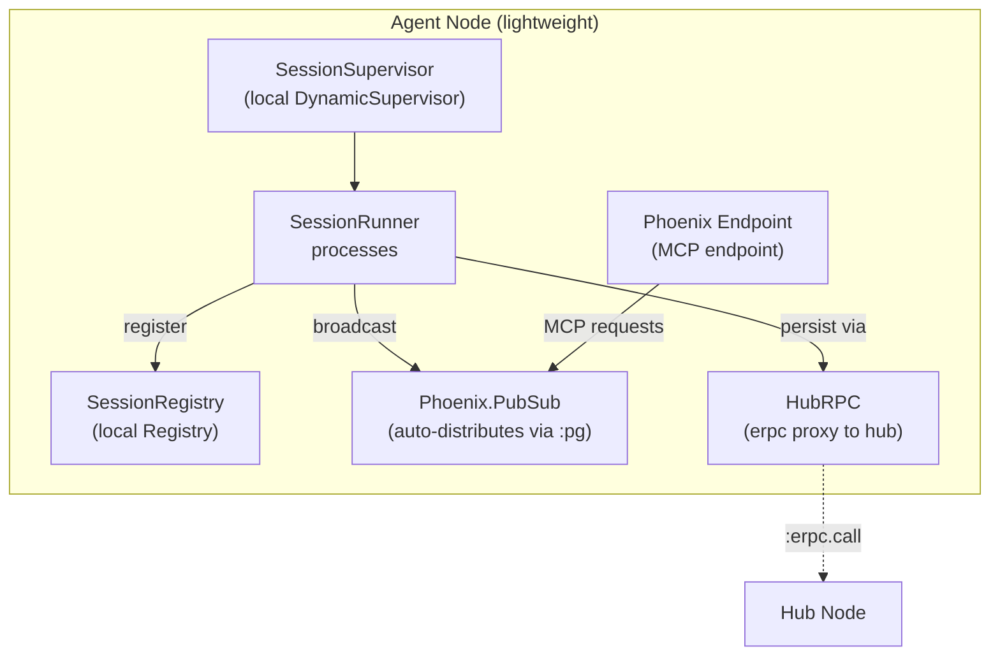
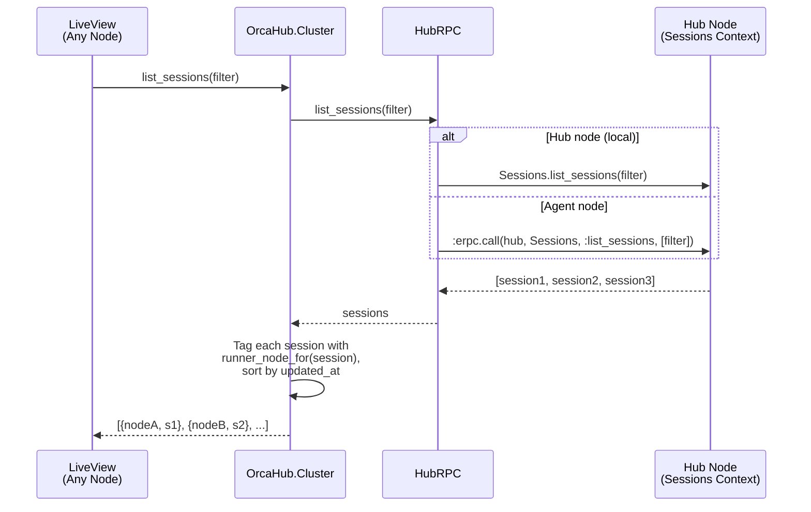
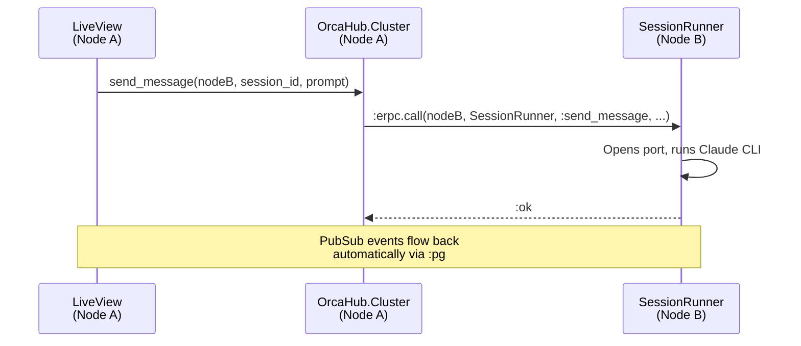
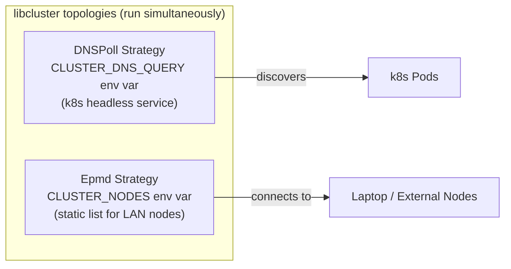

# Clustering Architecture

OrcaHub supports a **hub + agent** topology. One hub node owns the database
and runs the full stack (scheduler, triggers, web UI). Agent nodes are
lightweight — they run SessionRunner processes and forward all database
operations to the hub via `HubRPC` (which uses `:erpc` under the hood).

The mode is set via `ORCA_MODE=agent` (default: `hub`). `OrcaHub.Mode`
exposes `hub?()` / `agent?()` and discovers the hub node at runtime.

## Hub + Agent Topology

## Hub Node Architecture

## Agent Node Architecture

## Query Flow (Hub + Agent)

## Cross-Node Action Routing

## Hub vs Agent: Component Comparison

| Component | Hub | Agent | Notes |
|-----------|-----|-------|-------|
| **Ecto.Repo (PostgreSQL)** | Yes | No | Agent proxies all DB ops via HubRPC |
| **Phoenix Endpoint** | Full web UI | MCP endpoint only | Agent needs HTTP for MCP |
| **Telemetry** | Yes | No | |
| **SessionSupervisor** | Yes | Yes | Both nodes run agent-CLI sessions |
| **SessionRegistry** | Yes | Yes | Local registry per node |
| **SessionResumer** | Yes | Yes | Resumes sessions orphaned in `status: "running"` on boot |
| **SessionHeartbeat** | Yes | No | Hub-only scheduled heartbeat messages into sessions |
| **Streaming.WarmPool** | Yes | Yes | Per-node warm-port admission control (streaming engine) |
| **TerminalSupervisor** | Yes | Yes | Both nodes run terminal PTYs |
| **TerminalRegistry** | Yes | Yes | Local registry per node |
| **SessionViewersRegistry** | Yes | Yes | Tracks live viewers per session, local (`:duplicate` keys) |
| **LoginSupervisor** | Yes | Yes | Both nodes can drive backend login flows |
| **BackendInstallerSupervisor** + Registry | Yes | Yes | Both nodes install/upgrade backend CLIs locally |
| **Backend.Cache** | Yes | Yes | Local cache of backend capability/model lookups |
| **MCPSupervisor** | Yes | Yes | Per-session MCP servers |
| **MCP.CodeExec.Generator** / **BindingStore** | Yes | Yes | Code-exec tool surface generated + bound locally |
| **MCP.UpstreamClient** | Yes | No | Upstream MCP connections hub-only |
| **Quantum Scheduler** | Yes | No | Cron triggers fire on hub only |
| **TriggerLoader** | Yes | No | Syncs triggers into scheduler on boot |
| **ClusterNodeTracker** | Yes | No | Tracks node connect/disconnect into the `nodes` table |
| **PubSub** | Yes | Yes | Auto-distributes via `:pg` |
| **Task.Supervisor** | Yes | Yes | Async work (title gen, archival) |
| **libcluster** | Yes | Yes | Both participate in discovery |
| **AgentPresence** | Cleanup on boot | Write only | Hub cleans stale `.agents/` files |
| **Discord.Bot** | env-gated | env-gated | Gated by `DISCORD_BOT`/token, not by hub/agent mode |

### Key Modules

- **`OrcaHub.Mode`**: Returns `:hub` or `:agent` based on `ORCA_MODE` env var (default: `:hub`). `hub_node/0` returns self on hub, discovers hub via `:erpc` on agent.
- **`OrcaHub.HubRPC`**: Transparent proxy — calls locally on hub, forwards via `:erpc.call/5` on agent. Wraps all context modules (Sessions, Projects, Issues, Triggers, Terminals).
- **`OrcaHub.Cluster`**: Routing layer used by LiveViews and other callers. Queries go through HubRPC (single DB), actions route to the correct runner node via `rpc/5`.

### Node Routing

All entities are routed to their owning node through two fields:

- **Sessions/Terminals**: `runner_node` field (string) on the record itself. Resolved by `Cluster.runner_node_for/1`.
- **Projects/Issues/Triggers**: `node` field on the associated project. Resolved by `Cluster.project_node_for/1`. Triggers inherit routing from their project (`trigger → project → project.node`).

If the stored node is not in the current cluster, routing falls back to the local node.

### What Agents Cannot Do

Agent nodes are intentionally limited:

- **No direct DB access** — all reads/writes go through HubRPC to the hub
- **No trigger scheduling** — cron jobs only fire on the hub (but execution routes to the correct agent)
- **No upstream MCP connections** — `MCP.UpstreamClient` is hub-only
- **No web UI** — the Endpoint runs but only serves the MCP HTTP endpoint for Claude CLI
- **No agent presence cleanup** — hub handles stale `.agents/` file cleanup on boot

## Per-Node Policy

Beyond routing, each Erlang node has an optional policy row in the `nodes`
table (`OrcaHub.ClusterNodes.ClusterNode`, `lib/orca_hub/cluster_nodes/cluster_node.ex`):
`name` (Erlang node name), `display_name`, `first_connected_at`/
`last_connected_at`, `isolated`, `scrub_session_env`, `env_allowlist`,
`default_backend`, `default_model`. `OrcaHub.ClusterNodeTracker` (hub only,
`lib/orca_hub/cluster_node_tracker.ex`) is a GenServer that monitors
`:net_kernel` up/down events and upserts rows into this table, backing the
`/nodes` UI (`NodeLive`).

`OrcaHub.NodePolicy` (`lib/orca_hub/node_policy.ex`) resolves this policy at
the point of use, and fails safe in different directions depending on the
stakes:

- **`isolated`** — checked at cross-node tool-call time; an isolated node is
  blocked from *initiating* messaging/inspecting/spawning/discovering
  sessions on other nodes (inbound traffic to it is unaffected). Fails
  **open** (allowed) if the policy lookup itself fails.
- **`scrub_session_env`** — when true, sessions/terminals spawned on that
  node get `OrcaHub.Env.strict_env/1` (allow-list only) instead of the
  default `OrcaHub.Env.sanitized_env/1`. Also fails **open**.
- **`env_allowlist`** — extra environment variables let through on top of
  the strict base list when scrubbing is on. `NodePolicy.extra_env_allowlist/1`
  merges the node's `env_allowlist` with the owning **project's**
  `env_allowlist` (`lib/orca_hub/projects/project.ex`) as a deduped union —
  neither list takes precedence over the other, both are purely additive.
  This one fails **closed** (`[]`) on lookup error, since narrowing the
  allow-list is the safe direction.
- **`default_backend` / `default_model`** — *not* resolved by `NodePolicy`.
  Applied in `OrcaHub.Sessions.create_session/1`: the node's
  `default_backend` fills an unset `backend` attr, and `default_model` only
  fills `model` when the effective backend matches the node's
  `default_backend` (or none was explicitly requested) — an atomic
  backend+model pairing so a node's default model is never applied to a
  different backend.

## Discovery Strategies

