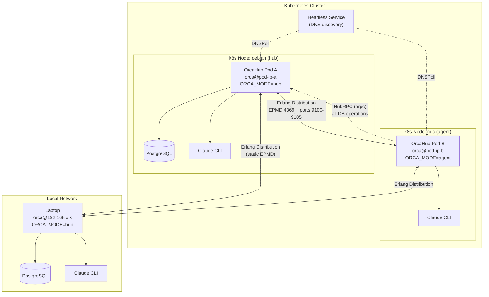
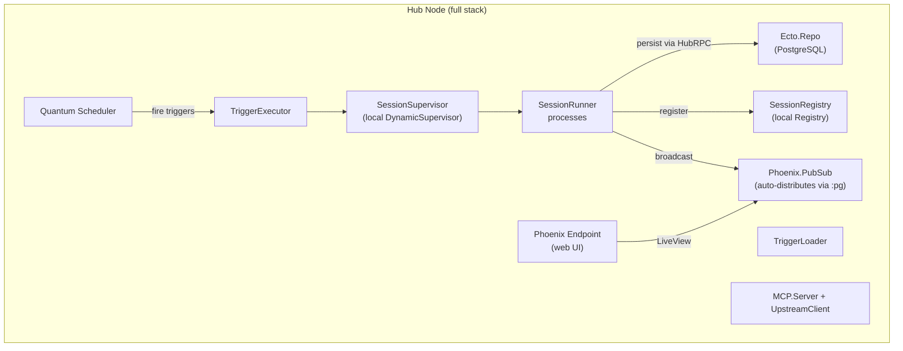
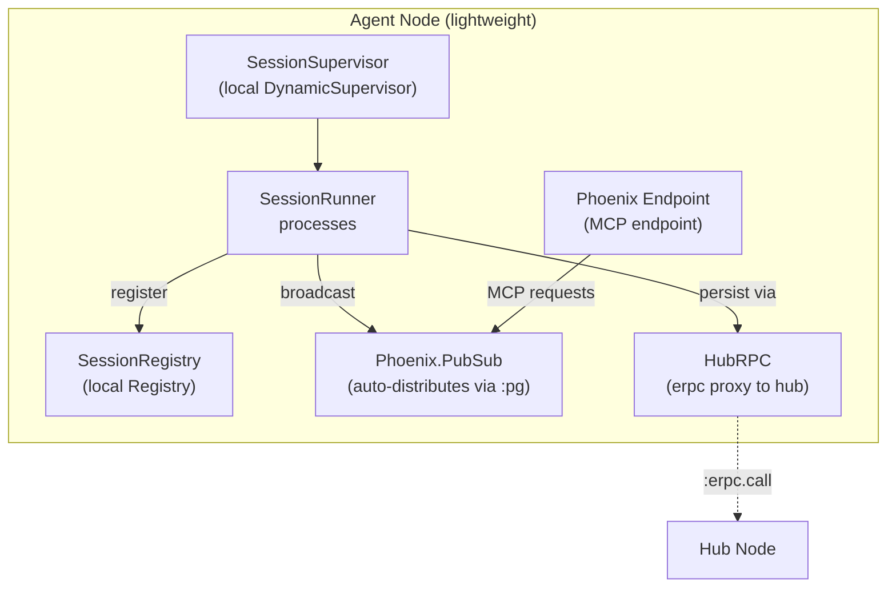
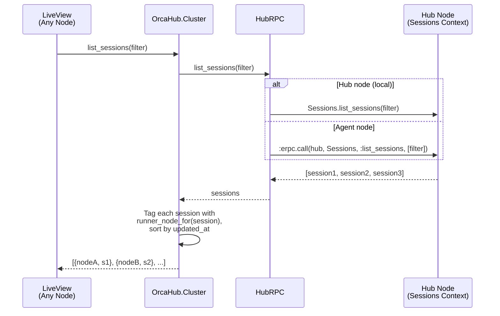
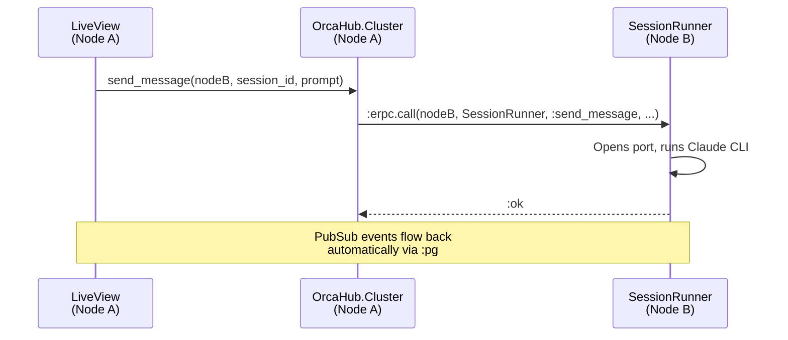
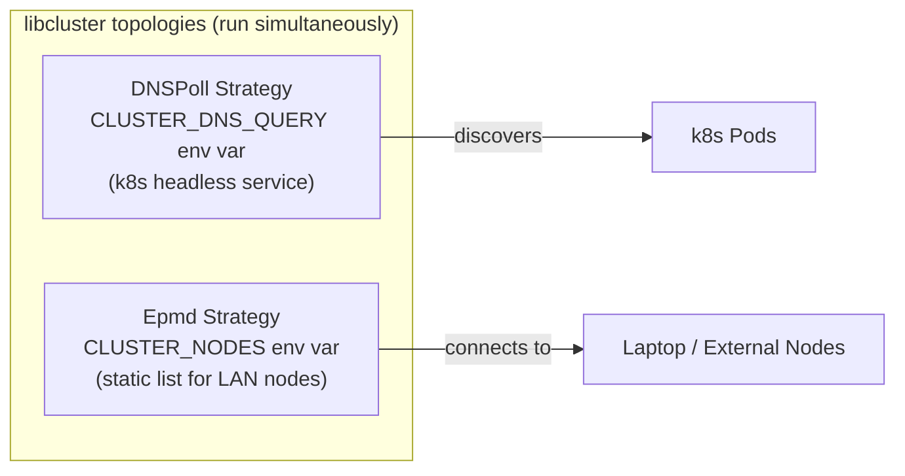

# Clustering Architecture

OrcaHub supports a **hub + agent** topology. One hub node owns the database
and runs the full stack (scheduler, triggers, web UI). Agent nodes are
lightweight — they run SessionRunner processes and forward all database
operations to the hub via `HubRPC` (which uses `:erpc` under the hood).

The mode is set via `ORCA_MODE=agent` (default: `hub`). `OrcaHub.Mode`
exposes `hub?()` / `agent?()` and discovers the hub node at runtime.

## Hub + Agent Topology

## Hub Node Architecture

## Agent Node Architecture

## Query Flow (Hub + Agent)

## Cross-Node Action Routing

## Discovery Strategies

