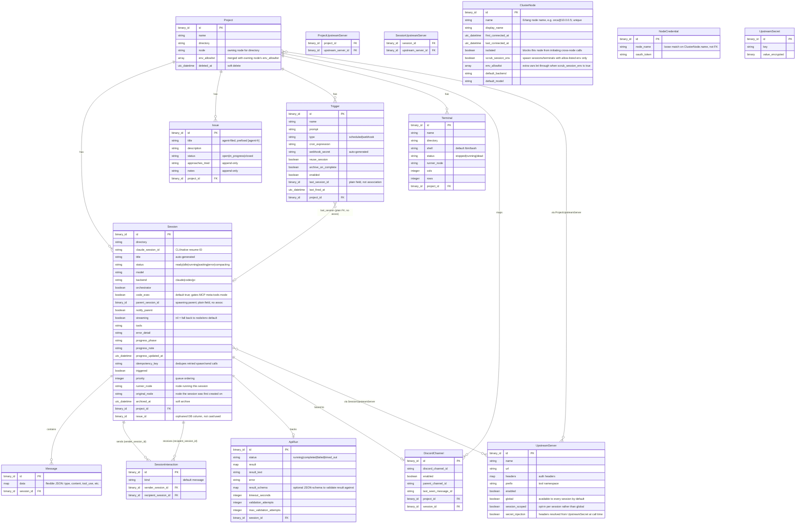

# Data Model

## Notes

- **Issue is now the agent-filed feature-request backlog, not a "worked by sessions" concept.** The full Issues feature (UI, routes, session linkage) was removed in commit `3ebb3fe`; the schema was minimally reintroduced to back `OrcaHub.MCP.Tools.FeatureRequests`, an MCP tool agents use to file/list/annotate/close platform-friction reports (titles prefixed `[agent-fr] `, deduped by title similarity). `Session` no longer has an `issue_id` association or cast — the `issue_id` column still exists on the `sessions` table (from the original migration) but is dead weight, not read or written by the schema.
- **`ClusterNode` (`nodes` table), `NodeCredential`, and `UpstreamSecret` are not linked by Ecto foreign keys** to the entities above — they're matched by name string (`ClusterNode.name` against `Session.runner_node` / `Project.node`; `NodeCredential.node_name` against `ClusterNode.name`), not `belongs_to`/`references`. They're drawn standalone in the diagram for that reason.
- **`SessionInteraction`** captures direct session→session messaging edges (e.g. via `send_message_to_session`), distinct from `Session.parent_session_id`, which captures spawn/parent-child lineage instead.
- **`env_allowlist`** on both `Project` and `ClusterNode` are unioned (deduped), not one overriding the other — see `.context/clustering.md`.
- Full Issues feature history and the current feature-request tool surface: `OrcaHub.MCP.Tools.FeatureRequests` (`lib/orca_hub/mcp/tools/feature_requests.ex`).
