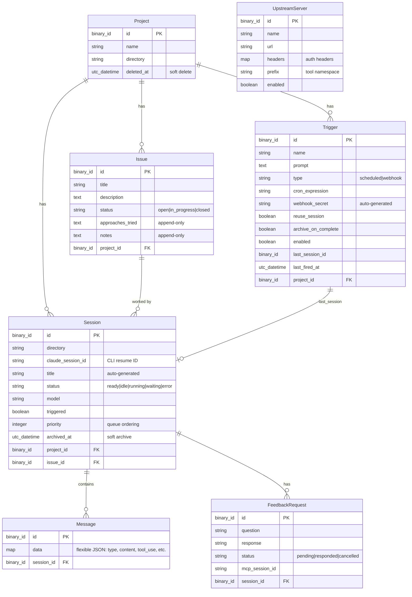

# Data Model

```mermaid
erDiagram
    Project ||--o{ Session : has
    Project ||--o{ Issue : has
    Project ||--o{ Trigger : has
    Issue ||--o{ Session : "worked by"
    Session ||--o{ Message : contains
    Session ||--o{ FeedbackRequest : has
    Trigger ||--o| Session : "last_session"

    Project {
        binary_id id PK
        string name
        string directory
        utc_datetime deleted_at "soft delete"
    }

    Session {
        binary_id id PK
        string directory
        string claude_session_id "CLI resume ID"
        string title "auto-generated"
        string status "ready|idle|running|waiting|error"
        string model
        boolean triggered
        integer priority "queue ordering"
        utc_datetime archived_at "soft archive"
        binary_id project_id FK
        binary_id issue_id FK
    }

    Message {
        binary_id id PK
        map data "flexible JSON: type, content, tool_use, etc."
        binary_id session_id FK
    }

    Issue {
        binary_id id PK
        string title
        text description
        string status "open|in_progress|closed"
        text approaches_tried "append-only"
        text notes "append-only"
        binary_id project_id FK
    }

    FeedbackRequest {
        binary_id id PK
        string question
        string response
        string status "pending|responded|cancelled"
        string mcp_session_id
        binary_id session_id FK
    }

    Trigger {
        binary_id id PK
        string name
        text prompt
        string type "scheduled|webhook"
        string cron_expression
        string webhook_secret "auto-generated"
        boolean reuse_session
        boolean archive_on_complete
        boolean enabled
        binary_id last_session_id
        utc_datetime last_fired_at
        binary_id project_id FK
    }

    UpstreamServer {
        binary_id id PK
        string name
        string url
        map headers "auth headers"
        string prefix "tool namespace"
        boolean enabled
    }
```
