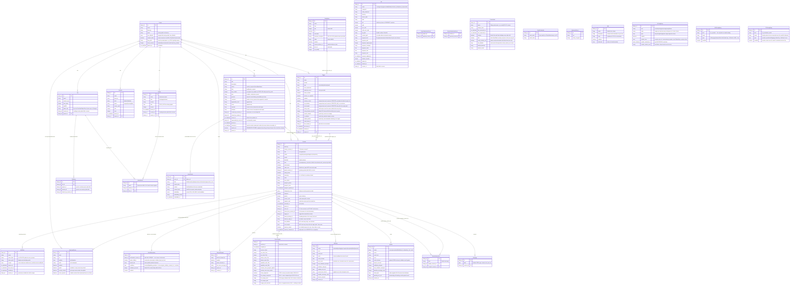

# Data Model

```mermaid
erDiagram
    Project ||--o{ Session : has
    Project ||--o{ Issue : has
    Project ||--o{ Trigger : has
    Project ||--o{ Terminal : has
    Project ||--o{ Artifact : has
    Project ||--o{ File : has
    Project ||--o{ DiscordChannel : maps
    Project }o--o{ UpstreamServer : "via ProjectUpstreamServer"

    Session ||--o{ Message : contains
    Session ||--o{ SessionInteraction : "sends (sender_session_id)"
    Session ||--o{ SessionInteraction : "receives (recipient_session_id)"
    Session ||--o| ApiRun : backs
    Session ||--o{ A2ATask : "one per message/send turn"
    Session ||--o| DiscordChannel : "bound to"
    Session }o--o{ UpstreamServer : "via SessionUpstreamServer"

    Session ||--o{ ChurnSample : "sampled every 120s while running"
    Session ||--o| AlertSubscription : "watches, as orchestrator"
    Session ||--o{ ApiToken : "optionally pinned to"

    File ||--o{ FileShare : "explicitly shared with"
    File ||--o{ ArtifactAsset : "referenced as"
    Artifact ||--o{ ArtifactAsset : "serves at /assets/:name"

    Issue ||--o{ IssueChunk : "embeddable slices of its text"
    Issue }o--o{ Session : "attempts (session.issue_id, real FK)"
    Trigger }o--o| Session : "last_session (plain FK, no assoc)"
    Trigger ||--o{ Session : "spawned (session.trigger_id)"
    EmailInbox ||--o{ Trigger : "polled for (email_inbox_id)"

    Project {
        binary_id id PK
        string name
        string directory
        string node "owning node for directory"
        array env_allowlist "merged with owning node's env_allowlist"
        boolean commit_trailer "instruct sessions to add the OrcaHub-Session trailer"
        string key_prefix "issue-key namespace, e.g. ORCA; globally unique"
        integer issue_counter "atomically incremented to mint Issue.key_number"
        utc_datetime deleted_at "soft delete"
    }

    Session {
        binary_id id PK
        string directory
        string claude_session_id "CLI/native resume ID"
        string title "auto-generated"
        string status "ready|idle|running|waiting|error|compacting"
        string model
        string backend "claude|codex|pi"
        string kind "session|memory_extraction; hidden from index/search_sessions by default"
        boolean orchestrator
        boolean code_exec "default true; gates MCP meta-tools mode"
        binary_id parent_session_id "spawning parent; plain field, no assoc"
        boolean notify_parent
        boolean streaming "nil = fall back to node/env default"
        string tools
        string error_detail
        string progress_phase
        string progress_note
        utc_datetime progress_updated_at
        string idempotency_key "dedupes retried spawn/send calls"
        boolean triggered
        integer priority "queue ordering"
        string runner_node "node running this session"
        string original_node "node the session was first created on"
        utc_datetime archived_at "soft archive"
        binary_id project_id FK
        binary_id issue_id "FK: this session is an ATTEMPT at that issue"
        binary_id forked_from_session_id "pi fork parent; the fork discriminant"
        binary_id trigger_id "trigger that created this session"
        string email_message_id "threading headers of the email that fired it"
        string email_in_reply_to "recorded, not yet read back"
        array tool_allowlist "MCP tools only; nil/[] = no restriction"
        array tool_denylist "MCP tools only; deny-all is the single glob *; deny wins"
        boolean memory_extract "nil = default scope rule, true = force, false = never"
        utc_datetime memory_extracted_at "watermark, set at DISPATCH not completion"
    }

    Message {
        binary_id id PK
        map data "flexible JSON: type, content, tool_use, etc."
        binary_id session_id FK
    }

    Issue {
        binary_id id PK
        string title
        string description
        string status "open|in_progress|closed|abandoned"
        string kind "task|feature_request"
        integer key_number "per-project seq; renders as ORCA-142 with project.key_prefix"
        string plan "mutable, orchestrator-owned"
        string premise "why this is worth doing; amendable post-close"
        string resolution "written at close; preserve-then-append on amend"
        string approaches_tried "append-only"
        string notes "append-only"
        array commits "frozen at close; derived live while open"
        array attempts "frozen at close; live projection while open"
        binary_id created_by_session_id "provenance, not an attempt link"
        binary_id closed_by_session_id
        utc_datetime closed_at "distinct from updated_at"
        binary_id superseded_by_issue_id "not cleared by reopen"
        utc_datetime pinned_at
        utc_datetime indexed_at "pgvector reindex watermark; written by Issues.Indexer via update_all"
        tsvector search_tsv "GENERATED STORED, weighted; lexical leg of Issues.Search. Not in the Ecto schema"
        binary_id project_id FK
    }

    IssueChunk {
        binary_id id PK
        binary_id issue_id FK "delete_all"
        string field "title|description|plan|premise|resolution|notes|approaches_tried"
        integer chunk_index
        string content "field-labelled text that was embedded"
        string content_hash "sha256 of content; reindex skip key"
        vector embedding "vector(1024), NULLABLE until embedded"
        string embedding_model
        utc_datetime embedded_at
    }

    Trigger {
        binary_id id PK
        string name
        string prompt
        string type "scheduled|webhook|email"
        string cron_expression
        string webhook_secret "auto-generated"
        boolean reuse_session
        boolean archive_on_complete
        boolean enabled
        boolean memory_extract "stamped onto each session it CREATES; overrides the default scope rule"
        array tool_allowlist "stamped onto each session it CREATES; nil/[] = no restriction"
        array tool_denylist "stamped onto each session it CREATES; deny-all is the single glob *"
        string setup_script "shell script run on the runner node before every firing"
        integer setup_timeout_seconds "default 120; timeout kills the whole process group"
        array sender_allowlist "email only; must be non-empty"
        string to_address "email only; optional recipient routing"
        string subject_pattern "email only; case-insensitive substring, not a regex"
        binary_id email_inbox_id FK
        binary_id last_session_id "plain field, not association"
        utc_datetime last_fired_at
        utc_datetime pinned_at
        binary_id project_id FK
    }

    EmailInbox {
        binary_id id PK
        string name
        string host
        integer port "default 993"
        boolean tls
        string username
        binary password_encrypted "AES-256-GCM; plaintext never persisted"
        string folder "default INBOX"
        boolean enabled
        string trusted_authserv_id "optional authserv-id pin"
        integer last_uid "watermark"
        integer uid_validity
    }

    Terminal {
        binary_id id PK
        string name
        string directory
        string shell "default /bin/bash"
        string status "stopped|running|dead"
        string runner_node
        integer cols
        integer rows
        utc_datetime pinned_at
        binary_id project_id FK
    }

    ApiRun {
        binary_id id PK
        string status "running|completed|failed|timed_out|awaiting_tool_result"
        map result
        string result_text
        string error
        map result_schema "optional JSON-schema to validate result against"
        integer timeout_seconds
        integer validation_attempts
        integer max_validation_attempts
        integer baseline_message_count
        array client_tools "caller-supplied AG-UI frontend tool definitions"
        map pending_tool_call "outstanding call awaiting a caller-posted result"
        binary_id session_id FK
    }

    A2ATask {
        binary_id id PK
        string status "submitted|working|input-required|completed|failed|canceled"
        string error
        string result_text
        map result "schema-validated structured result"
        map result_schema
        array client_tools "declared once, inherited across the conversation"
        integer max_validation_attempts
        integer validation_attempts
        map pending_tool_call
        array issued_tool_call_ids "append-only; backs idempotent acks"
        integer baseline_message_count
        integer timeout_seconds
        binary_id session_id FK
    }

    Job {
        binary_id id PK
        string status "running|verifying|succeeded|failed|verification_failed|timed_out|cancelled"
        string command
        string verify_command
        string directory
        string runner_node
        string label
        integer pid "whichever phase is CURRENTLY watched"
        integer pgid
        integer exit_code
        integer verify_exit_code
        string log_path "durable, outlives OrcaHub"
        string sentinel_path "exit code written via atomic rename"
        string progress_kind "file_bytes|command; declared by the job, never inferred"
        string progress_path
        integer progress_expect_bytes
        string progress_command
        float progress_value
        float progress_total
        string progress_note
        utc_datetime progress_updated_at
        integer timeout_seconds
        utc_datetime started_at
        utc_datetime finished_at
        binary_id session_id "plain field, no assoc"
    }

    Artifact {
        binary_id id PK
        string name "unique per project"
        string kind "html|svg|markdown"
        string content
        map data "ORCA_DATA live-data payload"
        integer version
        utc_datetime pinned_at
        binary_id session_id "creating session; plain field, no assoc"
        binary_id project_id FK
    }

    File {
        binary_id id PK
        string name
        string content_type
        integer size_bytes
        string sha256
        string object_key "key into OrcaHub.ObjectStore; bytes never in Postgres"
        binary_id session_id "creating session; plain field, no assoc"
        binary_id project_id FK
    }

    FileShare {
        binary_id id PK
        binary_id file_id FK
        binary_id project_id "grant to a whole project; plain field"
        binary_id session_id "grant to one session; plain field"
        binary_id shared_by_session_id
    }

    ArtifactAsset {
        binary_id id PK
        string name "unique per artifact; the /assets/:name segment"
        binary_id artifact_id FK
        binary_id file_id FK
    }

    DiscordChannel {
        binary_id id PK
        string discord_channel_id
        boolean enabled
        string parent_channel_id
        string last_seen_message_id
        binary_id project_id FK
        binary_id session_id FK
    }

    SessionInteraction {
        binary_id id PK
        string kind "default message"
        binary_id sender_session_id FK
        binary_id recipient_session_id FK
    }

    ChurnSample {
        binary_id id PK
        binary_id session_id "plain field, no assoc"
        utc_datetime sampled_at
        string session_status
        integer tool_calls_15m
        integer tool_calls_30m
        integer distinct_tools_15m
        integer distinct_tools_30m
        float repetition_ratio_15m
        float repetition_ratio_30m
        integer minutes_since_progress_update
        integer minutes_since_last_commit
        boolean churn_suspected "VOID on every row written before 2026-09-19"
        boolean file_surgery_suspected "NULL = never computed (pre-2026-09-19 row)"
        string file_surgery_kind "FileSurgery evidence kind; NULL when no detection"
        string file_surgery_path
        string surgery_alert_decision "alert, or suppress:reason; NULL = nothing to decide"
    }

    AlertSubscription {
        binary_id id PK
        binary_id orchestrator_session_id "plain field; UNIQUE — one row per orchestrator"
        boolean watch_children "resolve the orchestrator's children fresh each tick"
        array session_ids "extra explicitly-watched sessions"
        map conditions "churn|stall|pending_question => true; progress_stale|no_commit_for => minutes"
        integer cooldown_seconds "default 900; re-alert delay while still true"
        boolean enabled
    }

    ApiToken {
        binary_id id PK
        string name
        binary token_hash "raw SHA-256; plaintext never persisted"
        string token_prefix "display-only identifying prefix"
        array scopes "runs:create|runs:read|runs:tool_result|sessions:read|tts|a2a"
        utc_datetime expires_at
        utc_datetime last_used_at
        utc_datetime revoked_at
        binary_id session_id FK "optional pin; forbids the tts/a2a scopes"
    }

    UpstreamServer {
        binary_id id PK
        string name
        string url
        map headers "auth headers"
        string prefix "tool namespace"
        boolean enabled
        boolean global "available to every session by default"
        boolean session_scoped "opt-in per session rather than global"
        boolean secret_injection "headers resolved from UpstreamSecret at call time"
    }

    ProjectUpstreamServer {
        binary_id project_id FK
        binary_id upstream_server_id FK
    }

    SessionUpstreamServer {
        binary_id session_id FK
        binary_id upstream_server_id FK
    }

    ClusterNode {
        binary_id id PK
        string name "Erlang node name, e.g. orca@10.0.0.5; unique"
        string display_name
        utc_datetime first_connected_at
        utc_datetime last_connected_at
        boolean isolated "blocks this node from initiating cross-node calls"
        boolean dial "hub's NodeDialer actively connects to this row every 5s"
        boolean scrub_session_env "spawn sessions/terminals with allow-listed env only"
        array env_allowlist "extra vars let through when scrub_session_env is true"
        string default_backend
        string default_model
    }

    NodeCredential {
        binary_id id PK
        string node_name "loose match on ClusterNode.name, not FK"
        string oauth_token
    }

    UpstreamSecret {
        binary_id id PK
        string key
        binary value_encrypted
    }

    Skill {
        binary_id id PK
        string name "kebab-case, unique"
        string description "rendered into frontmatter at sync time"
        string body "markdown AFTER the frontmatter"
        boolean enabled
        array backends "subset of claude|codex|pi"
    }

    PiConfigEntry {
        binary_id id PK
        string kind "provider|setting|extension|prompt|theme"
        string name "unique per kind; becomes a filename for 3 of the 5 kinds"
        map spec "deep-stringified payload; shape depends on kind"
        boolean enabled
        map models_from "provider only; nil = hand-authored models, else PiModelSync resolves them"
        naive_datetime models_refreshed_at "last SUCCESSFUL resolution"
        string models_refresh_error "last failure, cleared on the next success"
    }

    ASRConfigEntry {
        binary_id id PK
        string kind "asr_provider — the only kind; no model catalog"
        string name
        map spec "url/language/timeouts/threshold; blank key = fall back to ASR_* env"
        boolean enabled
    }

    TTSConfigEntry {
        binary_id id PK
        string kind "tts_provider|tts_model"
        string name "literally active for the one provider row; the model id otherwise"
        map spec "provider: provider/url/language, blank key = fall back to env"
        boolean enabled "provider: whole row off; model: the default-selection flag"
    }
```

## Notes

- **Issue is a durable work item again, not just the feature-request backlog.** The original feature was removed in `3ebb3fe` and minimally reintroduced to back an agent-filed feature-request tool; it has since been rebuilt to the full model in `issues_spec.md` (`a3c3fa6`, `934ff26`, `62c1d93`), with `/issues` UI routes restored. The old `[agent-fr] ` title-prefix hack is gone — a platform-friction report is now just `kind: "feature_request"` alongside `kind: "task"`. Per-project short keys (`Project.key_prefix` + `Issue.key_number`, e.g. `ORCA-142`) are minted by an atomic counter increment on the project. `commits`/`attempts` are FROZEN snapshots written only at close (`Issues.derive_commits/1` / `derive_attempt_summary/1`) and cleared on reopen — while an issue is open both are `[]` and the live projections are used instead. `Session.issue_id` is live again (a real FK, `on_delete: :nilify_all`), linking a session as an ATTEMPT at one issue; an issue accumulates many attempts over its lifetime.
- **`ClusterNode` (`nodes` table), `NodeCredential`, `UpstreamSecret`, `Skill`, `PiConfigEntry`, `TTSConfigEntry`, and `ASRConfigEntry` are not linked by Ecto foreign keys** to the entities above — the first three are matched by name string (`ClusterNode.name` against `Session.runner_node` / `Project.node`; `NodeCredential.node_name` against `ClusterNode.name`), and `Skill`/`PiConfigEntry` are global hub-managed config fanned out to every node's disk by `SkillSync`/`PiConfigSync` (see `.context/supervision-tree.md`). They're drawn standalone in the diagram for that reason. `TTSConfigEntry` borrows `PiConfigEntry`'s exact `kind`/`name`/`spec`/`enabled` shape but is never materialized to disk — `OrcaHub.TTSConfig.resolve/0` reads it at request time in `TTSController`, and any blank/absent `spec` key falls back to that one field's env var, so a partially-filled row is legitimate. `ASRConfigEntry` (`asr_config_entries`, `OrcaHub.ASRConfig`) is the voice-mode sibling of that pattern — same four columns, same PER-FIELD "DB else `ASR_*` env else hardcoded" resolution on every ASR call, but only ONE kind (`asr_provider`): the GB10 sync lane is pinned to `large-v3-turbo`, so there is no model catalog to choose from. Its own table rather than a shared one, and deliberately unseeded, so an empty table means "use the env vars", not "transcription is unconfigured". See `.context/voice-mode.md`.
- **`File` / `FileShare` / `ArtifactAsset` are the cross-node file store** (`OrcaHub.Files`, see `.context/architecture.md`). Metadata lives in Postgres; the bytes live behind `OrcaHub.ObjectStore` under `object_key` and never enter the DB. Visibility is creator + same project + an explicit `FileShare`; deleting is narrower (creator or same project only — a share never grants delete rights). One `FileShare` grants to EXACTLY ONE of a session or a project, and both columns are plain fields rather than FKs so a later session/project deletion never needs to touch the table. `ArtifactAsset` is the opposite — both sides are real FKs that cascade, since the row is meaningless once either side is gone.
- **`Job` is deliberately association-free**: `session_id` is a plain field, and `runner_node`/`directory` pin it to the node that launched it. The row is a durable record of a DETACHED OS process that outlives the session, the runner, and OrcaHub itself — see `OrcaHub.Jobs`. `progress_kind` and friends are declared (and re-declarable mid-flight) BY the job; OrcaHub never infers a progress metric and never adjudicates "stalled", it only surfaces `progress_updated_at` age.
- **`SessionInteraction`** captures direct session→session messaging edges (e.g. via `send_message_to_session`), distinct from `Session.parent_session_id`, which captures spawn/parent-child lineage instead — except an orchestrator-spawns-orchestrator handoff (`start_session` with `orchestrator: true`), which links the new session as the caller's SIBLING (not a child) and instead records a `kind: "handoff"` `SessionInteraction` so that spawn edge isn't lost.
- **`PiConfigEntry.models_from` is opt-in dynamic model resolution** for `kind: "provider"` rows, consumed by `OrcaHub.PiModelSync` (hub-only, hourly): it refreshes that row's `models` array from the gateway's `/v1/models`. It is a COLUMN rather than a `spec` key on purpose — `spec` is written verbatim into every node's `~/.pi/agent/models.json`, so anything stashed there would be clutter pi never reads and one more field for its schema validation to trip over. `nil` (the default, and what every pre-existing row keeps) means "not managed": the hand-authored list is left alone. `models_refreshed_at`/`models_refresh_error` are the only way an operator sees a gateway that has been unreachable for a week, since the never-write-an-empty-list rule makes that failure silent on disk. `PiModelSync` only ever REFRESHES existing provider rows — it never creates one, so deleting every provider leaves an empty `models.json` and an empty model picker.
- **`env_allowlist`** on both `Project` and `ClusterNode` are unioned (deduped), not one overriding the other — see `.context/clustering.md`.
- **`pinned_at` is the same sort-to-top affordance on four entities** — `Artifact`, `Issue`, `Terminal`, `Trigger` — surfaced by the shared `OrcaHubWeb.GroupedIndex` component their index pages all render through. It is presentation state only; nothing in the runtime reads it.
- **`ApiRun` and `A2ATask` carry a deliberately parallel column set** (`client_tools`, `result_schema`, `max_validation_attempts`, `validation_attempts`, `pending_tool_call`, `result`) — two transports over one mechanism, mediated by `OrcaHub.MCP.ToolCallHolder` (`ApiRunHolder` / `A2ATaskHolder`). The difference is scope: an `ApiRun`'s tools are declared per run, while an `A2ATask` inherits them copy-forward from the first task in its conversation (one session == one A2A `contextId`).
- **`ChurnSample` and `AlertSubscription` are the two halves of worker-churn observability**, and both use plain `session_id`/`orchestrator_session_id` fields rather than FKs. `OrcaHub.ChurnSampler` (hub-only) samples every non-archived `running` session every 120s into `churn_samples` — a time series read by Grafana via the `[:orca_hub, :churn, :sample]` telemetry event, never by the agent-facing tools. The same sweep prunes samples older than 14 days, so the table is bounded rather than append-forever. `alert_subscriptions` is the opt-in watch an orchestrator configures with `set_worker_alerts`: ONE row per orchestrator (unique index, upserted in place like a heartbeat), DB-persisted deliberately so the watch survives a deploy. `OrcaHub.ChurnSampler.AlertEvaluator` runs right after each sampling pass and evaluates the watched set FRESH — `session_ids` plus, when `watch_children`, the orchestrator's current non-archived children — and alerts on a rising edge only, re-alerting no sooner than `cooldown_seconds`. See `OrcaHub.Sessions.Churn` for the heuristic itself.
- **Read `churn_samples.churn_suspected` with the 2026-09-19 discontinuity in mind (ORCAHUB3-66).** Until then the sampler called `Churn.assess/3`, in which `file_surgery` takes its `nil` default, so it NEVER COMPUTED the qualitative half at all: `churn_suspected` was true 0 times in 1,480 samples over weeks in which 229 file-surgery alerts were delivered from the alert path (the only caller that passed evidence). Those rows are "the question was never asked", not "clean". They are identified by `file_surgery_suspected IS NULL` — the column is nullable WITH NO DEFAULT precisely so a backfill can't erase the discontinuity — never by a date filter. Since then the sweep computes evidence with the batched `FileSurgery.fetch_many/2` and also persists `surgery_alert_decision`, what `OrcaHub.Sessions.SurgeryAlertPolicy` would decide about alerting on it (`"alert"`, or `"suppress:<reason>"`, prefix-queryable) — the only durable trace a SUPPRESSED alert leaves anywhere, since the alerts themselves are recorded only as delivered messages. Alerting has a third driver the samples don't gate on: `OrcaHub.Sessions.EditFailure` (ORCAHUB3-63 §1, repeated `Edit`/`Write`/`MultiEdit` failures on one path with no success between), which is deliberately suppressed by nothing — volume, repetition and `SurgeryAlertPolicy` all miss the population it exists to find.
- **`ApiToken` stores only a SHA-256 `token_hash`** — no column and no code path holds the plaintext secret, which is shown once at creation and never again. A token carries explicit `scopes` and may optionally be PINNED to one session via `session_id`; a pinned token is rejected at changeset time if it asks for a scope that takes no session (`tts`, `a2a`). `OrcaHubWeb.Plugs.ApiAuth` tries a scoped token first and falls back, byte-identically, to the legacy global `ORCA_API_TOKEN`, which remains full-access.
- **A `Trigger` points at sessions two different ways**: `last_session_id` is only ever the MOST RECENT session (used for `reuse_session`), whereas `Session.trigger_id` is the full history of every session that trigger has spawned — which is what the trigger show page lists.
- **`IssueChunk` is the pgvector index of an issue's prose** (`issue_chunks`,
  `OrcaHub.Issues.IssueChunk`, produced by `OrcaHub.Issues.Chunker`). Identity is
  `(issue_id, field, chunk_index)` — unique in the DB — so a reindex upserts on
  that key and skips a chunk whose `content_hash` (sha256 of `content`) is
  unchanged. `embedding` is `vector(1024)` (qwen3-embedding-0.6b, the dimension
  is baked into the column type) and **NULLABLE on purpose**: chunking and
  embedding fail independently, so a chunk may exist before or without its
  vector — every search query must filter `not is_nil(embedding)`, since a
  NULL means "not embedded yet", not "no match". In practice
  `OrcaHub.Issues.Indexer`, the only writer, never CREATES such a row: it
  embeds before writing, all-or-nothing, so an embedder outage leaves the
  previous index untouched rather than writing vectorless rows. The column
  stays nullable, and search stays defensive, because a manual fix or a
  future partial-write path may still produce one. An HNSW index with
  `vector_cosine_ops` backs the similarity scan.
  `issues.indexed_at` is the reconciliation watermark
  (`indexed_at is null or updated_at >= indexed_at` — `>=`, because Ecto
  timestamps are second-precision and a write in the same second as the stamp
  would otherwise be invisible forever). It is written ONLY by
  `Indexer.reindex_issue/1`, and only with `Repo.update_all`: stamping it
  through the changeset would bump `updated_at`, so the issue would look
  stale again immediately and be reindexed on every sweep tick. It is
  castable purely so a backfill/repair can set or clear it deliberately. The
  `vector` type only round-trips because `OrcaHub.PostgrexTypes` is wired into
  the Repo via `config :orca_hub, OrcaHub.Repo, types:` — `CREATE EXTENSION
  vector` itself is a manual, one-time step per database (now runnable by the
  database's own owner role since pgvector is `trusted`), not something the
  migration can do (see `priv/repo/migrations/*_enable_pgvector.exs`).
- **`issues.search_tsv` is the lexical half of issue search**, and it is a
  `GENERATED ... STORED` tsvector column with a GIN index, not a
  trigger-maintained one — Postgres maintains it on every insert/update with
  no application code to forget (which required an EXPLICIT `'english'`
  regconfig, since bare `to_tsvector/1` is only STABLE and Postgres rejects
  it in a generated column). Fields are weighted `A` title, `B` description,
  `C` premise/resolution, `D` notes, which `ts_rank/2` then honours. `plan`
  and `approaches_tried` are deliberately NOT in it even though
  `IssueChunk.indexable_fields/0` embeds them: `plan` is rewritten in place
  as understanding develops and `approaches_tried` is a dead-end log, so
  lexical hits there are mostly noise — the semantic leg still covers both.
  The column is deliberately absent from the `Issue` Ecto schema; nothing
  reads it except `OrcaHub.Issues.Search`'s own query fragments, and a
  generated column can never be written.
- Issue tool surface: `OrcaHub.MCP.Tools.Issues` (`lib/orca_hub/mcp/tools/issues.ex`); full design in `issues_spec.md`.
