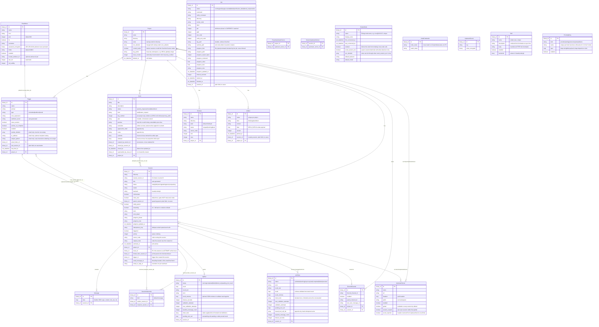

# Data Model

```mermaid
erDiagram
    Project ||--o{ Session : has
    Project ||--o{ Issue : has
    Project ||--o{ Trigger : has
    Project ||--o{ Terminal : has
    Project ||--o{ Artifact : has
    Project ||--o{ DiscordChannel : maps
    Project }o--o{ UpstreamServer : "via ProjectUpstreamServer"

    Session ||--o{ Message : contains
    Session ||--o{ SessionInteraction : "sends (sender_session_id)"
    Session ||--o{ SessionInteraction : "receives (recipient_session_id)"
    Session ||--o| ApiRun : backs
    Session ||--o{ A2ATask : "one per message/send turn"
    Session ||--o| DiscordChannel : "bound to"
    Session }o--o{ UpstreamServer : "via SessionUpstreamServer"

    Issue }o--o{ Session : "attempts (session.issue_id, real FK)"
    Trigger }o--o| Session : "last_session (plain FK, no assoc)"
    Trigger ||--o{ Session : "spawned (session.trigger_id)"
    EmailInbox ||--o{ Trigger : "polled for (email_inbox_id)"

    Project {
        binary_id id PK
        string name
        string directory
        string node "owning node for directory"
        array env_allowlist "merged with owning node's env_allowlist"
        boolean commit_trailer "instruct sessions to add the OrcaHub-Session trailer"
        string key_prefix "issue-key namespace, e.g. ORCA; globally unique"
        integer issue_counter "atomically incremented to mint Issue.key_number"
        utc_datetime deleted_at "soft delete"
    }

    Session {
        binary_id id PK
        string directory
        string claude_session_id "CLI/native resume ID"
        string title "auto-generated"
        string status "ready|idle|running|waiting|error|compacting"
        string model
        string backend "claude|codex|pi"
        boolean orchestrator
        boolean code_exec "default true; gates MCP meta-tools mode"
        binary_id parent_session_id "spawning parent; plain field, no assoc"
        boolean notify_parent
        boolean streaming "nil = fall back to node/env default"
        string tools
        string error_detail
        string progress_phase
        string progress_note
        utc_datetime progress_updated_at
        string idempotency_key "dedupes retried spawn/send calls"
        boolean triggered
        integer priority "queue ordering"
        string runner_node "node running this session"
        string original_node "node the session was first created on"
        utc_datetime archived_at "soft archive"
        binary_id project_id FK
        binary_id issue_id "FK: this session is an ATTEMPT at that issue"
        binary_id forked_from_session_id "pi fork parent; the fork discriminant"
        binary_id trigger_id "trigger that created this session"
        string email_message_id "threading headers of the email that fired it"
        string email_in_reply_to "recorded, not yet read back"
    }

    Message {
        binary_id id PK
        map data "flexible JSON: type, content, tool_use, etc."
        binary_id session_id FK
    }

    Issue {
        binary_id id PK
        string title
        string description
        string status "open|in_progress|closed|abandoned"
        string kind "task|feature_request"
        integer key_number "per-project seq; renders as ORCA-142 with project.key_prefix"
        string plan "mutable, orchestrator-owned"
        string premise "why this is worth doing; amendable post-close"
        string resolution "written at close; preserve-then-append on amend"
        string approaches_tried "append-only"
        string notes "append-only"
        array commits "frozen at close; derived live while open"
        array attempts "frozen at close; live projection while open"
        binary_id created_by_session_id "provenance, not an attempt link"
        binary_id closed_by_session_id
        utc_datetime closed_at "distinct from updated_at"
        binary_id superseded_by_issue_id "not cleared by reopen"
        binary_id project_id FK
    }

    Trigger {
        binary_id id PK
        string name
        string prompt
        string type "scheduled|webhook|email"
        string cron_expression
        string webhook_secret "auto-generated"
        boolean reuse_session
        boolean archive_on_complete
        boolean enabled
        array sender_allowlist "email only; must be non-empty"
        string to_address "email only; optional recipient routing"
        string subject_pattern "email only; case-insensitive substring, not a regex"
        binary_id email_inbox_id FK
        binary_id last_session_id "plain field, not association"
        utc_datetime last_fired_at
        binary_id project_id FK
    }

    EmailInbox {
        binary_id id PK
        string name
        string host
        integer port "default 993"
        boolean tls
        string username
        binary password_encrypted "AES-256-GCM; plaintext never persisted"
        string folder "default INBOX"
        boolean enabled
        string trusted_authserv_id "optional authserv-id pin"
        integer last_uid "watermark"
        integer uid_validity
    }

    Terminal {
        binary_id id PK
        string name
        string directory
        string shell "default /bin/bash"
        string status "stopped|running|dead"
        string runner_node
        integer cols
        integer rows
        binary_id project_id FK
    }

    ApiRun {
        binary_id id PK
        string status "running|completed|failed|timed_out|awaiting_tool_result"
        map result
        string result_text
        string error
        map result_schema "optional JSON-schema to validate result against"
        integer timeout_seconds
        integer validation_attempts
        integer max_validation_attempts
        integer baseline_message_count
        array client_tools "caller-supplied AG-UI frontend tool definitions"
        map pending_tool_call "outstanding call awaiting a caller-posted result"
        binary_id session_id FK
    }

    A2ATask {
        binary_id id PK
        string status "submitted|working|input-required|completed|failed|canceled"
        string error
        string result_text
        map result "schema-validated structured result"
        map result_schema
        array client_tools "declared once, inherited across the conversation"
        integer max_validation_attempts
        integer validation_attempts
        map pending_tool_call
        array issued_tool_call_ids "append-only; backs idempotent acks"
        integer baseline_message_count
        integer timeout_seconds
        binary_id session_id FK
    }

    Job {
        binary_id id PK
        string status "running|verifying|succeeded|failed|verification_failed|timed_out|cancelled"
        string command
        string verify_command
        string directory
        string runner_node
        string label
        integer pid "whichever phase is CURRENTLY watched"
        integer pgid
        integer exit_code
        integer verify_exit_code
        string log_path "durable, outlives OrcaHub"
        string sentinel_path "exit code written via atomic rename"
        string progress_kind "file_bytes|command; declared by the job, never inferred"
        string progress_path
        integer progress_expect_bytes
        string progress_command
        float progress_value
        float progress_total
        string progress_note
        utc_datetime progress_updated_at
        integer timeout_seconds
        utc_datetime started_at
        utc_datetime finished_at
        binary_id session_id "plain field, no assoc"
    }

    Artifact {
        binary_id id PK
        string name "unique per project"
        string kind "html|svg|markdown"
        string content
        map data "ORCA_DATA live-data payload"
        integer version
        utc_datetime pinned_at
        binary_id session_id "creating session; plain field, no assoc"
        binary_id project_id FK
    }

    DiscordChannel {
        binary_id id PK
        string discord_channel_id
        boolean enabled
        string parent_channel_id
        string last_seen_message_id
        binary_id project_id FK
        binary_id session_id FK
    }

    SessionInteraction {
        binary_id id PK
        string kind "default message"
        binary_id sender_session_id FK
        binary_id recipient_session_id FK
    }

    UpstreamServer {
        binary_id id PK
        string name
        string url
        map headers "auth headers"
        string prefix "tool namespace"
        boolean enabled
        boolean global "available to every session by default"
        boolean session_scoped "opt-in per session rather than global"
        boolean secret_injection "headers resolved from UpstreamSecret at call time"
    }

    ProjectUpstreamServer {
        binary_id project_id FK
        binary_id upstream_server_id FK
    }

    SessionUpstreamServer {
        binary_id session_id FK
        binary_id upstream_server_id FK
    }

    ClusterNode {
        binary_id id PK
        string name "Erlang node name, e.g. orca@10.0.0.5; unique"
        string display_name
        utc_datetime first_connected_at
        utc_datetime last_connected_at
        boolean isolated "blocks this node from initiating cross-node calls"
        boolean scrub_session_env "spawn sessions/terminals with allow-listed env only"
        array env_allowlist "extra vars let through when scrub_session_env is true"
        string default_backend
        string default_model
    }

    NodeCredential {
        binary_id id PK
        string node_name "loose match on ClusterNode.name, not FK"
        string oauth_token
    }

    UpstreamSecret {
        binary_id id PK
        string key
        binary value_encrypted
    }

    Skill {
        binary_id id PK
        string name "kebab-case, unique"
        string description "rendered into frontmatter at sync time"
        string body "markdown AFTER the frontmatter"
        boolean enabled
        array backends "subset of claude|codex|pi"
    }

    PiConfigEntry {
        binary_id id PK
        string kind "provider|setting|extension|prompt|theme"
        string name "unique per kind; becomes a filename for 3 of the 5 kinds"
        map spec "deep-stringified payload; shape depends on kind"
        boolean enabled
    }
```

## Notes

- **Issue is a durable work item again, not just the feature-request backlog.** The original feature was removed in `3ebb3fe` and minimally reintroduced to back an agent-filed feature-request tool; it has since been rebuilt to the full model in `issues_spec.md` (`a3c3fa6`, `934ff26`, `62c1d93`), with `/issues` UI routes restored. The old `[agent-fr] ` title-prefix hack is gone — a platform-friction report is now just `kind: "feature_request"` alongside `kind: "task"`. Per-project short keys (`Project.key_prefix` + `Issue.key_number`, e.g. `ORCA-142`) are minted by an atomic counter increment on the project. `commits`/`attempts` are FROZEN snapshots written only at close (`Issues.derive_commits/1` / `derive_attempt_summary/1`) and cleared on reopen — while an issue is open both are `[]` and the live projections are used instead. `Session.issue_id` is live again (a real FK, `on_delete: :nilify_all`), linking a session as an ATTEMPT at one issue; an issue accumulates many attempts over its lifetime.
- **`ClusterNode` (`nodes` table), `NodeCredential`, `UpstreamSecret`, `Skill`, and `PiConfigEntry` are not linked by Ecto foreign keys** to the entities above — the first three are matched by name string (`ClusterNode.name` against `Session.runner_node` / `Project.node`; `NodeCredential.node_name` against `ClusterNode.name`), and `Skill`/`PiConfigEntry` are global hub-managed config fanned out to every node's disk by `SkillSync`/`PiConfigSync` (see `.context/supervision-tree.md`). They're drawn standalone in the diagram for that reason.
- **`Job` is deliberately association-free**: `session_id` is a plain field, and `runner_node`/`directory` pin it to the node that launched it. The row is a durable record of a DETACHED OS process that outlives the session, the runner, and OrcaHub itself — see `OrcaHub.Jobs`. `progress_kind` and friends are declared (and re-declarable mid-flight) BY the job; OrcaHub never infers a progress metric and never adjudicates "stalled", it only surfaces `progress_updated_at` age.
- **`SessionInteraction`** captures direct session→session messaging edges (e.g. via `send_message_to_session`), distinct from `Session.parent_session_id`, which captures spawn/parent-child lineage instead — except an orchestrator-spawns-orchestrator handoff (`start_session` with `orchestrator: true`), which links the new session as the caller's SIBLING (not a child) and instead records a `kind: "handoff"` `SessionInteraction` so that spawn edge isn't lost.
- **`env_allowlist`** on both `Project` and `ClusterNode` are unioned (deduped), not one overriding the other — see `.context/clustering.md`.
- **`ApiRun` and `A2ATask` carry a deliberately parallel column set** (`client_tools`, `result_schema`, `max_validation_attempts`, `validation_attempts`, `pending_tool_call`, `result`) — two transports over one mechanism, mediated by `OrcaHub.MCP.ToolCallHolder` (`ApiRunHolder` / `A2ATaskHolder`). The difference is scope: an `ApiRun`'s tools are declared per run, while an `A2ATask` inherits them copy-forward from the first task in its conversation (one session == one A2A `contextId`).
- **A `Trigger` points at sessions two different ways**: `last_session_id` is only ever the MOST RECENT session (used for `reuse_session`), whereas `Session.trigger_id` is the full history of every session that trigger has spawned — which is what the trigger show page lists.
- Issue tool surface: `OrcaHub.MCP.Tools.Issues` (`lib/orca_hub/mcp/tools/issues.ex`); full design in `issues_spec.md`.
