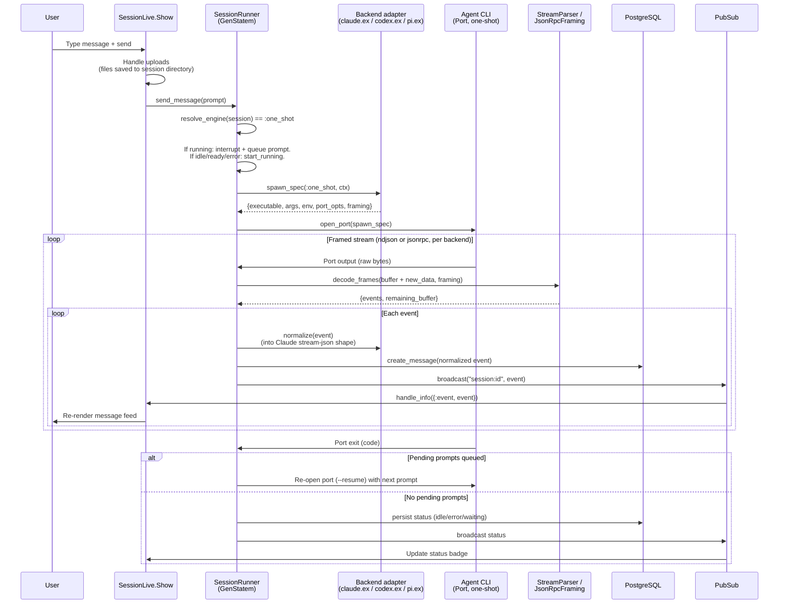
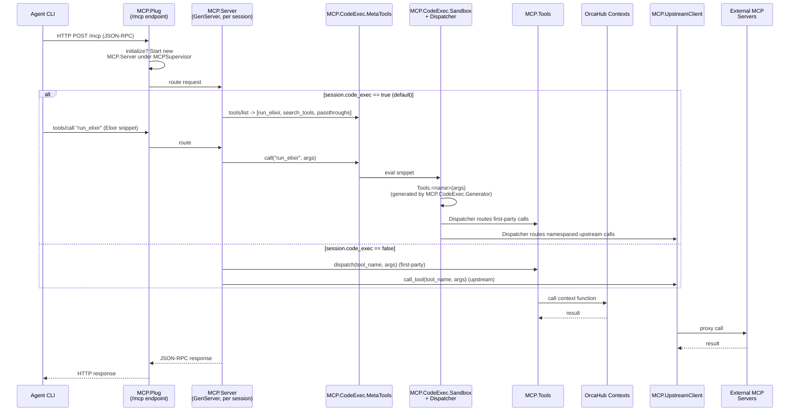

# Message Flow

`SessionRunner` supports two engines for driving the agent CLI. Which one a
session uses is resolved fresh on every `send_message` (`resolve_engine/1`),
in this precedence order:

1. **Runtime kill switch engaged** (`OrcaHub.Streaming.kill_engaged?/0`, a
   `:persistent_term` flag toggled per-node via `Streaming.disable!/1`) →
   forces `:one_shot`, overriding everything else.
2. **Per-session `streaming` column** — `true` → `:streaming`, `false` →
   `:one_shot`.
3. **`ORCA_DISABLE_STREAMING` env var** (`Streaming.streaming_disabled?/0`) →
   `:one_shot` when the column is unset (`nil`).
4. Otherwise → **`:streaming`** (the default).

The same resolution function backs a `:reresolve_engine` cast so a live
kill-switch toggle can re-decide already-running sessions without opening a
new port. CLI spawn args, stdin encoding, and event normalization are all
delegated to the session's `data.backend` adapter (`claude.ex` / `codex.ex` /
`pi.ex`, implementing the `OrcaHub.Backend` behaviour) — `SessionRunner`
itself contains no CLI-specific logic.

## One-Shot Engine (fresh port per turn)

Used when streaming is disabled for the session/node. Each turn opens a new
port, streams NDJSON (or JSON-RPC, depending on the backend) to completion,
and exits; a message sent while a turn is running interrupts it and queues
the new prompt for auto-resume.



## Streaming Engine (default — long-lived warm port)

A warm port is opened once and kept alive across turns; each new message is
written to the same stdin rather than spawning a fresh process.
`Streaming.WarmPool` gates how many warm ports a node may hold at once
(`ORCA_MAX_WARM_SESSIONS`, default 6) and evicts the least-recently-used
idle/error session (never a `:running` one) when a new session needs a slot.

```mermaid
sequenceDiagram
    participant User
    participant LiveView as SessionLive.Show
    participant Runner as SessionRunner<br>(GenStatem)
    participant WarmPool as Streaming.WarmPool
    participant Backend as Backend adapter
    participant CLI as Agent CLI<br>(Port, long-lived)
    participant DB as PostgreSQL
    participant PubSub

    User->>LiveView: Type message + send
    LiveView->>Runner: send_message(prompt)
    Runner->>Runner: resolve_engine(session) == :streaming

    alt Port cold (no warm process yet)
        Runner->>WarmPool: request_slot(session_id)
        WarmPool-->>Runner: admitted (evicts LRU idle/error victim if at cap)
        Runner->>Backend: spawn_spec(:streaming, ctx)
        Runner->>CLI: open_port(spawn_spec)
        Runner->>Backend: on_open(ctx)<br>(e.g. Codex app-server "initialize" handshake)
        opt capabilities.warmup_turn
            Runner->>CLI: throwaway warmup turn
            Runner->>Runner: queue real prompt until warmup result lands
        end
    else Port already warm
        Runner->>WarmPool: touch(session_id, :running)
    end

    Runner->>Backend: encode_user_turn(prompt)
    Runner->>CLI: write to stdin (JSON-RPC framed, via JsonRpcFraming)

    loop Streamed frames
        CLI->>Runner: stdout frame
        Runner->>Backend: normalize(event)
        Runner->>DB: create_message(event)
        Runner->>PubSub: broadcast event
        PubSub->>LiveView: Re-render
    end

    CLI->>Runner: "result" event (turn complete)
    Runner->>Runner: next_state :idle (port stays open)
    Runner->>Runner: arm state_timeout :idle_teardown (15 min)

    alt idle_teardown fires (or evict_warm from WarmPool)
        Runner->>CLI: Port.close
        Runner->>WarmPool: release(session_id)
        Note over Runner: Session stays idle/error but goes cold;<br>next message re-opens with --resume / native resume id
    end
```

A turn arriving while the state machine is `:running` either steers the live
turn in place (`encode_steer_turn/2`, currently only `pi`) or sends a
`control_request` interrupt over the same port (not a process-level SIGINT —
the port survives) and queues the new prompt. See `.context/session-lifecycle.md`
for the `downgrade`/`evict_warm` state transitions this engine adds on top of
the four core GenStatem states.

## MCP Tool Call Flow

Every session runs its own `MCP.Server`. When `session.code_exec` is true
(the default), `tools/list` collapses to a small meta-tool surface —
`run_elixir`, `search_tools`, and a handful of first-party "passthrough"
tools (`send_message_to_session`, `get_session_tail`, `report_progress`,
the feature-request tools) — instead of the full flattened tool list. Other
tools are only reachable as generated `Tools.<name>/1` Elixir functions
called from inside a `run_elixir` snippet.



Code-exec mode adds a routing layer in front of dispatch — it does not
bypass `MCP.Tools`/`MCP.UpstreamClient`. `MCP.CodeExec.Dispatcher` reuses the
identical upstream-vs-first-party decision `MCP.Server` makes directly when
code-exec is off. `MCP.CodeExec.BindingStore` persists Elixir variable
bindings across `run_elixir` calls within a session, so a session can build
up state across multiple tool calls like a REPL.
