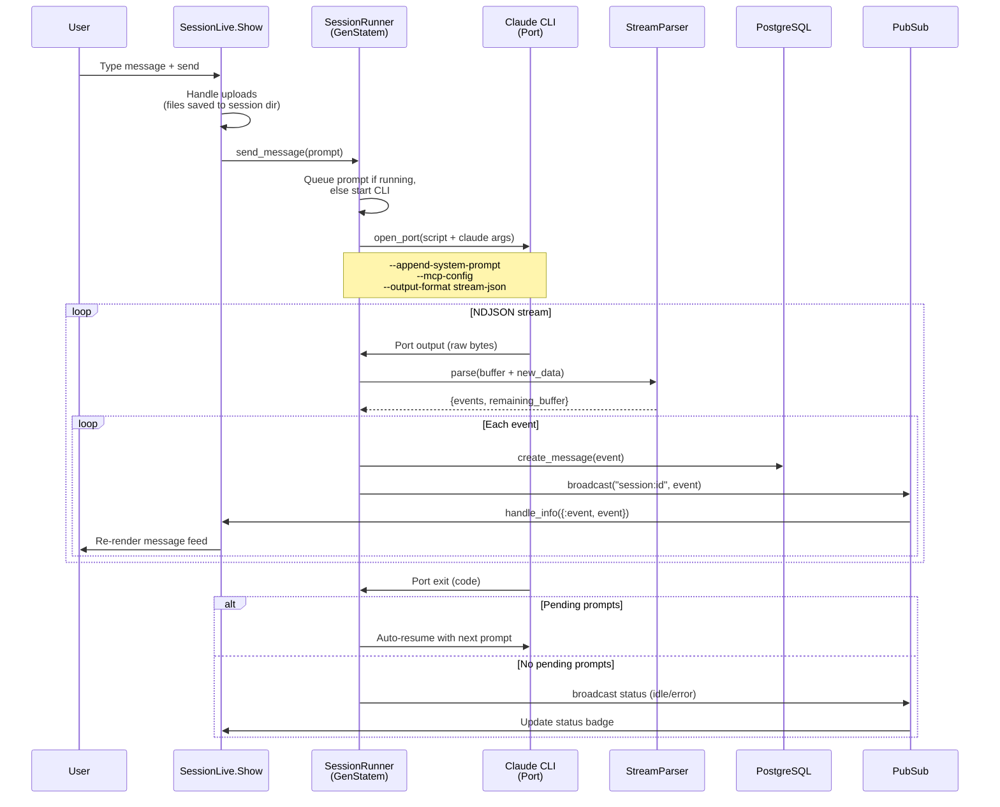
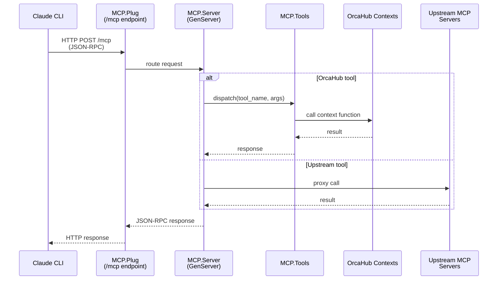

# Message Flow

## User Message to Claude and Back

```mermaid
sequenceDiagram
    participant User
    participant LiveView as SessionLive.Show
    participant Runner as SessionRunner<br>(GenStatem)
    participant CLI as Claude CLI<br>(Port)
    participant Parser as StreamParser
    participant DB as PostgreSQL
    participant PubSub

    User->>LiveView: Type message + send
    LiveView->>LiveView: Handle uploads<br>(files saved to session dir)
    LiveView->>Runner: send_message(prompt)
    Runner->>Runner: Queue prompt if running,<br>else start CLI

    Runner->>CLI: open_port(script + claude args)
    Note over Runner,CLI: --append-system-prompt<br>--mcp-config<br>--output-format stream-json

    loop NDJSON stream
        CLI->>Runner: Port output (raw bytes)
        Runner->>Parser: parse(buffer + new_data)
        Parser-->>Runner: {events, remaining_buffer}

        loop Each event
            Runner->>DB: create_message(event)
            Runner->>PubSub: broadcast("session:id", event)
            PubSub->>LiveView: handle_info({:event, event})
            LiveView->>User: Re-render message feed
        end
    end

    CLI->>Runner: Port exit (code)
    alt Pending prompts
        Runner->>CLI: Auto-resume with next prompt
    else No pending prompts
        Runner->>PubSub: broadcast status (idle/error)
        PubSub->>LiveView: Update status badge
    end
```

## MCP Tool Call Flow

```mermaid
sequenceDiagram
    participant CLI as Claude CLI
    participant MCPPlug as MCP.Plug<br>(/mcp endpoint)
    participant Server as MCP.Server<br>(GenServer)
    participant Tools as MCP.Tools
    participant Context as OrcaHub Contexts
    participant Upstream as Upstream MCP<br>Servers

    CLI->>MCPPlug: HTTP POST /mcp<br>(JSON-RPC)
    MCPPlug->>Server: route request

    alt OrcaHub tool
        Server->>Tools: dispatch(tool_name, args)
        Tools->>Context: call context function
        Context-->>Tools: result
        Tools-->>Server: response
    else Upstream tool
        Server->>Upstream: proxy call
        Upstream-->>Server: result
    end

    Server-->>MCPPlug: JSON-RPC response
    MCPPlug-->>CLI: HTTP response
```
