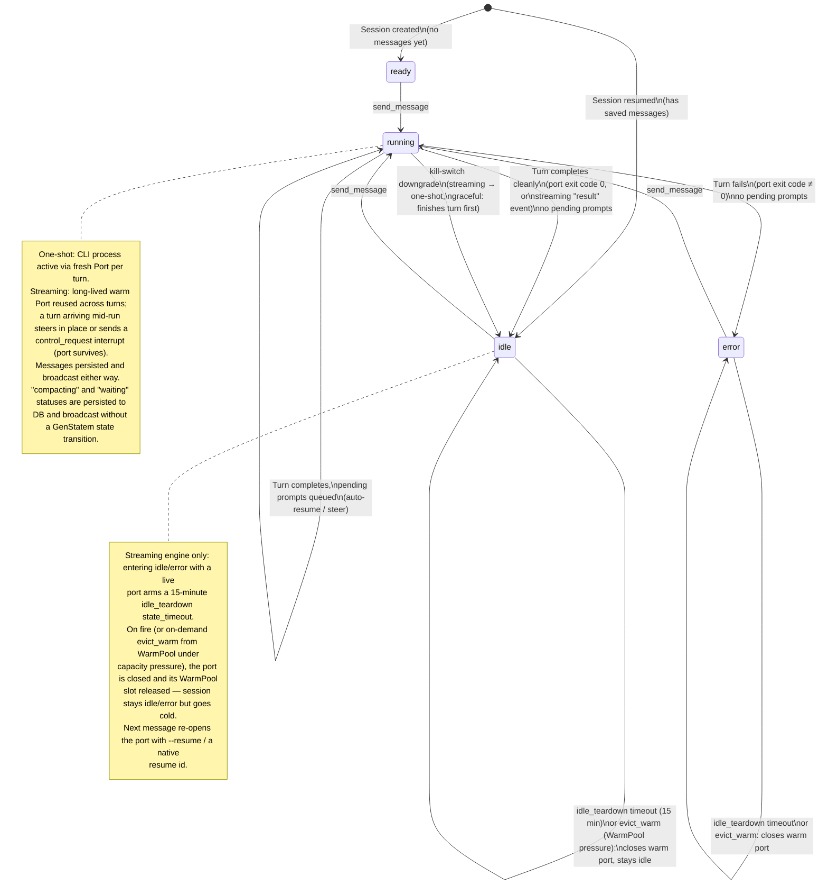

# Session Lifecycle

SessionRunner is a GenStatem (`callback_mode: :state_functions`) with 4
states: `ready`, `idle`, `running`, `error`. `"waiting"` and `"compacting"`
are **not** separate GenStatem states — they're persisted `status` strings /
broadcasts overlaid on `idle`/`running` (see notes below). Which engine
drives a turn (one-shot vs streaming) is decided per-message by
`resolve_engine/1` — see `.context/message-flow.md` — but both engines land
on the same four states below.

## Notes

- **`waiting`**: set when a turn completes with an unanswered
  `AskUserQuestion` pending — the GenStatem stays in `idle` (clean exit) or
  `running` (still-hung turn), but the persisted/broadcast `status` shows
  `"waiting"` until a queued answer resumes it.
- **`downgrade`**: the runtime kill switch (`Streaming.disable!/1`) forcing a
  warm streaming session back to the one-shot engine — `:graceful` finishes
  the in-flight turn first, `:interrupt` cuts it short immediately.
- **`evict_warm`**: `Streaming.WarmPool` reclaiming a warm port under
  per-node capacity pressure (`ORCA_MAX_WARM_SESSIONS`, default 6) by
  tearing down the least-recently-used idle/error session; a `running`
  session always refuses eviction.
