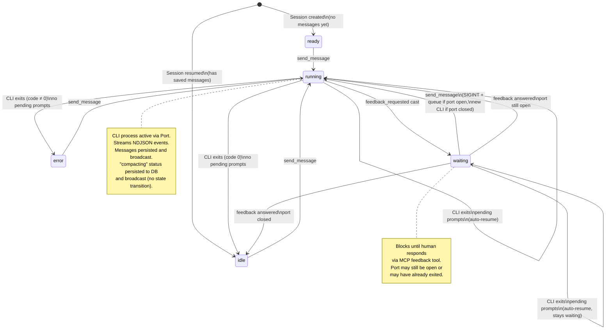

# Session Lifecycle

SessionRunner is a GenStatem with 5 states.

```mermaid
stateDiagram-v2
    [*] --> ready: Session created\n(no messages yet)
    [*] --> idle: Session resumed\n(has saved messages)

    ready --> running: send_message
    idle --> running: send_message
    error --> running: send_message

    running --> idle: CLI exits (code 0)\nno pending prompts
    running --> running: CLI exits\npending prompts\n(auto-resume)
    running --> error: CLI exits (code ≠ 0)\nno pending prompts
    running --> waiting: feedback_requested cast

    waiting --> running: send_message\n(SIGINT + queue if port open,\nnew CLI if port closed)
    waiting --> running: feedback answered\nport still open
    waiting --> idle: feedback answered\nport closed
    waiting --> waiting: CLI exits\npending prompts\n(auto-resume, stays waiting)

    note right of running
        CLI process active via Port.
        Streams NDJSON events.
        Messages persisted and broadcast.
        "compacting" status persisted to DB
        and broadcast (no state transition).
    end note

    note right of waiting
        Blocks until human responds
        via MCP feedback tool.
        Port may still be open or
        may have already exited.
    end note
```
