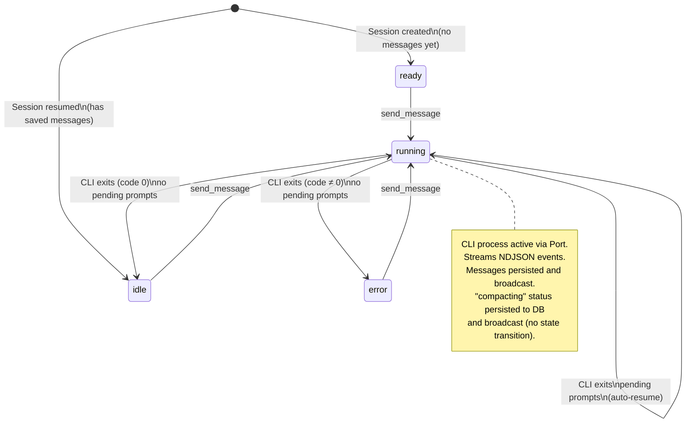

# Session Lifecycle

SessionRunner is a GenStatem with 4 states.

```mermaid
stateDiagram-v2
    [*] --> ready: Session created\n(no messages yet)
    [*] --> idle: Session resumed\n(has saved messages)

    ready --> running: send_message
    idle --> running: send_message
    error --> running: send_message

    running --> idle: CLI exits (code 0)\nno pending prompts
    running --> running: CLI exits\npending prompts\n(auto-resume)
    running --> error: CLI exits (code ≠ 0)\nno pending prompts

    note right of running
        CLI process active via Port.
        Streams NDJSON events.
        Messages persisted and broadcast.
        "compacting" status persisted to DB
        and broadcast (no state transition).
    end note
```
