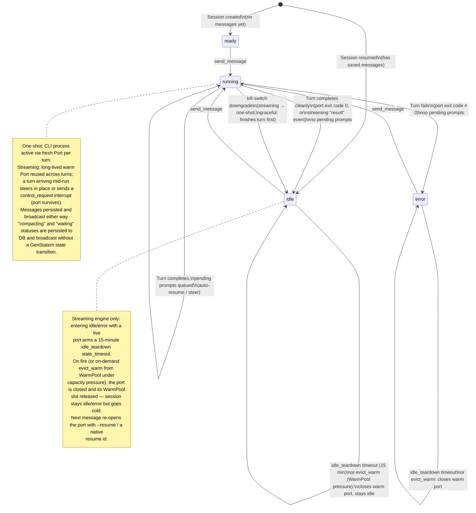

# Session Lifecycle

SessionRunner is a GenStatem (`callback_mode: :state_functions`) with 4
states: `ready`, `idle`, `running`, `error`. `"waiting"` and `"compacting"`
are **not** separate GenStatem states — they're persisted `status` strings /
broadcasts overlaid on `idle`/`running` (see notes below). Which engine
drives a turn (one-shot vs streaming) is decided per-message by
`resolve_engine/1` — see `.context/message-flow.md` — but both engines land
on the same four states below.

```mermaid
stateDiagram-v2
    [*] --> ready: Session created\n(no messages yet)
    [*] --> idle: Session resumed\n(has saved messages)

    ready --> running: send_message
    idle --> running: send_message
    error --> running: send_message

    running --> idle: Turn completes cleanly\n(port exit code 0, or\nstreaming "result" event)\nno pending prompts
    running --> running: Turn completes,\npending prompts queued\n(auto-resume / steer)
    running --> error: Turn fails\n(port exit code ≠ 0)\nno pending prompts

    idle --> idle: idle_teardown timeout (15 min)\nor evict_warm (WarmPool pressure):\ncloses warm port, stays idle
    error --> error: idle_teardown timeout\nor evict_warm: closes warm port

    running --> idle: kill-switch downgrade\n(streaming → one-shot,\ngraceful: finishes turn first)

    note right of running
        One-shot: CLI process active via fresh Port per turn.
        Streaming: long-lived warm Port reused across turns;
        a turn arriving mid-run steers in place or sends a
        control_request interrupt (port survives).
        Messages persisted and broadcast either way.
        "compacting" and "waiting" statuses are persisted to
        DB and broadcast without a GenStatem state transition.
    end note

    note right of idle
        Streaming engine only: entering idle/error with a live
        port arms a 15-minute idle_teardown state_timeout.
        On fire (or on-demand evict_warm from WarmPool under
        capacity pressure), the port is closed and its WarmPool
        slot released — session stays idle/error but goes cold.
        Next message re-opens the port with --resume / a native
        resume id.
    end note
```

## Notes

- **`waiting`**: set when a turn completes with an unanswered interactive
  question pending — Claude's built-in `AskUserQuestion`, or pi's `question`
  tool, both gated by the same `ask_user_question` capability. The GenStatem
  stays in `idle` (clean exit) or `running` (still-hung turn), but the
  persisted/broadcast `status` shows `"waiting"` until a queued answer
  resumes it.
- **`downgrade`**: the runtime kill switch (`Streaming.disable!/1`) forcing a
  warm streaming session back to the one-shot engine — `:graceful` finishes
  the in-flight turn first, `:interrupt` cuts it short immediately.
- **`evict_warm`**: reclaiming a warm port without ending the session. Two
  callers: `Streaming.WarmPool` under per-node capacity pressure
  (`ORCA_MAX_WARM_SESSIONS`, default 6), which tears down the LRU idle/error
  session; and `PiConfigSync`, which evicts idle *pi* ports after writing new
  pi config so the next turn re-reads it (WarmPool rows carry the session's
  backend precisely so this can be filtered). A `running` session always
  refuses eviction in both cases.
- **A forked pi child never enters `running` on its own schedule.** Its first
  prompt is held by `OrcaHub.ForkGate` until the previous sibling's first
  turn has fully completed; the session row and UI exist from the moment of
  the spawn, sitting in `ready` until the gate releases it. See
  `.context/message-flow.md`.
- Entering `idle` also nudges `OrcaHub.MemoryGit.Server` to snapshot this
  node's on-disk agent memory — a side effect of the transition, not a state.
