# Supervision Tree

The supervision tree varies based on `OrcaHub.Mode` (hub vs agent). Both trees
are built by `OrcaHub.Application.start/2`: it picks `hub_children/1` or
`agent_children/1`, then appends `OrcaHub.Discord.children/0` (env-gated —
`[]` unless `DISCORD_BOT=true` and a Nostrum token are configured; this is
**not** mode-gated, so a hub node can in principle run the Discord bot too,
though in practice it runs on the dedicated `orca-agent-discord` agent pod).
The whole tree is one `Supervisor` (`OrcaHub.Supervisor`) with strategy
`:one_for_one`.

## Hub Mode (default)

```mermaid
graph TB
    App["OrcaHub.Application\n(Supervisor, one_for_one)"]

    App --> Telemetry["OrcaHubWeb.Telemetry\n(hub only)"]
    App --> Repo["OrcaHub.Repo\n(PostgreSQL, hub only)"]
    App --> DNS["DNSCluster"]
    App --> LibCluster["Cluster.Supervisor\n(libcluster)"]
    App --> PubSub["Phoenix.PubSub"]

    subgraph Registries["Registries"]
        SessionRegistry["SessionRegistry\n(:unique)"]
        MCPRegistry["MCPRegistry\n(:unique)"]
        TerminalRegistry["TerminalRegistry\n(:unique)"]
        ViewersRegistry["SessionViewersRegistry\n(:duplicate)"]
        BackendInstallerRegistry["BackendInstallerRegistry\n(:unique)"]
    end
    App --> Registries

    App --> BackendCache["OrcaHub.Backend.Cache"]
    App --> TaskSupervisor["Task.Supervisor"]
    App --> SessionHeartbeat["OrcaHub.SessionHeartbeat\n(hub only)"]
    App --> WarmPool["OrcaHub.Streaming.WarmPool"]
    App --> SessionSupervisor["OrcaHub.SessionSupervisor\n(DynamicSupervisor)"]
    App --> SessionResumer["OrcaHub.SessionResumer"]
    App --> TerminalSupervisor["OrcaHub.TerminalSupervisor\n(DynamicSupervisor)"]
    App --> LoginSupervisor["OrcaHub.LoginSupervisor\n(DynamicSupervisor)"]
    App --> BackendInstallerSupervisor["OrcaHub.BackendInstallerSupervisor\n(DynamicSupervisor)"]
    App --> MCPSupervisor["DynamicSupervisor\n(MCPSupervisor)"]
    App --> CodeExecGenerator["OrcaHub.MCP.CodeExec.Generator"]
    App --> CodeExecBindingStore["OrcaHub.MCP.CodeExec.BindingStore"]
    App --> UpstreamClient["OrcaHub.MCP.UpstreamClient\n(hub only)"]
    App --> Scheduler["OrcaHub.Scheduler\n(Quantum, hub only)"]
    App --> TriggerLoader["OrcaHub.TriggerLoader\n(hub only)"]
    App --> ClusterNodeTracker["OrcaHub.ClusterNodeTracker\n(hub only)"]
    App --> Endpoint["OrcaHubWeb.Endpoint"]
    App -.->|"DISCORD_BOT=true"| DiscordBot["OrcaHub.Discord.Bot\n(nostrum)"]

    SessionSupervisor -->|start_child| SR1["SessionRunner\n(GenStatem, one per session)"]
    TerminalSupervisor -->|start_child| TR1["TerminalRunner\n(GenServer, one per terminal)"]
    MCPSupervisor -->|start_child| MS1["MCP.Server\n(GenServer, one per MCP session)"]
    BackendInstallerSupervisor -->|start_child| BJ1["BackendInstaller.Job\n(GenServer, one per install/update)"]
    LoginSupervisor -->|start_child| LR1["LoginRunner / CodexLoginRunner"]

    SR1 -->|registered in| SessionRegistry
    MS1 -->|registered in| MCPRegistry
    TR1 -->|registered in| TerminalRegistry

    UpstreamClient -->|connects to| ExtMCP["External MCP\nServers"]
    Scheduler -->|fires| TriggerLoader
```

## Agent Mode (ORCA_MODE=agent)

Agent nodes omit `Telemetry`, `Repo`, `MCP.UpstreamClient`, `Scheduler`,
`TriggerLoader`, `SessionHeartbeat`, and `ClusterNodeTracker`. All database
operations are proxied to the hub node via `HubRPC`. Everything else —
including `Streaming.WarmPool`, `TerminalSupervisor`, `LoginSupervisor`, and
the `BackendInstaller*`/`MCP.CodeExec.*` children — runs on agent nodes too,
since sessions, terminals, backend installs, and code-exec tool calls all
execute locally wherever the runner process lives.

```mermaid
graph TB
    App["OrcaHub.Application\n(Supervisor, one_for_one)"]

    App --> DNS["DNSCluster"]
    App --> LibCluster["Cluster.Supervisor\n(libcluster)"]
    App --> PubSub["Phoenix.PubSub"]

    subgraph Registries["Registries"]
        SessionRegistry["SessionRegistry\n(:unique)"]
        MCPRegistry["MCPRegistry\n(:unique)"]
        TerminalRegistry["TerminalRegistry\n(:unique)"]
        ViewersRegistry["SessionViewersRegistry\n(:duplicate)"]
        BackendInstallerRegistry["BackendInstallerRegistry\n(:unique)"]
    end
    App --> Registries

    App --> BackendCache["OrcaHub.Backend.Cache"]
    App --> TaskSupervisor["Task.Supervisor"]
    App --> WarmPool["OrcaHub.Streaming.WarmPool"]
    App --> SessionSupervisor["OrcaHub.SessionSupervisor\n(DynamicSupervisor)"]
    App --> SessionResumer["OrcaHub.SessionResumer"]
    App --> TerminalSupervisor["OrcaHub.TerminalSupervisor\n(DynamicSupervisor)"]
    App --> LoginSupervisor["OrcaHub.LoginSupervisor\n(DynamicSupervisor)"]
    App --> BackendInstallerSupervisor["OrcaHub.BackendInstallerSupervisor\n(DynamicSupervisor)"]
    App --> MCPSupervisor["DynamicSupervisor\n(MCPSupervisor)"]
    App --> CodeExecGenerator["OrcaHub.MCP.CodeExec.Generator"]
    App --> CodeExecBindingStore["OrcaHub.MCP.CodeExec.BindingStore"]
    App --> Endpoint["OrcaHubWeb.Endpoint\n(MCP endpoint only)"]
    App -.->|"DISCORD_BOT=true"| DiscordBot["OrcaHub.Discord.Bot\n(nostrum)"]

    SessionSupervisor -->|start_child| SR1["SessionRunner\n(GenStatem)"]
    TerminalSupervisor -->|start_child| TR1["TerminalRunner\n(GenServer)"]
    MCPSupervisor -->|start_child| MS1["MCP.Server\n(GenServer)"]

    SR1 -->|registered in| SessionRegistry
    MS1 -->|registered in| MCPRegistry
    TR1 -->|registered in| TerminalRegistry
```

## Key Modules Added Since the Original One-Shot-Only Design

- **`OrcaHub.Streaming.WarmPool`**: GenServer admission control for
  long-lived ("warm") streaming ports — caps concurrent warm processes per
  node (`ORCA_MAX_WARM_SESSIONS`, default 6) and evicts the LRU idle/error
  victim under pressure. See `.context/message-flow.md`.
- **`OrcaHub.SessionResumer`**: auto-resumes sessions orphaned in
  `status: "running"` after a node restart or deploy.
- **`OrcaHub.SessionHeartbeat`** (hub only): manages periodic heartbeat
  messages sessions schedule via MCP tools.
- **`OrcaHub.TerminalSupervisor`** / **`TerminalRegistry`**: per-node
  DynamicSupervisor + Registry for `TerminalRunner` PTY processes — see
  `.context/terminals.md`.
- **`OrcaHub.LoginSupervisor`**: DynamicSupervisor for `LoginRunner` /
  `CodexLoginRunner` processes that drive interactive CLI login flows
  (`claude setup-token`, codex auth) from the web UI, one per in-progress
  login.
- **`OrcaHub.BackendInstallerSupervisor`** + **`BackendInstallerRegistry`**:
  DynamicSupervisor/Registry for `BackendInstaller.Job` processes that
  install/upgrade agent CLIs (claude/codex/pi) on a node, streaming progress
  via PubSub.
- **`OrcaHub.MCP.CodeExec.Generator`**: GenServer that (re)generates the
  in-memory `Tools` module exposing every MCP tool as a callable
  `Tools.<name>/1` Elixir function for `run_elixir` sandboxes.
- **`OrcaHub.MCP.CodeExec.BindingStore`**: GenServer persisting per-session
  Elixir variable bindings across `run_elixir` calls (REPL-like state).
- **`OrcaHub.Backend.Cache`**: caches backend capability/model lookups.
- **`OrcaHub.ClusterNodeTracker`** (hub only): tracks Erlang node
  connect/disconnect events into the `nodes` table backing the Nodes UI —
  see `.context/clustering.md`.
- **`OrcaHub.Discord.Bot`**: conditionally-started Nostrum gateway consumer;
  see `lib/orca_hub/discord/`.
