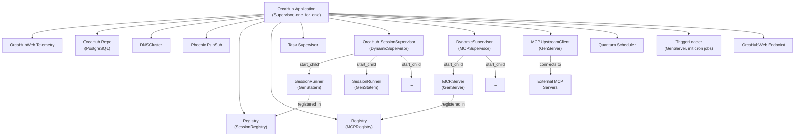

# Supervision Tree

```mermaid
graph TB
    App["OrcaHub.Application\n(Supervisor, one_for_one)"]

    App --> Telemetry["OrcaHubWeb.Telemetry"]
    App --> Repo["OrcaHub.Repo\n(PostgreSQL)"]
    App --> DNS["DNSCluster"]
    App --> PubSub["Phoenix.PubSub"]
    App --> SessionRegistry["Registry\n(SessionRegistry)"]
    App --> MCPRegistry["Registry\n(MCPRegistry)"]
    App --> TaskSupervisor["Task.Supervisor"]
    App --> SessionSupervisor["OrcaHub.SessionSupervisor\n(DynamicSupervisor)"]
    App --> MCPSupervisor["DynamicSupervisor\n(MCPSupervisor)"]
    App --> UpstreamClient["MCP.UpstreamClient\n(GenServer)"]
    App --> Scheduler["Quantum Scheduler"]
    App --> TriggerLoader["TriggerLoader\n(GenServer, init cron jobs)"]
    App --> Endpoint["OrcaHubWeb.Endpoint"]

    SessionSupervisor -->|start_child| SR1["SessionRunner\n(GenStatem)"]
    SessionSupervisor -->|start_child| SR2["SessionRunner\n(GenStatem)"]
    SessionSupervisor -->|start_child| SRN["..."]

    MCPSupervisor -->|start_child| MS1["MCP.Server\n(GenServer)"]
    MCPSupervisor -->|start_child| MSN["..."]

    SR1 -->|registered in| SessionRegistry
    MS1 -->|registered in| MCPRegistry

    UpstreamClient -->|connects to| ExtMCP["External MCP\nServers"]
```
