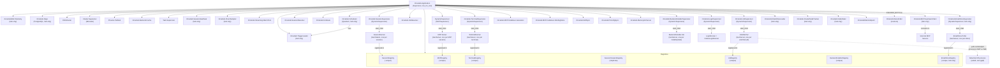
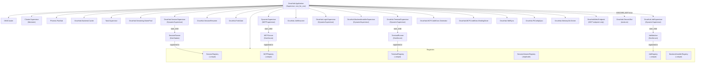

# Supervision Tree

The supervision tree varies based on `OrcaHub.Mode` (hub vs agent). Both trees
are built by `OrcaHub.Application.start/2`: it picks `hub_children/1` or
`agent_children/1`, then appends `OrcaHub.Discord.children/0` (env-gated —
`[]` unless `DISCORD_BOT=true` and a Nostrum token are configured; this is
**not** mode-gated, so a hub node can in principle run the Discord bot too,
though in practice it runs on the dedicated `orca-agent-discord` agent pod).
The whole tree is one `Supervisor` (`OrcaHub.Supervisor`) with strategy
`:one_for_one`.

## Hub Mode (default)

```mermaid
graph TB
    App["OrcaHub.Application\n(Supervisor, one_for_one)"]

    App --> Telemetry["OrcaHubWeb.Telemetry\n(hub only)"]
    App --> Repo["OrcaHub.Repo\n(PostgreSQL, hub only)"]
    App --> DNS["DNSCluster"]
    App --> LibCluster["Cluster.Supervisor\n(libcluster)"]
    App --> PubSub["Phoenix.PubSub"]

    subgraph Registries["Registries"]
        SessionRegistry["SessionRegistry\n(:unique)"]
        MCPRegistry["MCPRegistry\n(:unique)"]
        TerminalRegistry["TerminalRegistry\n(:unique)"]
        ViewersRegistry["SessionViewersRegistry\n(:duplicate)"]
        JobRegistry["JobRegistry\n(:unique)"]
        BackendInstallerRegistry["BackendInstallerRegistry\n(:unique)"]
        EmailInboxRegistry["EmailInboxRegistry\n(:unique, hub only)"]
    end
    App --> Registries

    App --> BackendCache["OrcaHub.Backend.Cache"]
    App --> TaskSupervisor["Task.Supervisor"]
    App --> SessionHeartbeat["OrcaHub.SessionHeartbeat\n(hub only)"]
    App --> ChurnSampler["OrcaHub.ChurnSampler\n(hub only)"]
    App --> WarmPool["OrcaHub.Streaming.WarmPool"]
    App --> SessionSupervisor["OrcaHub.SessionSupervisor\n(DynamicSupervisor)"]
    App --> SessionResumer["OrcaHub.SessionResumer"]
    App --> ForkGate["OrcaHub.ForkGate"]
    App --> TerminalSupervisor["OrcaHub.TerminalSupervisor\n(DynamicSupervisor)"]
    App --> JobSupervisor["OrcaHub.JobSupervisor\n(DynamicSupervisor)"]
    App --> JobResumer["OrcaHub.JobResumer"]
    App --> LoginSupervisor["OrcaHub.LoginSupervisor\n(DynamicSupervisor)"]
    App --> BackendInstallerSupervisor["OrcaHub.BackendInstallerSupervisor\n(DynamicSupervisor)"]
    App --> MCPSupervisor["DynamicSupervisor\n(MCPSupervisor)"]
    App --> CodeExecGenerator["OrcaHub.MCP.CodeExec.Generator"]
    App --> CodeExecBindingStore["OrcaHub.MCP.CodeExec.BindingStore"]
    App --> SkillSync["OrcaHub.SkillSync"]
    App --> PiConfigSync["OrcaHub.PiConfigSync"]
    App --> MemoryGitServer["OrcaHub.MemoryGit.Server"]
    App --> UpstreamClient["OrcaHub.MCP.UpstreamClient\n(hub only)"]
    App --> Scheduler["OrcaHub.Scheduler\n(Quantum, hub only)"]
    App --> TriggerLoader["OrcaHub.TriggerLoader\n(hub only)"]
    App --> EmailInboxSupervisor["OrcaHub.EmailInboxSupervisor\n(DynamicSupervisor, hub only)"]
    App --> EmailInboxLoader["OrcaHub.EmailInboxLoader\n(hub only)"]
    App --> ClusterNodeTracker["OrcaHub.ClusterNodeTracker\n(hub only)"]
    App --> NodeDialer["OrcaHub.NodeDialer\n(hub only)"]
    App --> Endpoint["OrcaHubWeb.Endpoint"]
    App -.->|"DISCORD_BOT=true"| DiscordBot["OrcaHub.Discord.Bot\n(nostrum)"]

    SessionSupervisor -->|start_child| SR1["SessionRunner\n(GenStatem, one per session)"]
    TerminalSupervisor -->|start_child| TR1["TerminalRunner\n(GenServer, one per terminal)"]
    JobSupervisor -->|start_child| JW1["JobWatcher\n(GenServer, one per watched job)"]
    MCPSupervisor -->|start_child| MS1["MCP.Server\n(GenServer, one per MCP session)"]
    BackendInstallerSupervisor -->|start_child| BJ1["BackendInstaller.Job\n(GenServer, one per install/update)"]
    LoginSupervisor -->|start_child| LR1["LoginRunner / CodexLoginRunner"]
    EmailInboxSupervisor -->|start_child| EP1["EmailInbox.Poller\n(GenServer, one per inbox)"]

    SR1 -->|registered in| SessionRegistry
    MS1 -->|registered in| MCPRegistry
    TR1 -->|registered in| TerminalRegistry
    JW1 -->|registered in| JobRegistry
    EP1 -->|registered in| EmailInboxRegistry

    JW1 -.->|"polls sentinel/pid\n(process is NOT a child)"| DetachedProc["Detached OS process\n(setsid, own pgid)"]
    UpstreamClient -->|connects to| ExtMCP["External MCP\nServers"]
    Scheduler -->|fires| TriggerLoader
```

## Agent Mode (ORCA_MODE=agent)

Agent nodes omit `Telemetry`, `Repo`, `MCP.UpstreamClient`, `Scheduler`,
`TriggerLoader`, `SessionHeartbeat`, `ChurnSampler`, `ClusterNodeTracker`,
`NodeDialer`, and the `EmailInbox*` children. All database operations are
proxied to the hub node via `HubRPC`. Everything else — including `Streaming.WarmPool`,
`ForkGate`, `TerminalSupervisor`, `JobSupervisor`/`JobResumer`,
`LoginSupervisor`, `SkillSync`/`PiConfigSync`/`MemoryGit.Server`, and the
`BackendInstaller*`/`MCP.CodeExec.*` children — runs on agent nodes too,
since sessions, terminals, jobs, backend installs, on-disk skill/pi-config
materialization, and code-exec tool calls all execute locally wherever the
runner process lives.

```mermaid
graph TB
    App["OrcaHub.Application\n(Supervisor, one_for_one)"]

    App --> DNS["DNSCluster"]
    App --> LibCluster["Cluster.Supervisor\n(libcluster)"]
    App --> PubSub["Phoenix.PubSub"]

    subgraph Registries["Registries"]
        SessionRegistry["SessionRegistry\n(:unique)"]
        MCPRegistry["MCPRegistry\n(:unique)"]
        TerminalRegistry["TerminalRegistry\n(:unique)"]
        ViewersRegistry["SessionViewersRegistry\n(:duplicate)"]
        JobRegistry["JobRegistry\n(:unique)"]
        BackendInstallerRegistry["BackendInstallerRegistry\n(:unique)"]
    end
    App --> Registries

    App --> BackendCache["OrcaHub.Backend.Cache"]
    App --> TaskSupervisor["Task.Supervisor"]
    App --> WarmPool["OrcaHub.Streaming.WarmPool"]
    App --> SessionSupervisor["OrcaHub.SessionSupervisor\n(DynamicSupervisor)"]
    App --> SessionResumer["OrcaHub.SessionResumer"]
    App --> ForkGate["OrcaHub.ForkGate"]
    App --> TerminalSupervisor["OrcaHub.TerminalSupervisor\n(DynamicSupervisor)"]
    App --> JobSupervisor["OrcaHub.JobSupervisor\n(DynamicSupervisor)"]
    App --> JobResumer["OrcaHub.JobResumer"]
    App --> LoginSupervisor["OrcaHub.LoginSupervisor\n(DynamicSupervisor)"]
    App --> BackendInstallerSupervisor["OrcaHub.BackendInstallerSupervisor\n(DynamicSupervisor)"]
    App --> MCPSupervisor["DynamicSupervisor\n(MCPSupervisor)"]
    App --> CodeExecGenerator["OrcaHub.MCP.CodeExec.Generator"]
    App --> CodeExecBindingStore["OrcaHub.MCP.CodeExec.BindingStore"]
    App --> SkillSync["OrcaHub.SkillSync"]
    App --> PiConfigSync["OrcaHub.PiConfigSync"]
    App --> MemoryGitServer["OrcaHub.MemoryGit.Server"]
    App --> Endpoint["OrcaHubWeb.Endpoint\n(MCP endpoint only)"]
    App -.->|"DISCORD_BOT=true"| DiscordBot["OrcaHub.Discord.Bot\n(nostrum)"]

    SessionSupervisor -->|start_child| SR1["SessionRunner\n(GenStatem)"]
    TerminalSupervisor -->|start_child| TR1["TerminalRunner\n(GenServer)"]
    JobSupervisor -->|start_child| JW1["JobWatcher\n(GenServer)"]
    MCPSupervisor -->|start_child| MS1["MCP.Server\n(GenServer)"]

    SR1 -->|registered in| SessionRegistry
    MS1 -->|registered in| MCPRegistry
    TR1 -->|registered in| TerminalRegistry
    JW1 -->|registered in| JobRegistry
```

## Key Modules Added Since the Original One-Shot-Only Design

- **`OrcaHub.Streaming.WarmPool`**: GenServer admission control for
  long-lived ("warm") streaming ports — caps concurrent warm processes per
  node (`ORCA_MAX_WARM_SESSIONS`, default 6) and evicts the LRU idle/error
  victim under pressure. See `.context/message-flow.md`.
- **`OrcaHub.SessionResumer`**: auto-resumes sessions orphaned in
  `status: "running"` after a node restart or deploy.
- **`OrcaHub.SessionHeartbeat`** (hub only): manages periodic heartbeat
  messages sessions schedule via MCP tools.
- **`OrcaHub.ChurnSampler`** (hub only): every 120s it samples each
  non-archived `running` session's churn metrics (`OrcaHub.Sessions.Churn`)
  into the `churn_samples` table and emits a `[:orca_hub, :churn, :sample]`
  telemetry event for Grafana. Bolted onto the tail of the same sweep,
  `ChurnSampler.AlertEvaluator` evaluates every enabled `alert_subscriptions`
  row and delivers rising-edge worker alerts to the subscribing orchestrator
  — see `.context/data-model.md`. Hub-only for the same reason as the
  heartbeat: two nodes sweeping would double-sample and double-alert. Each
  sweep is wrapped in `rescue`/log, so one bad session can't kill the timer
  loop.
- **`OrcaHub.ForkGate`**: serializes forked pi children's FIRST turns, one
  FIFO per parent session — child N+1's first prompt goes out only after
  child N's first `result` event lands. A correctness mechanism, not an
  optimization: N concurrent same-prefix first turns get 1 warm cache hit and
  N−1 full cold prefills (`pi_fork_spec.md` §6/§6.1). Runs on hub + agent — a
  fork child runs wherever its parent does.
- **`OrcaHub.TerminalSupervisor`** / **`TerminalRegistry`**: per-node
  DynamicSupervisor + Registry for `TerminalRunner` PTY processes — see
  `.context/terminals.md`.
- **`OrcaHub.JobSupervisor`** / **`JobRegistry`** / **`OrcaHub.JobResumer`**:
  the Jobs subsystem (`OrcaHub.Jobs`) — durable records of DETACHED OS
  background processes. The processes themselves are deliberately NOT
  supervision children: `Jobs.Launcher` starts them with `setsid` in their own
  process group, stdout/stderr to a durable log and the exit code to a
  sentinel file, so they survive idle teardown, WarmPool eviction, and OrcaHub
  restarts entirely. The BEAM only ever OBSERVES one, via a disposable
  `JobWatcher` polling the sentinel/pid/declared progress metric.
  `JobResumer` re-attaches watchers to this node's non-terminal jobs on boot —
  the job-subsystem analog of `SessionResumer`.
- **`OrcaHub.LoginSupervisor`**: DynamicSupervisor for `LoginRunner` /
  `CodexLoginRunner` processes that drive interactive CLI login flows
  (`claude setup-token`, codex auth) from the web UI, one per in-progress
  login.
- **`OrcaHub.BackendInstallerSupervisor`** + **`BackendInstallerRegistry`**:
  DynamicSupervisor/Registry for `BackendInstaller.Job` processes that
  install/upgrade agent CLIs (claude/codex/pi) on a node, streaming progress
  via PubSub.
- **`OrcaHub.MCP.CodeExec.Generator`**: GenServer that (re)generates the
  in-memory `Tools` module exposing every MCP tool as a callable
  `Tools.<name>/1` Elixir function for `run_elixir` sandboxes.
- **`OrcaHub.MCP.CodeExec.BindingStore`**: GenServer persisting per-session
  Elixir variable bindings across `run_elixir` calls (REPL-like state).
- **`OrcaHub.SkillSync`** / **`OrcaHub.PiConfigSync`**: hub-DB-to-local-disk
  materializers, both running on EVERY node. No agent CLI supports remote
  config, so the hub DB is the source of truth and each node writes its own
  copy: `SkillSync` renders the `skills` table to `<home_root>/skills/<name>/
  SKILL.md` per installed backend, `PiConfigSync` renders `pi_config_entries`
  into `~/.pi/agent/` (`models.json` providers, `settings.json` keys, and
  files under `extensions/`/`prompts/`/`themes/`). Both keep an on-disk
  ownership manifest so a disabled/deleted row is removed rather than
  orphaned, and both boot-sync with bounded retry since an agent may not have
  hub connectivity yet.
- **`OrcaHub.MemoryGit.Server`**: serializes per-node git snapshot+sync passes
  over the on-disk agent memory stores (`~/.claude/projects/<slug>/memory/**`,
  `~/.codex/memories`), pushing to Gitea. Triggered by `SessionRunner` idle
  transitions; soft-degrades on a missing `git`/unreachable Gitea.
- **`OrcaHub.EmailInboxSupervisor`** / **`EmailInboxRegistry`** /
  **`OrcaHub.EmailInboxLoader`** (hub only): one `EmailInbox.Poller` per
  enabled `email_inboxes` row, IMAP-polling for messages that fire `type:
  "email"` triggers. Hub-only for the same reason as the scheduler — an
  inbox's credentials and its UID watermark are hub state, and two nodes
  polling one mailbox would race to fire the same trigger twice.
- **`OrcaHub.Backend.Cache`**: caches backend capability/model lookups.
- **`OrcaHub.ClusterNodeTracker`** (hub only): tracks Erlang node
  connect/disconnect events into the `nodes` table backing the Nodes UI —
  see `.context/clustering.md`.
- **`OrcaHub.NodeDialer`** (hub only): dials out every 5s to each `nodes` row
  flagged `dial: true` — see `.context/clustering.md`.
- **`OrcaHub.Discord.Bot`**: conditionally-started Nostrum gateway consumer;
  see `lib/orca_hub/discord/`.
