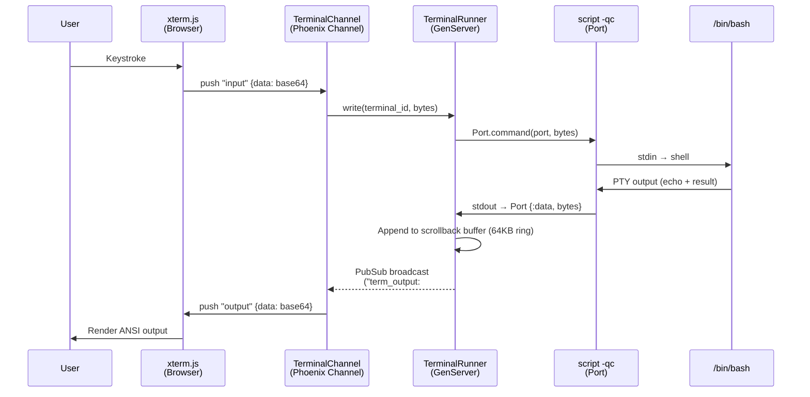
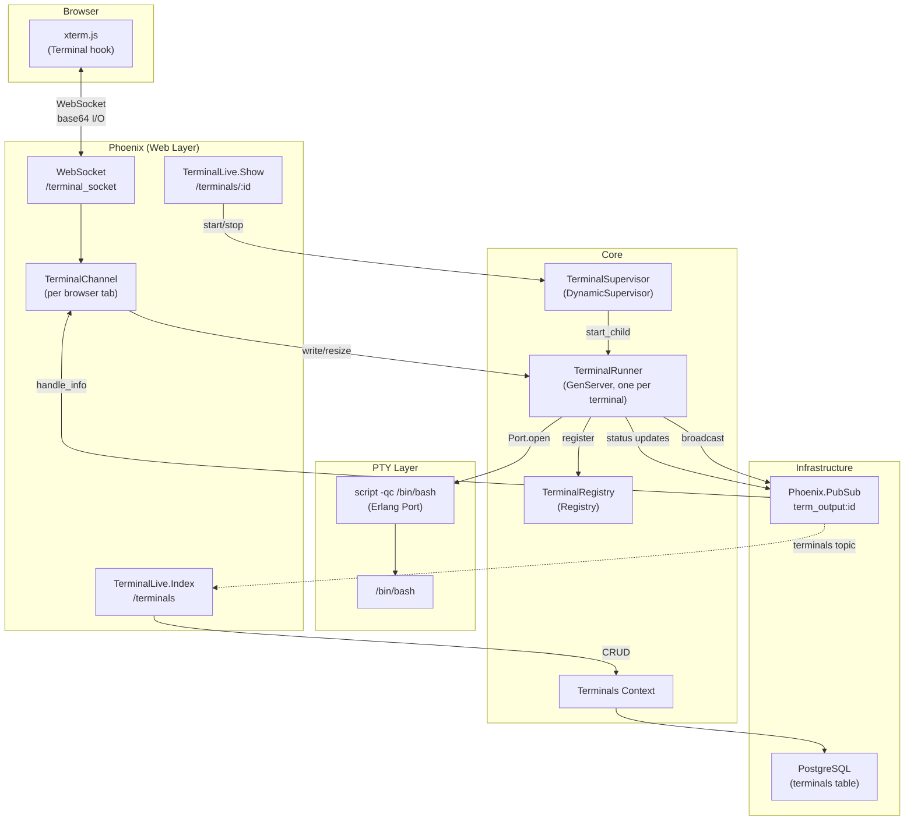
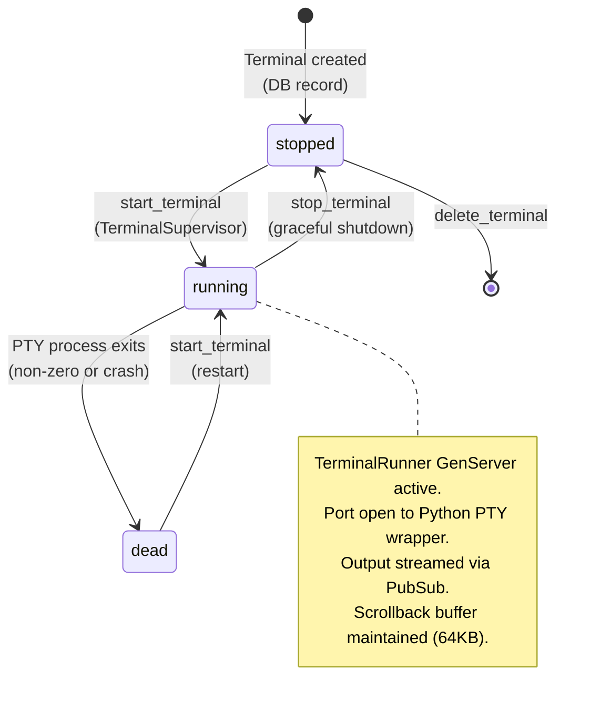

# Terminal System

Embedded web terminals powered by xterm.js, with PTY management via
`script -qc` running under an Erlang Port.

## Data Flow



## Architecture



## PubSub Topic Design

```
term_output:<terminal_id>   → per-terminal output + status + exit events
                               (subscribed by TerminalChannel)

terminals                   → aggregate events for index page
                               (subscribed by TerminalLive.Index)
```

**Important:** The `term_output:` prefix is intentionally different from the
Channel topic `terminal:`. Phoenix Channels internally subscribe the channel
process to PubSub using the channel topic name. Using the same name would
cause double delivery (`:pg.join` allows duplicate joins).

## Terminal Lifecycle



## PTY Implementation

The PTY is managed via `script -qc /bin/bash /dev/null` spawned as an
Erlang Port — the same pattern used by `SessionRunner` for Claude CLI.
`script` allocates a PTY so the shell behaves as an interactive terminal
(colored output, line editing, etc.). The typescript file is `/dev/null`
so only PTY output flows through the port.

## Multi-Client Pairing

Multiple browser tabs can join the same `terminal:<id>` Channel topic.
Each receives the same output stream. Input from any client goes to the
same PTY. This enables user-agent pairing: a human and a Claude session
can both view and type in the same terminal.

## Cluster Integration

Terminals follow the same pattern as sessions:
- `runner_node` field tracks which node owns the PTY process
- `Cluster.start_terminal(node, id)` routes via `:erpc`
- `HubRPC` proxies DB operations to the hub node
- `TerminalRegistry` and `TerminalSupervisor` run on every node
