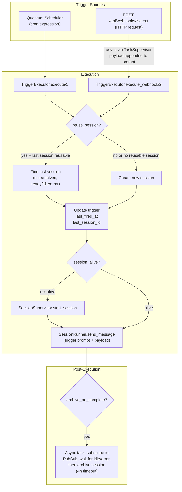

# Trigger System

```mermaid
flowchart TB
    subgraph Sources["Trigger Sources"]
        Cron["Quantum Scheduler\n(cron expression)"]
        Webhook["POST /api/webhooks/:secret\n(HTTP request)"]
    end

    subgraph Execution
        ExecuteCron["TriggerExecutor.execute/1"]
        ExecuteWebhook["TriggerExecutor.execute_webhook/2"]
        Resolve{"reuse_session?"}
        Reuse["Find last session\n(not archived, ready/idle/error)"]
        Create["Create new session"]
        Update["Update trigger\nlast_fired_at\nlast_session_id"]
        StartCheck{"session_alive?"}
        Start["SessionSupervisor.start_session"]
        Send["SessionRunner.send_message\n(trigger prompt + payload)"]
    end

    subgraph Cleanup["Post-Execution"]
        Archive{"archive_on_complete?"}
        ArchiveTask["Async task: subscribe to\nPubSub, wait for idle/error,\nthen archive session\n(4h timeout)"]
    end

    Cron --> ExecuteCron
    Webhook -->|async via TaskSupervisor\npayload appended to prompt| ExecuteWebhook

    ExecuteCron --> Resolve
    ExecuteWebhook --> Resolve
    Resolve -->|yes + last session reusable| Reuse
    Resolve -->|no or no reusable session| Create
    Reuse --> Update
    Create --> Update
    Update --> StartCheck
    StartCheck -->|not alive| Start --> Send
    StartCheck -->|alive| Send

    Send --> Archive
    Archive -->|yes| ArchiveTask
```
