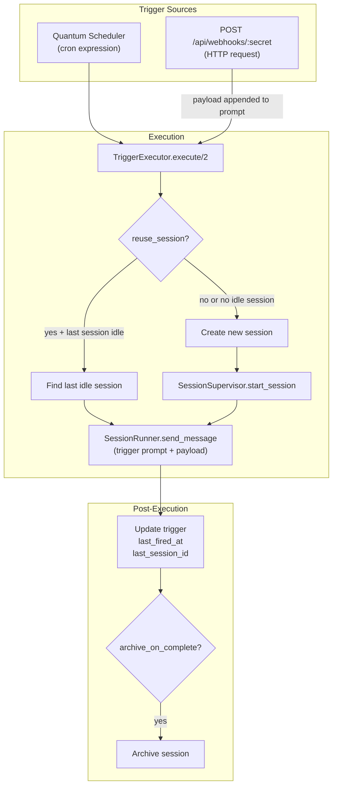

# Trigger System

```mermaid
flowchart TB
    subgraph Sources["Trigger Sources"]
        Cron["Quantum Scheduler\n(cron expression)"]
        Webhook["POST /api/webhooks/:secret\n(HTTP request)"]
    end

    subgraph Execution
        Executor["TriggerExecutor.execute/2"]
        Resolve{"reuse_session?"}
        Reuse["Find last idle session"]
        Create["Create new session"]
        Start["SessionSupervisor.start_session"]
        Send["SessionRunner.send_message\n(trigger prompt + payload)"]
    end

    subgraph Cleanup["Post-Execution"]
        Update["Update trigger\nlast_fired_at\nlast_session_id"]
        Archive{"archive_on_complete?"}
        ArchiveSession["Archive session"]
    end

    Cron --> Executor
    Webhook -->|payload appended to prompt| Executor

    Executor --> Resolve
    Resolve -->|yes + last session idle| Reuse
    Resolve -->|no or no idle session| Create
    Reuse --> Send
    Create --> Start --> Send

    Send --> Update
    Update --> Archive
    Archive -->|yes| ArchiveSession
```
