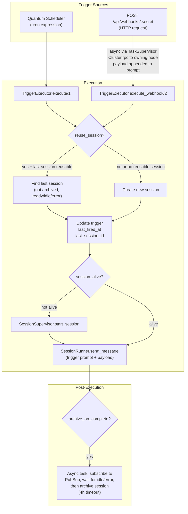
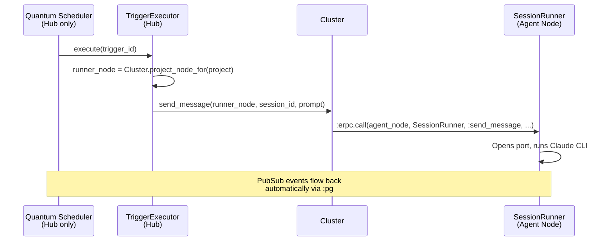

# Trigger System

## Cluster Compatibility

Triggers are fully compatible with remote agent nodes. Node routing is
derived from the trigger's associated project (`trigger → project → project.node`).

- **Scheduling** is hub-only: `Quantum Scheduler` and `TriggerLoader` only
  run on the hub node (see `Application.hub_children/1`).
- **Execution** is distributed: when a trigger fires, `TriggerExecutor`
  resolves the target node via `Cluster.project_node_for(project)` and
  routes session creation and messaging to that node.
- **Webhook triggers** received on any node are dispatched to the correct
  runner node via `Cluster.rpc(runner_node, TriggerExecutor, :execute_webhook, ...)`.
- **New sessions** created by triggers are tagged with the correct
  `runner_node` from the project.

