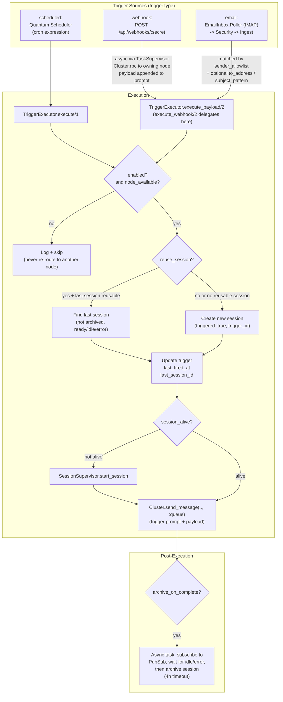
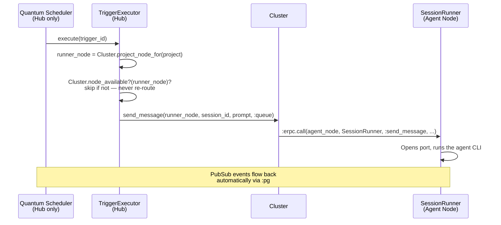

# Trigger System

```mermaid
flowchart TB
    subgraph Sources["Trigger Sources (trigger.type)"]
        Cron["scheduled:\nQuantum Scheduler\n(cron expression)"]
        Webhook["webhook:\nPOST /api/webhooks/:secret"]
        Email["email:\nEmailInbox.Poller (IMAP)\n-> Security -> Ingest"]
    end

    subgraph Execution
        ExecuteCron["TriggerExecutor.execute/1"]
        ExecutePayload["TriggerExecutor.execute_payload/2\n(execute_webhook/2 delegates here)"]
        EnabledCheck{"enabled?\nand node_available?"}
        Skip["Log + skip\n(never re-route to another node)"]
        Resolve{"reuse_session?"}
        Reuse["Find last session\n(not archived, ready/idle/error)"]
        Create["Create new session\n(triggered: true, trigger_id)"]
        Update["Update trigger\nlast_fired_at\nlast_session_id"]
        StartCheck{"session_alive?"}
        Start["SessionSupervisor.start_session"]
        Send["Cluster.send_message(.., :queue)\n(trigger prompt + payload)"]
    end

    subgraph Cleanup["Post-Execution"]
        Archive{"archive_on_complete?"}
        ArchiveTask["Async task: subscribe to\nPubSub, wait for idle/error,\nthen archive session\n(4h timeout)"]
    end

    Cron --> ExecuteCron
    Webhook -->|"async via TaskSupervisor\nCluster.rpc to owning node\npayload appended to prompt"| ExecutePayload
    Email -->|"matched by sender_allowlist\n+ optional to_address / subject_pattern"| ExecutePayload

    ExecuteCron --> EnabledCheck
    ExecutePayload --> EnabledCheck
    EnabledCheck -->|no| Skip
    EnabledCheck -->|yes| Resolve
    Resolve -->|yes + last session reusable| Reuse
    Resolve -->|no or no reusable session| Create
    Reuse --> Update
    Create --> Update
    Update --> StartCheck
    StartCheck -->|not alive| Start --> Send
    StartCheck -->|alive| Send

    Send --> Archive
    Archive -->|yes| ArchiveTask
```

Both entry points funnel into the same resolve → start → send path;
`execute_webhook/2` is now just a thin alias for `execute_payload/2`, which
also serves inbound email. Because `Cluster.rpc/5` runs the WHOLE body on the
trigger's runner node, any filesystem work it does (e.g. writing email
attachments into the session directory) already lands on the right node
without a second transfer hop.

Delivery is `:queue`, deliberately: an overlapping fire (a cron trigger with
`reuse_session` firing again while the prior run is still working) waits for
the in-flight turn to end rather than interrupting and cancelling it.

## Cluster Compatibility

Triggers are fully compatible with remote agent nodes. Node routing is
derived from the trigger's associated project (`trigger → project → project.node`).

- **Scheduling** is hub-only: `Quantum Scheduler` and `TriggerLoader` only
  run on the hub node (see `Application.hub_children/1`).
- **Mailbox polling** is hub-only too, for the same reason — the `EmailInbox*`
  children run only on the hub, so an email trigger is ingested there and its
  execution routes out to the owning agent like any other.
- **Execution** is distributed: when a trigger fires, `TriggerExecutor`
  resolves the target node via `Cluster.project_node_for(project)` and
  routes session creation and messaging to that node.
- **Payload triggers** (webhook or email) received on any node are dispatched
  to the correct runner node via
  `Cluster.rpc(runner_node, TriggerExecutor, :execute_payload, ...)`.
- **An unreachable node skips the firing; it never relocates it.** Both
  entry points check `Cluster.node_available?/1` first and log-and-skip
  (`{:error, :node_unavailable}` for a payload fire) rather than running the
  trigger against some other node's filesystem.
- **New sessions** created by triggers are tagged with the correct
  `runner_node` from the project, plus `triggered: true` and `trigger_id`.

```mermaid
sequenceDiagram
    participant Scheduler as Quantum Scheduler<br/>(Hub only)
    participant Executor as TriggerExecutor<br/>(Hub)
    participant Cluster as Cluster
    participant Agent as SessionRunner<br/>(Agent Node)

    Scheduler->>Executor: execute(trigger_id)
    Executor->>Executor: runner_node = Cluster.project_node_for(project)
    Executor->>Executor: Cluster.node_available?(runner_node)?<br/>skip if not — never re-route
    Executor->>Cluster: send_message(runner_node, session_id, prompt, :queue)
    Cluster->>Agent: :erpc.call(agent_node, SessionRunner, :send_message, ...)
    Agent->>Agent: Opens port, runs the agent CLI
    Note over Scheduler,Agent: PubSub events flow back<br/>automatically via :pg
```

## Trigger Types

| Type | Fires from | Type-specific fields |
|---|---|---|
| `scheduled` | Quantum cron on the hub | `cron_expression` (5–7 fields) |
| `webhook` | `POST /api/webhooks/:secret` | `webhook_secret` (auto-generated) |
| `email` | `EmailInbox.Poller` IMAP poll on the hub | `email_inbox_id`, `sender_allowlist` (must be non-empty), optional `to_address` / `subject_pattern` |

An email trigger's `sender_allowlist` is validated non-empty at the changeset
level — an empty one would fire for mail from ANY authenticated sender.
Sender authentication itself (`Authentication-Results`, optionally pinned to
the inbox's `trusted_authserv_id`) happens in `OrcaHub.EmailInbox.Security`
before a trigger is ever matched. `subject_pattern` is a case-insensitive
SUBSTRING match, not a regex.

`Trigger.memory_extract` (nullable boolean, mirrors `Session.memory_extract`)
overrides automatic memory extraction for every session a trigger spawns —
`TriggerExecutor` stamps it onto each new session it creates. `OrcaHub.
MemoryReview` uses this to set it `false` on its own two scheduled triggers
(`memory-consolidate-nightly`, `memory-verify-weekly`, upserted idempotently
by `TriggerLoader` on hub boot) — an automated review pass must never itself
be memory-extracted. See that module's moduledoc for the pass rules
(propose, never retire/rewrite).

## Per-trigger tool restrictions

`Trigger.tool_allowlist` / `tool_denylist` mirror the `sessions` columns of
the same names exactly, and `TriggerExecutor.session_attrs/1` stamps them
onto every session the trigger CREATES — so the enforced policy is resolved
from the session row by `OrcaHub.ToolPolicy` like any other. Semantics are
the session ones verbatim: nil OR `[]` mean "no restriction" on either side
(explicit deny-all is `tool_denylist: ["*"]`), deny wins over allow, entries
are exact raw MCP tool names or anchored `*`-globs. This replaces the "you
may NEVER call `retire_memory`" English paragraphs operators write into
trigger prompts, which a model is free to ignore.

Same limitation as `memory_extract`: only a session the trigger CREATES is
stamped, so editing the lists does not retroactively re-scope a session a
`reuse_session: true` trigger is still reusing.

## Where the operator sees all four fields

Both lists plus `setup_script`/`setup_timeout_seconds` are edited in one
collapsible section of the trigger form (`TriggerLive.Index`), which submits
the lists as free text — one entry per line, parsed by
`OrcaHubWeb.EnvAllowlistInput.parse/1`, with an empty field persisted as
`nil`. Because the section's inputs are absent from the DOM while collapsed,
a save from a collapsed form leaves all four columns untouched rather than
clearing them. `TriggerLive.Show` renders whichever of them are set.

On the session side the resolved policy is READ-ONLY: `SessionLive.Show`
gates a header toggle + panel on `ToolPolicy.restricted?/1`, so an
unrestricted session (nil/`[]` on both lists) shows nothing at all. The
`system`/`setup_script` feed event renders collapsed in
`MessageComponents`, expanding to the script and its output — as escaped
plain text in a `<pre>`, never through `OrcaHubWeb.Markdown.render/2`, since
the output is arbitrary command output in the MAIN document rather than the
sandboxed artifact iframe. Every one of these surfaces states that the
restriction covers MCP tools ONLY, not the agent CLI's built-in
Bash/Read/Write/WebFetch — the likeliest operator misreading.

## Pre-run setup script

`Trigger.setup_script` (+ `setup_timeout_seconds`, default 120) is an
operator-authored shell script `OrcaHub.Triggers.SetupScript` runs on the
session's runner node, in the session's directory, on EVERY firing —
including a `reuse_session` firing — before the prompt is delivered. It is a
"gather current state before this run" hook (`date -u`, `git log -1`), not
one-time provisioning.

Both `TriggerExecutor` entry points route it through `Cluster.rpc/5`
uniformly (a same-node call is just a local `apply/3`), which is what makes
it correct for `execute/1` — running on the HUB — as well as
`execute_payload/2`, whose whole body already runs on the runner node. The
result (combined stdout+stderr capped at 16KB keeping the TAIL, exit code,
duration) is PREPENDED to the built prompt in a `<setup_script>` block —
outside the email path's `<untrusted_email>` region, since setup output is
operator-authored and an email body is not — and persisted to the session
feed as a `system`/`setup_script` event.

Two properties are load-bearing: no part of a webhook body or inbound email
ever reaches the script, its args, or its env (the script text is written to
a temp file and executed as a file, never interpolated into `sh -c`); and a
timeout signals the script's whole PROCESS GROUP (`setsid` + a pidfile,
`OrcaHub.Jobs.Launcher`'s approach without the detached Jobs machinery), so a
script that backgrounds children cannot leave orphans. A non-zero exit or a
timeout never aborts the firing — it is logged at `:warning` and surfaced
prominently in the prompt block instead.
