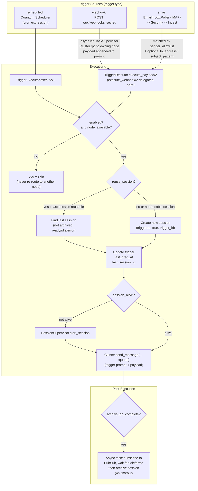
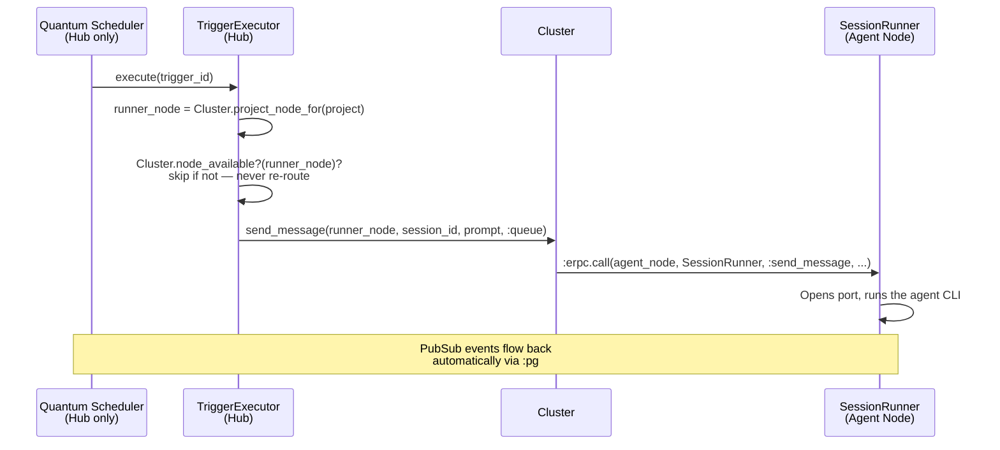

# Trigger System

```mermaid
flowchart TB
    subgraph Sources["Trigger Sources (trigger.type)"]
        Cron["scheduled:\nQuantum Scheduler\n(cron expression)"]
        Webhook["webhook:\nPOST /api/webhooks/:secret"]
        Email["email:\nEmailInbox.Poller (IMAP)\n-> Security -> Ingest"]
    end

    subgraph Execution
        ExecuteCron["TriggerExecutor.execute/1"]
        ExecutePayload["TriggerExecutor.execute_payload/2\n(execute_webhook/2 delegates here)"]
        EnabledCheck{"enabled?\nand node_available?"}
        Skip["Log + skip\n(never re-route to another node)"]
        Resolve{"reuse_session?"}
        Reuse["Find last session\n(not archived, ready/idle/error)"]
        Create["Create new session\n(triggered: true, trigger_id)"]
        Update["Update trigger\nlast_fired_at\nlast_session_id"]
        StartCheck{"session_alive?"}
        Start["SessionSupervisor.start_session"]
        Send["Cluster.send_message(.., :queue)\n(trigger prompt + payload)"]
    end

    subgraph Cleanup["Post-Execution"]
        Archive{"archive_on_complete?"}
        ArchiveTask["Async task: subscribe to\nPubSub, wait for idle/error,\nthen archive session\n(4h timeout)"]
    end

    Cron --> ExecuteCron
    Webhook -->|"async via TaskSupervisor\nCluster.rpc to owning node\npayload appended to prompt"| ExecutePayload
    Email -->|"matched by sender_allowlist\n+ optional to_address / subject_pattern"| ExecutePayload

    ExecuteCron --> EnabledCheck
    ExecutePayload --> EnabledCheck
    EnabledCheck -->|no| Skip
    EnabledCheck -->|yes| Resolve
    Resolve -->|yes + last session reusable| Reuse
    Resolve -->|no or no reusable session| Create
    Reuse --> Update
    Create --> Update
    Update --> StartCheck
    StartCheck -->|not alive| Start --> Send
    StartCheck -->|alive| Send

    Send --> Archive
    Archive -->|yes| ArchiveTask
```

Both entry points funnel into the same resolve → start → send path;
`execute_webhook/2` is now just a thin alias for `execute_payload/2`, which
also serves inbound email. Because `Cluster.rpc/5` runs the WHOLE body on the
trigger's runner node, any filesystem work it does (e.g. writing email
attachments into the session directory) already lands on the right node
without a second transfer hop.

Delivery is `:queue`, deliberately: an overlapping fire (a cron trigger with
`reuse_session` firing again while the prior run is still working) waits for
the in-flight turn to end rather than interrupting and cancelling it.

## Cluster Compatibility

Triggers are fully compatible with remote agent nodes. Node routing is
derived from the trigger's associated project (`trigger → project → project.node`).

- **Scheduling** is hub-only: `Quantum Scheduler` and `TriggerLoader` only
  run on the hub node (see `Application.hub_children/1`).
- **Mailbox polling** is hub-only too, for the same reason — the `EmailInbox*`
  children run only on the hub, so an email trigger is ingested there and its
  execution routes out to the owning agent like any other.
- **Execution** is distributed: when a trigger fires, `TriggerExecutor`
  resolves the target node via `Cluster.project_node_for(project)` and
  routes session creation and messaging to that node.
- **Payload triggers** (webhook or email) received on any node are dispatched
  to the correct runner node via
  `Cluster.rpc(runner_node, TriggerExecutor, :execute_payload, ...)`.
- **An unreachable node skips the firing; it never relocates it.** Both
  entry points check `Cluster.node_available?/1` first and log-and-skip
  (`{:error, :node_unavailable}` for a payload fire) rather than running the
  trigger against some other node's filesystem.
- **New sessions** created by triggers are tagged with the correct
  `runner_node` from the project, plus `triggered: true` and `trigger_id`.

```mermaid
sequenceDiagram
    participant Scheduler as Quantum Scheduler<br/>(Hub only)
    participant Executor as TriggerExecutor<br/>(Hub)
    participant Cluster as Cluster
    participant Agent as SessionRunner<br/>(Agent Node)

    Scheduler->>Executor: execute(trigger_id)
    Executor->>Executor: runner_node = Cluster.project_node_for(project)
    Executor->>Executor: Cluster.node_available?(runner_node)?<br/>skip if not — never re-route
    Executor->>Cluster: send_message(runner_node, session_id, prompt, :queue)
    Cluster->>Agent: :erpc.call(agent_node, SessionRunner, :send_message, ...)
    Agent->>Agent: Opens port, runs the agent CLI
    Note over Scheduler,Agent: PubSub events flow back<br/>automatically via :pg
```

## Trigger Types

| Type | Fires from | Type-specific fields |
|---|---|---|
| `scheduled` | Quantum cron on the hub | `cron_expression` (5–7 fields) |
| `webhook` | `POST /api/webhooks/:secret` | `webhook_secret` (auto-generated) |
| `email` | `EmailInbox.Poller` IMAP poll on the hub | `email_inbox_id`, `sender_allowlist` (must be non-empty), optional `to_address` / `subject_pattern` |

An email trigger's `sender_allowlist` is validated non-empty at the changeset
level — an empty one would fire for mail from ANY authenticated sender.
Sender authentication itself (`Authentication-Results`, optionally pinned to
the inbox's `trusted_authserv_id`) happens in `OrcaHub.EmailInbox.Security`
before a trigger is ever matched. `subject_pattern` is a case-insensitive
SUBSTRING match, not a regex.
